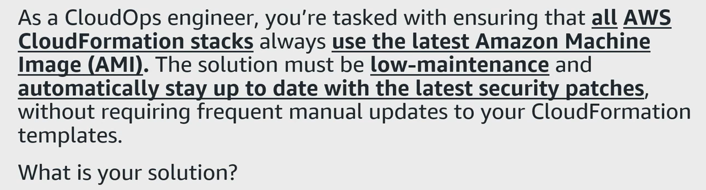
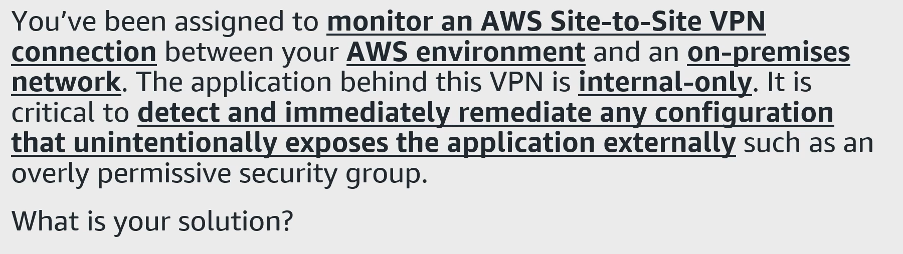

## Question - CloudFormation 

    
Reveal answer

    <ul>
        <li>Best Answer: Amazon EC2 Image Builder and Parameter Store</li>
        <li>Second Answer: AWS Systems Manager - Parameter Store</li>
    </ul>

## Question - VPN

    
Reveal answer

### AWS Config Rule
- Create a custom AWS Config rule to continuously evaluate the security groups associated with application.
- This rule checks if inbound rules allow access from IP addresses outside the corporate CIDR block
- Use a Lambda function to run the compliance logic.

### AWS Systems Manager Automation
- Automate remediation using Systems Manager Automation
- When the AWS Config rule detects non-compliant resources, it runs an Automation runbook
- The runbook removes or restricts non-corporate CIDRs from the affected security groups, restoring internal-only access.

