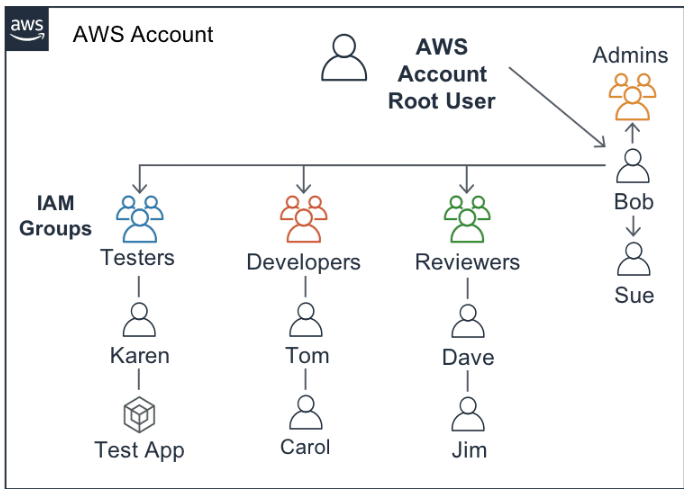

# AWS Security Services [^](../../README.md#3-aws-certified-developer-associate)

<div>
<details>

<summary>1. AWS Web Application Firewall (WAF) </summary>

- WAF can stop common web attacks by reviewing the data sent to application and stopping well-known attacks.
- WAF can protect websites not hosted in AWS through CloudFront.
- Configure CloudFront to present a custom error page when requests are blocked
- Create Web Access Control Lists (Web ACLs) to monitor HTTP(S) requests for AWS resources.
- Available under a composite dashboard: **WAF & Shield** which has three services.
  - **AWS WAF** - Monitor and control web requests coming to an Amazon API Gateway API, CloudFront distribution, or Application LB.
  - **AWS Shield** - Provides continuous DDoS attack protection and automatic mitigations. (**Standard** and **Advanced**)
  - **AWS Firewall Manager** - Configure and manage firewall rules across accounts and applications centrally.
  
</details>
</div>


<div>
<details>

<summary>2. Identity and Access Management (IAM) </summary>

## Identity and Access Management
- Allows to configure who can access our AWS account, services, or ven applications running in our account.
- A **global** service and is automatically available across ALL regions.
- Each resource in the AWS gets a unique identifier (ARN).
- A newly created **IAM Policy** also get its own ARN.



### IAM User
- A unique identifier generated by the IAM service and recognized by all AWS services to grant access to AWS resources.
- A user can be a person, system, or application that requires access to AWS services.
- Generate login credentials and access keys for any user in the account.
- **Roles** and **policies** control the scope (permissions) of a user's access to AWS resources in the account.

### IAM Group
- A group collects IAM users with the same level of permissions to access AWS resources.
- Attach or detach permissions to a group using access control policies.
- A group makes it easier to manage IAM users with the same level of permissions.

### IAM Role
- A role is simply a set of policies (permissions) to access AWS services.
- Assign a role to either an IAM user or an AWS service such as EC2.
- Creating and storing roles helps to delegate access with defined permissions without sharing long-term access keys.
- IAM roles are assumed by authorized entities, such as IAM users, applications, or other AWS services.

### IAM Policy
- An access control policy is **a JSON file** that defines:
  - the resource to grant access 
  - level of access
  - allowed actions
- Attach a policy to multiple users, groups, or roles to assign permissions to AWS resources.
- AWS offers a utility **IAM Policy Simulator** where you can evaluate, and validate the effects of your access control policies.
- In addition to IAM policies, AWS offers the other types of policies:
  - S3 Bucket Policy
  - SNS Topic Policy
  - VPC Endpoint Policy
  - SQS Queue Policy

```json
{
    "Version": "2012-10-17",
    "Statement": [
        {
            "Action": "ec2:*",
            "Resource": "*",
            "Effect": "Allow",
            "Condition": {
                "StringEquals": {
                    "ec2:Region": "us-east-2"
                }
            }
        }
    ]
}

```

## Types of AWS Credentials

### Username and Passwords
- You should define a password policy for all of your IAM users to enforce strong passwords and to require your users to regularly change their passwords.
- Password requirements are similar to those found in most secure online environments.

### Multi-Factor Authentication (MFA)
- additional layer of security for accessing AWS services

### User Access Keys
  - Needed by users to make programmatic calls to AWS using the AWS CLI, AWS SDKs, or direct HTTPS calls using the APIs for individual AWS services.
  - Used to digitally sign API calls made to the AWS services.
  - Each access key credential consists of an access key ID and a secret key.
  - Each user have two active access keys, which is useful when need to rotate the user's access keys or revoke permissions.

</details>
</div>

<div>
<details>

<summary>3. IAM Identity Center</summary>

## IAM Identity Center
- Provides a central place to create or connect workforce identities in AWS once and manage access centrally to multiple AWS account and applications.
- If you are administering a cloud account for a company or organization, you'll need to use this service to track accounts and certificates used across the AWS cloud.

### Benefits
1. Provide centralized identity management.
2. Fine-grained permissions and assignments.
3. Administrative and governance features.

</details>
</div>

<div>
<details>

<summary>4. Amazon Cognito </summary>

## Amazon Cognito [^](#aws-security-services-)
- Service that offers authentication and authorization features. Helps secure identity and access management for apps.
- Save and synchronize any kind of data in the AWS Cloud, such as app preferences, without managing any infrastructure.
- Enables simple and secure user authentication, authorization, and user management for web and mobile apps.
- With Cognito, a developer can:
  - Easily add user sign-up, sign-in, and control access to their apps leveraging its built-in UI.
  - Help synchronize data across multiple devices and applications.
  - Provide secure access to other AWS services from their app by defining roles and mapping users to different roles.

### Benefits
- **Secure and scalable user directory** - Helps secure user directories that can scale to many users.
- **Social and enterprise identity federation** - Users can sign-in through social identity providers like Google, Facebook, and Amazon.
- **Standards-based authentication** - Support IAM standards such as **OAuth 2.0**, **SAML 2.0**, and **OpenID Connect**.
- **Security for apps and users** - It has encryption and MFA capabilities.
- **Access control for AWS resources** - Helps control access to backend resources from app by leveraging role-based access control with AWS IAM.

</details>
</div>
