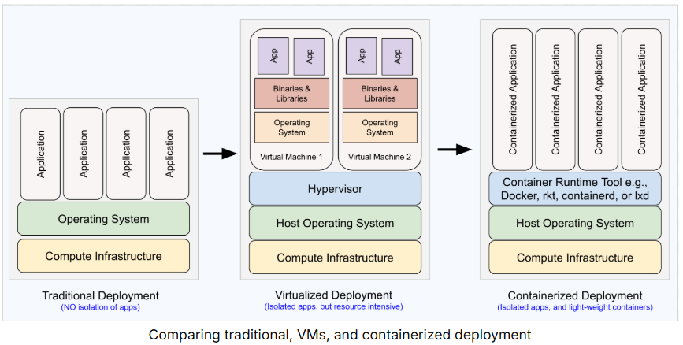

# AWS Container Services [↑](../README.md#1-aws-cloud-practitioner-notes)

1. Containers Overview

## Introduction to Containers
- **Container** is an OS level virtualization that allows to run **multiple isolated processes** in parallel.
- A Container is an isolated process that consists of the following items, all bundles into one package:
  - Application code
  - Required dependencies (e.g. libraries, utilities, configuration files)
  - Necessary runtime environment to run the application

## Benefits of Containers
- Easier for developers to create, deploy, and run applications on different hardware and platforms.
- Containers share a single kernel and share application libraries
- Containers cause a lower system overhead as compared to VMs.
- Containers are much smaller than VMs and run as isolated processes. VMs can be in GB while containers are in MBs.
- VMs can be slow to boot and take minutes to launch while container can spawn much more quickly typically in seconds.
- Containers are designed to be programmatically built and are defined as source code. VMs are often replicas of conventional computer systems.

## Docker
- Docker is a container runtime tool that helps build, test, and run containers.
- Build containers locally using a command-line utility Docker Desktop.
- **Docker Compose** is used to specify dependent relationship between containers

### Docker Image
- An Image (Docker Image) is a portable auto-generated template that contains a set of instructions to create a container.
- An image can be instantiated multiple number of times to create multiple containers

### Dockerfile
A text file containing commands to create an image. In other words, Docker generates images by reading the commands from this file. 

2. Elastic Container Service (ECS)

## Amazon Elastic Container Service (ECS)
- An orchestration service used for automating deployment, scaling, and managing of containerized applications.
- ECS works well with Docker containers by:
  - Launching and stopping Docker containers
  - Scaling applications
  - Querying the state of applications
- Schedule long-running applications, services, and batch processes using ECS.
- Docker is the only container-runtime platform supported by Amazon ECS.

