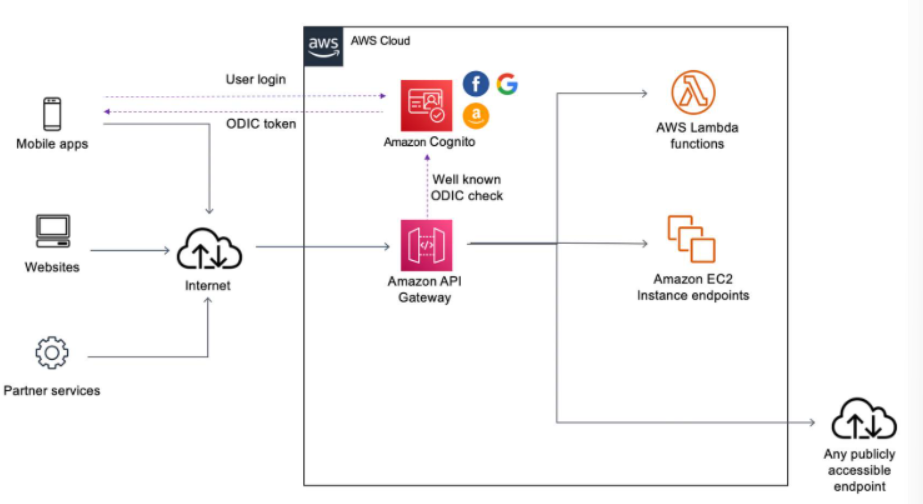
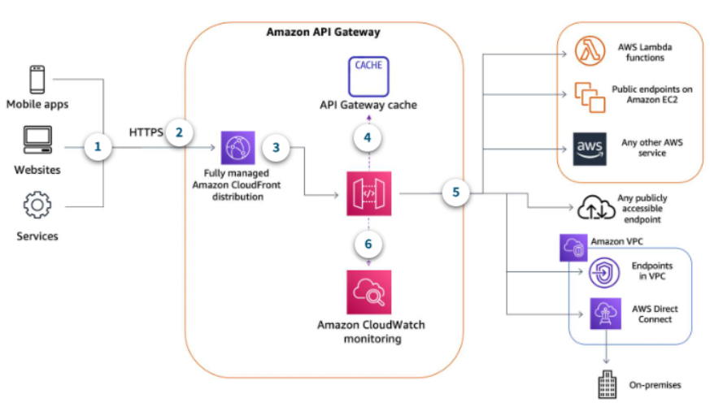
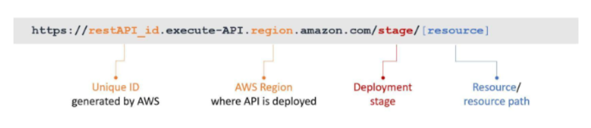
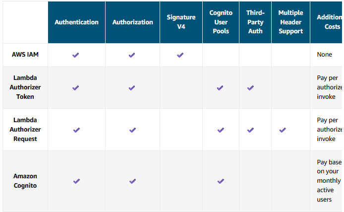

# Amazon API Gateway [^](../../README.md#3-aws-certified-developer-associate)

- [1. Architecture](#api-gateway-architecture-)
- [2. WebSocket APIs in API Gateway](#websocket-api-designing-)
- [3. REST APIs in API Gateway](#rest-api-gateway-)
- [4. Building/Deploying APIs](#buildingdeploying-apis-)
- [5. API Gateway Integration Types](#api-gateway-integration-types-)
- [6. Authorization for API Gateway](#authorization-for-api-gateway-)

## Basic information about Amazon API Gateway
- API Gateway makes a great front door to your AWS Lambda functions and backend APIs
- Facilitates the creation, publishing, maintenance, monitoring, and security of APIs at any scale.
- Handles task around accepting and processing hundreds of thousands of concurrent API calls.
- Reduce latency and throttle traffic for API req/res by taking advantage of Amazon CloudFront.
- Offers native OpenID Connect (OIDC) and OAuth2 support. For custom authorization requirements, **Lambda authorizer** from Lambda can be inoked.

### Features
- **Run multiple versions of API at the same time** - Host multiple versions for different user.
- **Quick SDK Generation**
- **Transform or validate request-response data**

## API Gateway Architecture [^](#amazon-api-gateway-)

## WebSocket API Designing [^](#amazon-api-gateway-)
- WebSocket API allows the client and server to send message to each other any time.
- Backend servers can push data to connected users and devices, avoiding the need to implement complex polling mechanisms.

### Pricing Considerations
- Pay only when API are in use.

#### Flat Charge
- Messages that are sent and received are charged by API Gateway.
- up to 128KB in size
- Messages are metered in 32-KB increments, so a 33-KB message is charged as two messages.

#### Connection Minutes
In addition to paying for the messages you send and receive, you are also charged for the total number of connection minutes.

#### Additional Charges
You may also incur additional charges if you use API Gateway in conjunction with other AWS services or transfer data out of AWS.

### WebSocket Routes
- JSON messages can be routed to invoke a specific backend service based on message content.
- The request will be matched to the route with the corresponding route key in API gateway.
- Three predefined routes ( + custom routes):
  - `$connect`
  - `$disconnect`
  - `$default`
- After configuring the WebSocket API routes, whether predefined or custom, the next step is to attach integrations to each route.

### WebSocket API Integrations
- A backend endpoint is also referred as **integration endpoint**. This can be a Lambda function, an HTTP endpoint, or an AWS service action.
- The API integration has an **integration request** and **integration response** option.

### Connection Maintenance

#### Connect
The client apps connect to your WebSocket API by sending a WebSocket upgrade request. 
If the request succeeds, the `$connect` route is invoked while the connection is being established. 
Until the invocation of the integration you associated with the `$connect` route is completed, 
the upgrade request is pending and the actual connection will not be established. 
If the $connect request fails, the connection will not be made.

#### Established connection
After the connection is established, your client's JSON messages can be routed to invoke a specific backend service based on message content. When a client sends a message over its WebSocket connection, this results in a route request to the WebSocket API. The request will be matched to the route with the corresponding route key in API Gateway. 

#### Disconnect
- The `$disconnect` route is invoked after the connection is closed. The connection can be closed by the server or by the client.
- API Gateway will try its best to deliver the `$disconnect` event to your integration, but it cannot guarantee delivery. 
- The backend can initiate disconnection by using the `@connections` API.

## REST API Gateway [^](#amazon-api-gateway-)

### REST API Endpoint Types

#### Regional Endpoint
- Designed to reduce latency when calls are made from the same AWS Region as the API
- API Gateway does not deploy its own CloudFront distribution in front of the API.

#### Edge-optimized Endpoint
- Designed to help reduce client latency from anywhere on the internet.
- API Gateway automatically configure a fully managed CloudFront distribution to provide lower latency access to APIs.
- Reduces first hit latency for API.
- No need to pay for or manage a CDN separately from API Gateway.

#### Private Endpoint
- Designed to expose APIs only inside the selected Amazon VPC.
- This endpoint type is still managed by API Gateway.
- Requests are only routable and can only originate from within a single VPC.
- Designed for application that have very secure workloads such as healthcare or financial data that cannot be exposed publicly on the internet.

### Supported Endpoint Type Change
- From edge-optimized to regional or private
- From regional to edge-optimized or private
- From private to regional

### API Gateway Optional Cache
- Can be turned on to cache endpoint responses.
- Helps reduce the number of calls made to endpoints and also improve the latency of requests to API.
- Only GET methods will be cached.
- Provision between 0.5 GB to 237 GB of cache
- Set TTL in seconds. The default TTL is 300s. The maximum TTL is 3600s. TTL=0 means caching is turned off.
- encryption of cache data can also be turned on.
- caching can also be turned on or off in method level.
- Caching is charged at an hourly rate and dependent on the cache size selected.

### REST API Pricing Considerations

#### Flat Charge
REST APIs for API Gateway have a flat charge per million API Gateway requests. With API Gateway, you only pay when your APIs are in use at a set cost per million requests.

#### Data Transfer Out
An additional cost to factor into your cost estimates is the data transfer out of AWS that will be charged at standard AWS prices. You may incur additional charges if you use API Gateway in conjunction with other AWS services or transfer data out of AWS.

#### Optional Cache
Hourly rate for cache options

## Building/Deploying APIs [^](#amazon-api-gateway-)

### Invoke URL Pattern

### Customizing the Hostname
- In most cases, custom domains are used because they are more user friendly than the invoke URL.
- API Gateway is integrated with AWS Certificate Manager (ACM) and Secure Sockets Layer (SSL) certificate with ACM to import own certificate.

### Configuring Resource as a Proxy
- If the option to create a proxy is selected, it will automatically create a special HTTP method called _ANY_.
- A proxy resource is expressed by a special resource path parameter of **{proxy+}** often referred to as **greedy path parameter**
- To use proxy option, first configure the resource as a proxy resource and then set up an integration type of either HTTP or Lambda proxy when creating the method.

#### Lambda Proxy option
In addition to the HTTP proxy. With the Lambda proxy integration, the client can call a single Lambda function in the backend.
The function accesses many resources or features of other AWS services, including calling other Lambda functions.

## API Gateway Integration Types [^](#amazon-api-gateway-)
Determines how method request data is passed to the backend.
- **Lambda Function** - Requests being proxied to Lambda with request details available to function handler in the event parameter. IAM role setup is needed
- **HTTP Endpoint** - Useful for public web applications.
- **AWS Service** - expose AWS service actions such as dropping a message directly to Amazon SQS.
- **Mock** - For health checks. Returns a response without sending the request further to the backend
- **VPC Link** - Connect to a Network LB to get something in a private VPC. E.g., accessing a private EC2 instance requires a NLB configured.

## Authorization for API Gateway [^](#amazon-api-gateway-)
- Use **IAM** and **Signature Version 4 (Sig V4)** to authenticate and authorize entities to access APIs.
- Use **Lambda Authorizer** to use to support bearer token authentication strategies such as OAuth or SAML.
- Use **Amazon Cognito** with user pools

### Token Bucket Algorithm 
Requests that come into a bucket are fulfilled at a steady rate. If the rate at which the bucket is being filled causes the bucket to fill up and exceed the burst value, a **429 - Too Many Requests** error will be returned.

