# Event Driven Architectures [^](../../README.md#3-aws-certified-developer-associate)

## SQS Queue between API Gateway and Lambda
- This creates an asynchronous connection between the API request and Lambda.
- This allows to satisfy the API request without regard for how long the Lambda function (or the backend services) will run.

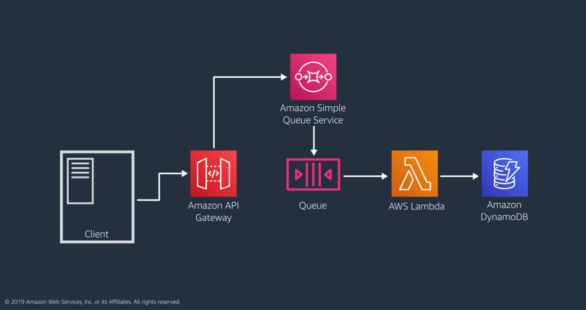

### Standard SQS vs FIFO SQS

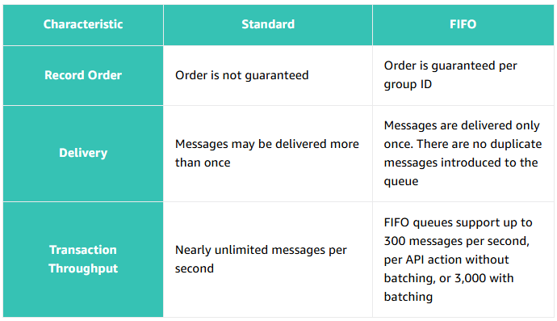

## Workflow Orchestration with AWS Step Functions
- Step Functions control the sequence and timing of each task and track the state of the workflow.
- Lambda functions can be focused on the business logic.

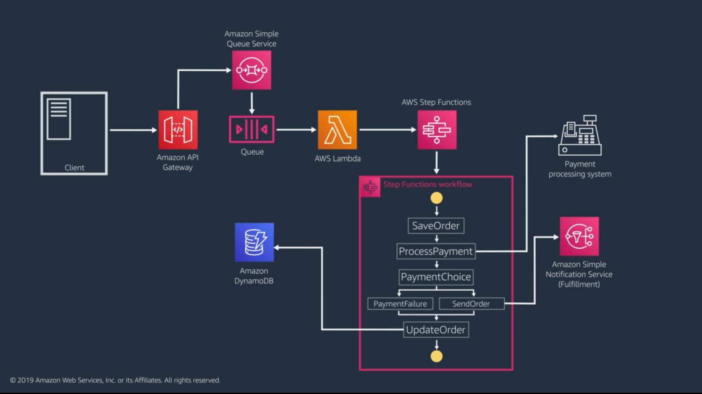

1. Lambda function gets a batch of messages off the queue and uses the **StartExecution API** to initiate a Step Function flow, passing along relevant parts of the message payload.
2. The Step Function flow orchestrates each task in the flow. In the case above, the tasks are Lambda functions.
The Lambda function performs the business logic, the Step Functions tracks the task state and the success or failure of the step.
3. The final step updates the order data and the status of the completed work in DynamoDB.

> A common use case for Step Functions is tasks that requires human intervention, such as a manual approval process in a workflow. To implement this, you can use the callback integration pattern(opens in a new tab) with the enterprise messaging patterns to call a service with a task token. Step Functions will wait until that task token is returned with a payload before progressing with the workflow.

## Communicating Status Updates Pattern

### Client Polling Pattern
The client can use the ID returned from Amazon SQS to get the status of the request.

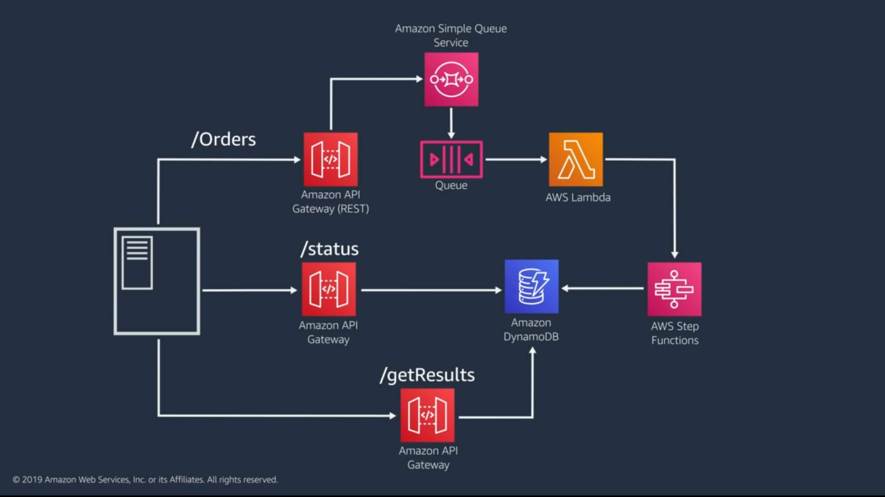

1. The identifier returned to API Gateway from the queue is included in the API response to the client (/Orders).
The client can then use that ID to hit a different endpoint (/status) to find out if the work has been completed.
2. The Step Functions workflow tracks the status of the process, and when it is finished, updates the DynamoDB table with the order data and a status of complete.
3. When the client gets a job status response of `complete` from the /status endpoint, the client requests the transaction results from the results endpoint.

#### Disadvantage
- Adds additional latency to the consistency of the data to the client
- Unnecessary work and increased cost for requests and responses when nothing has changed.

### Webhook pattern with Amazon SNS
- **Webhooks** are user-defined HTTP callbacks.
- With trusted clients, Amazon SNS is used to set up an HTTP subscriber that notifies the client using the webhook.
- The benefit of using SNS with HTTP subscribers is that it can model retry behaviors and exponential backoffs until the webhook succeeds.

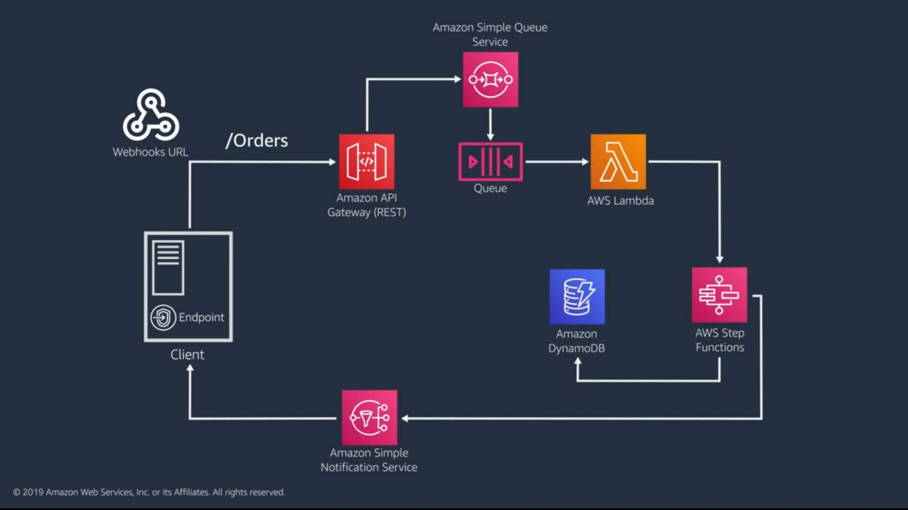

1. The client configures the webhook and gets the request ID back from the API Gateway.
2. The Step Functions workflow includes a task that publishes a message to Amazon SNS when the flow is complete.
3. Amazon SNS sends a message to its topic subscribers, using filtering to target the right subscriber. The message includes the information about the order that the client service needs.

### WebSockets pattern with AWS AppSync
- For persistent connection, use WebSocket API.
- Status is provided for the client using WebSockets with GraphQL subscriptions to listen for updates through AWS AppSync.
- With AWS AppSync, clients can automatically subscribe and receive status updates as they occur.
- Great pattern when data drives the user interface and is ideal for data that is streaming or might yield more than a single response.

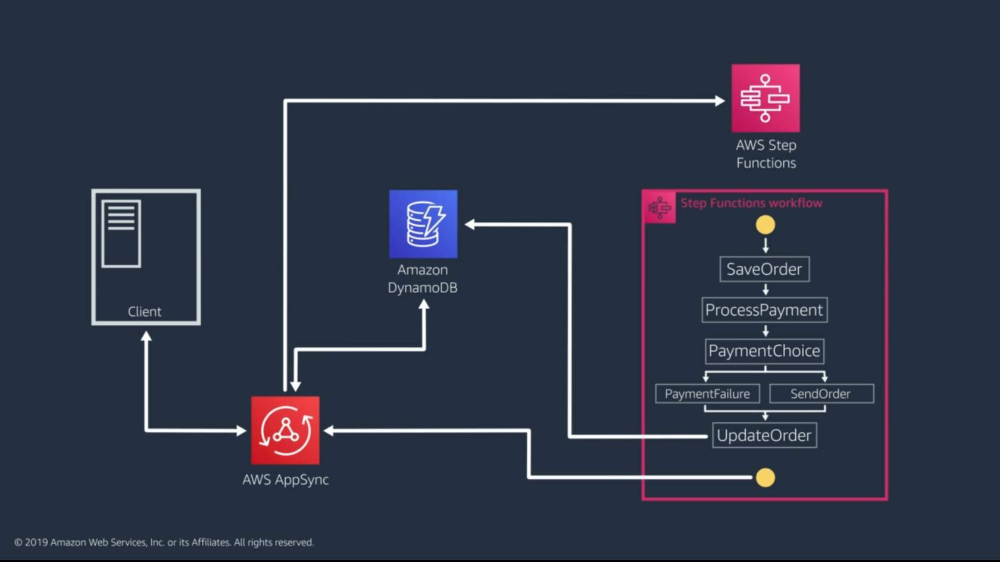

1. The client creates a subscription for order status updates and submits the order through the AWS AppSync Service.
2. As data changes, the client receives updates through the subscription. This includes changes related to the status of the work as well as changes to the order data.

## Data Processing Patterns

### Amazon Kinesis Data Streams
- Clickstream data from mobile apps, applications logs, and home security camera feeds. Traditional batch processing would not give the responsiveness needed to make data actionable

#### Amazon Kinesis Producers
Adds data records to the streams. Created by the following
- **Kinesis Produce Library (KPL)**
- AWS SDK
- Third-party tools

#### Amazon Kinesis Consumers
Get records and process them. Can be the following:
- Lambda functions
- Other streams
- Application created with **Kinesis Client Library (KCL)**

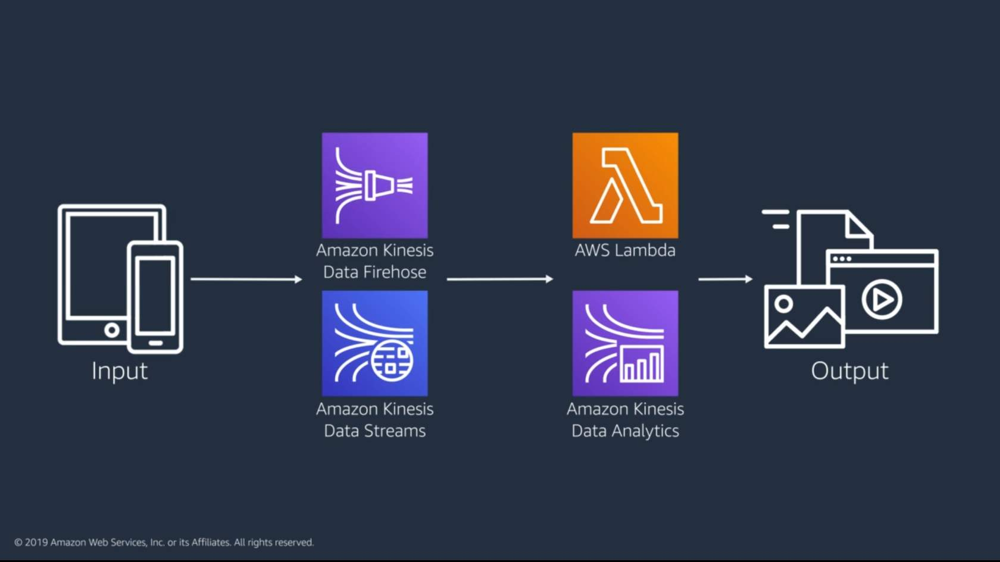

### Kinesis Data Streams 
- Kinesis Data Streams scales horizontally by adding shards. 
- Each shard has a uniquely identified sequence of data records. 
- Each data record has a sequence number assigned by Kinesis.

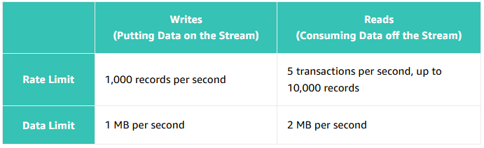

## Serverless Data Processing flow via Amazon Kinesis

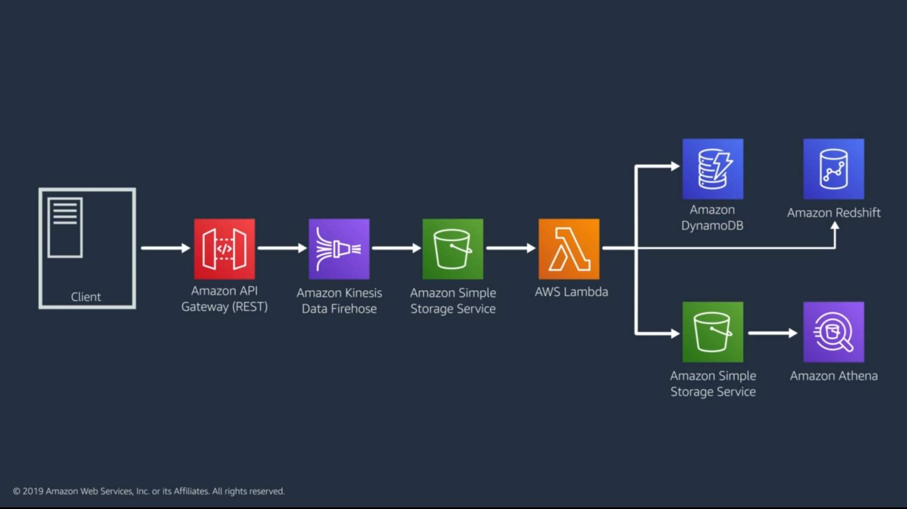
1. API Gateway proxies the incoming records and loads data onto the Kinesis Data Firehose
2. Kinesis Data Firehose delivers raw data records directly to S3 through built-in integration.
3. Amazon S3 invokes a Lambda function that transforms data and then stores the transformed data on S3 and writes select data to DynamoDB.
4. The data is available for further analysis via Amazon Athena
5. Persist data to Amazon Redshift for analytics.

## Amazon SNS filtering, fan-out, and nested serverless applications
Another serverless data processing through the use of Amazon SNS where messaging is utilized instead of streaming.

### Amazon SNS message filtering
- The subscriber assign filter policy to the topic subscription.
- The filter policy contains attributes that define which messages that subscriber receives. Amazon SNS compares message attribute to filter the policy for each subscription.
- If the attributes don't match, the message does not get sent to that subscriber.

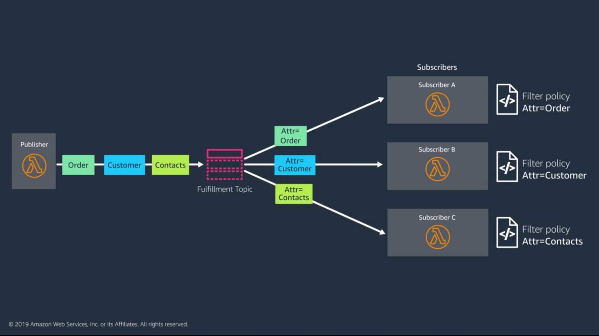

### Nested Serverless Application
Build recurring patterns as a small serverless application for reusability.

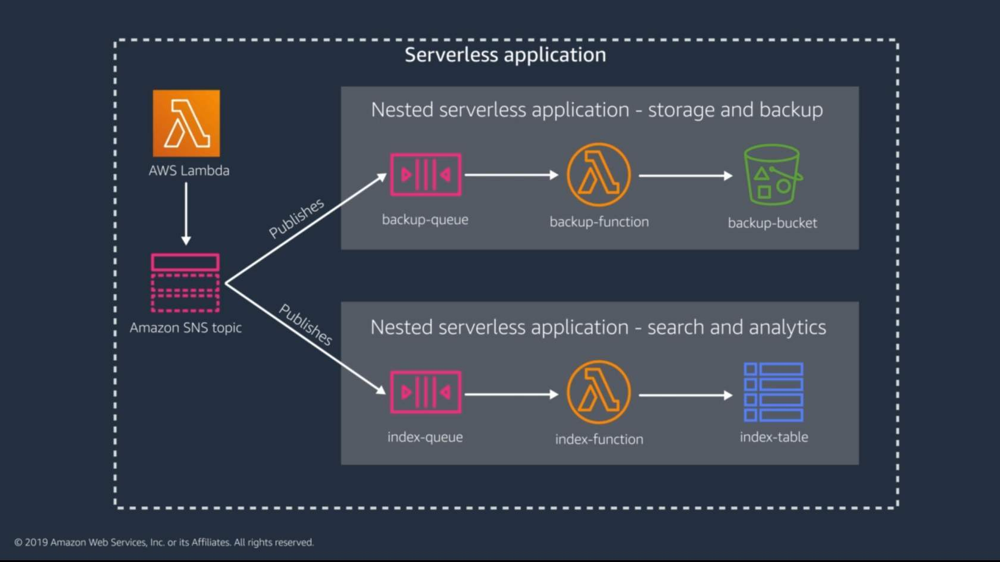

## Comparison: Messaging and Streaming

### Messaging
- The core entity is an individual message, and message rates vary.
- Messages are deleted when they've been consumed.
- Configure retries and DLQs for failures

### Streaming
- The stream of messages is being looked at together, the stream is generally continuous.
- Data remains on the stream for a period of time. Consumer must maintain a pointer.
- A message is retried until it succeeds or expires. Error handling must be built into the function to bypass a record.

