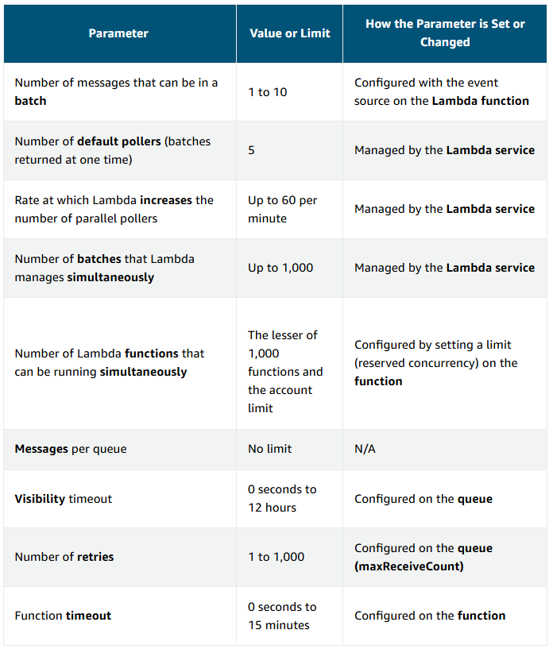

# Scaling Serverless Architectures [^](../../README.md#3-aws-certified-developer-associate)
Build today with tomorrow in mind

## Scaling Best Practices
- Separate application and database
- Take advantage of the AWS Global Cloud Infrastructure
- Identify and avoid heavy lifting
- Monitor for percentile
- Refactor as you go

## Concurrency
- **Concurrency** is the number of Lambda invocations that can be run at the same time.
- If the number of requests for invocations exceeds the account or Lambda function concurrency limit, requests are throttled.

> Concurrency = (request rate) * (average duration of a function)

> If the available concurrency is exceeded, requests will be throttled.

- With **asynchronous event source**, there will be two retries for a failed or throttled request.
- For a **synchronous event source**, there are no retries built in.

### Streaming Event Sources
- In Streaming event sources (like Amazon Kinesis Data Streams) concurrency is measured by the number of shards.
- There is a limit of one concurrent Lambda invocations per shard.
- Lambda will continue to retry a record until the record is successfully processed for most streaming services or the retention period of the record expires.
  - This means that if one record in a batch fails, the whole batch of records and by extension the shard serving that batch is help up until retention period expires.

### Polling Event Sources
Polling event sources like Amazon SQS adjust concurrency depending on the depth of messages in the queue, up to the function or account limit

## Scaling Considerations
Key considerations include the following:
- Timeouts
- Retry behaviors
- Throughput
- Payload size

### API Gateway Scaling Considerations
- **Auth Caching** allows a Lambda authorizer to avoid repeated authorization which lessens concurrency value. Cache authorizations from 5 minutes to an hour.
- Set **Throttling limits options** by method. Set up API keys and usage plans to throttle request volume client by client.

### Amazon SQS Scaling Considerations
- When Lambda uses SQS as an event source, Lambda service manages polling the queue on user's behalf, but other configuration options can be control that impact how application performs such as:
  - **Batch size**
  - **concurrency limit**
  - **timeout**
  - **visibility timeout**
  - **max receive count**
  - **redrive policy** on the queue (determines when to send failed records to DLQ)
  - **dead-letter queue**
- Lambda defaults to using 5 parallel processes to get messages of the queue. This means that Lambda is invoking 5 concurrent instance of the lambda function. Hence, ensure that the reserved concurrency on the function is at least five to avoid being throttled out of the gate.
- If Lambda detects increase in queue size, it will automatically increase how many batches it gets from the queue, each time.
- Lambda will continue to add additional processes every minute until the queue has slowed down, or it reaches maximum concurrency.
- Maximum concurrency is 1000, unless the account or function limit is slower.
- SQS will continue to try a failed message up to the maximum receive count specified in the redrive policy. If a DLQ is configured, the failed message will be put into the DLQ and deleted from the SQS queue.
- The best practice is to set the visibility timeout to six times the function timeout.

### Lambda Scaling Considerations
- **Lambda Power Tuning** helps understand the optimal memory to allocate to functions. Specify whether to optimize on cost, performance, or balance of the two.
- Under the hood, an AWS Step Functions state machine invokes the function you’ve specified at different memory settings from <u>128 MB to 3 GB</u> and captures both duration and cost values.

### DynamoDB Scaling

#### On-Demand DynamoDB Mode
- Tables automatically scale read/write throughput based on each prior peak.
- Instantly handles up to double the previous traffic peak on a table and will then use the latest peak as the baseline from which it can instantly double capacity for the next peak.
- For new peak that is more than twice the previous, DynamoDB will still give more capacity, but request could get throttled if the new peak is exceeded within the next 30 minutes.

#### Provisioned DynamoDB Mode
- Provisioned throughput is the maximum amount of capacity the table can consume. If exceeded, requests will get throttled.
- Throttled requests will return an error. The AWS SDK has built-in support for retries and exponential backoff.
- Auto-scaling is available to define lower and upper capacity limits and target a utilization percentage within the range.
- Auto-scaling target can be set between 20% to 90%. A table will increase its read/write capacity to handle sudden increase in traffic without getting throttled.

#### DynamoDB Accelerator (DAX)
- For really read heavy and requires even lower latency than DynamoDB.
- An in-memory cache for real-time applications.
- Put DAX in front of DynamoDB table. AWS Lambda will read from and write to DAX who will read/write from DynamoDB as needed.

### Step Function Scaling Considerations
- Step Functions does not set a default timeout. It will wait for a response from certain worker that might not end at all.
- Use **TimeoutSeconds options** within **Amazon States Language** to end the activity regardless of the worker response.
- Use Amazon S3 to store data and pass the ARN of the S3 bucket for payload that has potential to grow beyond the limit for input/output data size.

### Amazon SNS Scaling Considerations
- the **AWS Event Fork Pipeline** applications available in the **Serverless Application Repository** let you deploy pre-built applications that use SNS to execute common tasks in parallel.
- Use the pipelines to model own SNS fanouts. By default, 200 filter policies per account, per AWS Region can be applied to a topic.

### Amazon Kinesis Data Streams Scaling Considerations
- Stream processing is dependent on the number of shards on the stream. AWS Lambda gets records in a batch (one per shard) and invokes one instance of the function per shard.
- If Lambda can't process one message in the shard, that whole shard is blocked until the message is force complete or retention period expires for the data in the shard.
- Kinesis Data Streams can take up to 1MB of data or 1000 records per second, per shard from a producer.

> If the stream need to take 4000 records or 4 MB of data per second, it will need 4 shards.
