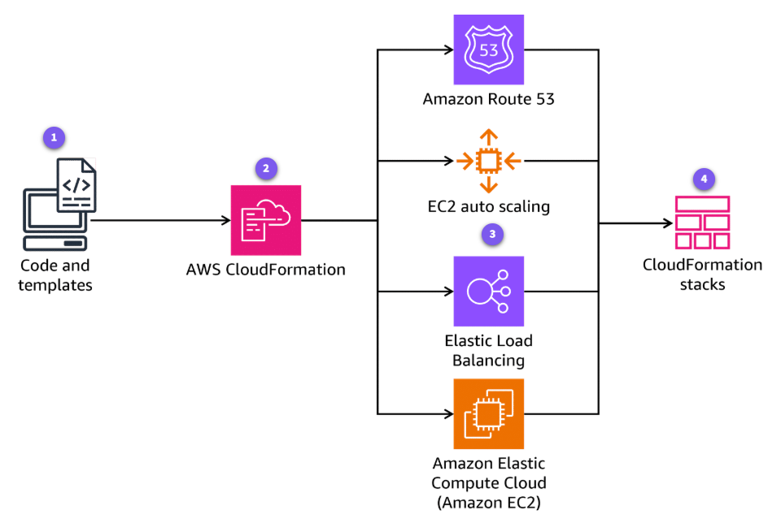

#### `PREVIOUS CONTENT:` [DevOps in AWS](5_Serverless-DevOps.md)

-----

# CloudFormation Deep Dive [^](../../README.md#3-aws-certified-developer-associate)

<div style="padding-bottom:5px; border:3px;">
<details style="background-color:rgb(231 231 231 / 0.4);">

<summary style="font-size: 200%;">1. Introduction</summary>

## AWS CloudFormation
- Handles the complexity of creating and configuring resources, maintaining their dependencies, and managing updates or deletions.
- Eliminates the need to manually create and configure resources through AWS Management Console or write custom scripts to orchestrate resource creation and updates.
- Reduces the potential for human error and increases consistency across deployments

### Core Functionalities

1. **Template-based Resource Provisioning**
    - The templates are text files that describe the desired infrastructure state using either JSON or YAML syntax.
2. **Stack Management**
   - A **CloudFormation Stack** is a collection of AWS resources managed as a single unit.
   - When a stack is created, CloudFormation provisions all the resources defined in the template in the correct order, respecting dependencies between resources.
3. **Change Management and Drift detections**
   - Tools are provided to manage changes to infrastructure safely and predictably.
   - Changes can be previewed before it is applied which shows exactly what will be modified, created, or deleted when the stack is updated.
   - CloudFormation can detect when resources in a stack have been modified outside of CloudFormation, a condition known as <span style="background-color:yellow; color: black;">drift</span>.
   - Drift detection helps maintain integrity of infrastructure by alerting when manual changes have been made.
4. **Extensibility**
   - Using the **AWS CloudFormation Registry**, third-party resources and modules published by APNs can be modeled and provisioned.
5. **Cost Optimization**
   - Helps manage costs through user defined configurations and automated scaling, which optimizes resource utilization and reduces waste.

### Technical Concepts

1. **Templates Anatomy:** 
    - Templates have specific structure with sections including Format Version, Description, Parameters, Mappings, Conditions, Resources, Outputs, and Metadata
    - The **Resource section** is the only required section.
    - Each resource has a type (e.g. AWS::EC2::Instance) that determines its properties and behavior.
2. **Stack and stack operations**
    - A stack is the runtime instance of a CloudFormation template.
    - Stack operations: creation, updating, deletion. These operations are atomic units.
3. **Parameters and Pseudo Parameters**
    - Parameters help customize templates without modifying the template itself.
    - Pseudo Parameters are values provided by CloudFormation itself such as `AWS::Region` or `AWS::StackName`
4. **Intrinsic Functions**
    - built-in functions that help manage resources and properties.
    - Assign values to properties that are not available until runtime, reference other resources, or conditionally create resources.

### Features and Capabilities
- **Infrastructure as a Code (IaaS)**
- **Template reusability**
- **Automatic dependency management** - Determines the correct order to provision resources
- **Rollback capability**
- **Drift detection and resolution**
- **Custom resources** - Incorporate resources that are not natively supported by AWS.

</details>
</div>


<div style="padding-bottom:5px; border:3px;">
<details style="background-color:rgb(231 231 231 / 0.4);">

<summary style="font-size: 200%;">2. Technical Overview</summary>

## CloudFormation Architecture
When a template is submitted, CloudFormation parses it, validates the syntax and resource configurations, then orchestrates the creation of resources by making API calls to the respective AWS services.



## CloudFormation Integrations

### AWS IAM
- Control who can create, update, and delete stacks. Fundamental integration to implement secure infrastructure deployment practices.
- Roles and policies determine the permissions CloudFormation has when creating resources on the user's behalf.
- The CloudFormation must have sufficient permissions to create all resources defined in the templates, making IAM integration critical for successful deployments.

### AWS CodePipeline
- Automate infrastructure deployment as part of the CI/CD pipelines. This integration connects infrastructure changes to application deployment processes
- Configure CodePipeline to detect changes in CloudFormation templates stored in repositories, automatically create change sets, and deploy updates after approval.

### AWS Systems Manager Parameter Store
- CloudFormation can retrieve sensitive or environment-specific values from Parameter Store to use in templates.
- Helps sensitive information out of templates while maintaining deployment flexibility.
- Avoid hardcoding sensitive information (DB passwords, API keys)

### AWS Config
- Track resource configuration and compliance over time. This integration provides visibility into how resources evolve after deployment.
- Config can record configuration changes to resources managed by CloudFormation and evaluate them against compliance rules.

### AWS Service Catalog
IT administrators can create CloudFormation templates that define approved infrastructure configurations, then make them available through Service Catalog. End users can deploy these templates without needing to understand the underlying CloudFormation syntax or AWS service details.

### AWS Lambda
- CloudFormation can provision Lambda functions as resources.
- CloudFormation can also use Lambda functions to extend its capabilities through custom resources.
- This integration significantly expands CloudFormation's flexibility and applicability to diverse use cases.

## Integration Considerations

1. **Security**
    - Manage service access using IAM roles and policies
    - Regularly audit access patterns and permissions to maintain a strong security posture.
    - Consider implementing additional security layers such as VPC endpoints or private links where applicable to minimize exposure to public networks.
2. **Scalability**
    - Implement proper error handling and retry mechanisms.
    - Monitor service quotas and request increases when needed to accommodate growth.
    - Use asynchronous processing patterns where appropriate to decouple components and improve system resilience during peak loads.
3. **Monitoring**
    - Use CloudWatch metrics and alarms for comprehensive monitoring and potential issue detection.

</details>
</div>

<div style="padding-bottom:5px; border:3px;">
<details style="background-color:rgb(231 231 231 / 0.4);">

<summary style="font-size: 200%;">3. Sample CloudFormation Template</summary>

### Important Note:
CloudFormation stack can also be created using the CloudFormation Designer (CloudFormation > Infrastructure Composer) available in the AWS Management Console.

```yaml
---
AWSTemplateFormatVersion: "2010-09-09"
Description: "Simple budget example"
Parameters:
  Email:
    Type: String
    Default: email@example.com
    Description: Please enter the email address to which budget notifications should be addressed.
Resources:
  BudgetExample:
    Type: "AWS::Budgets::Budget"
    Properties:
      Budget:
        BudgetLimit:
          Amount: 10
          Unit: USD
        TimeUnit: MONTHLY
        BudgetType: COST
      NotificationsWithSubscribers:
        - Notification:
            NotificationType: ACTUAL
            ComparisonOperator: GREATER_THAN
            Threshold: 99
          Subscribers:
            - SubscriptionType: EMAIL
              Address: !Ref Email
        - Notification:
            NotificationType: ACTUAL
            ComparisonOperator: GREATER_THAN
            Threshold: 80
          Subscribers:
          - SubscriptionType: EMAIL
            Address: !Ref Email
Outputs:
  BudgetId:
    Value: !Ref BudgetExample

```

</details>
</div>

--------

#### `NEXT TOPIC:` [Serverless Deployments](7_Serverless-App-Deployment.md)