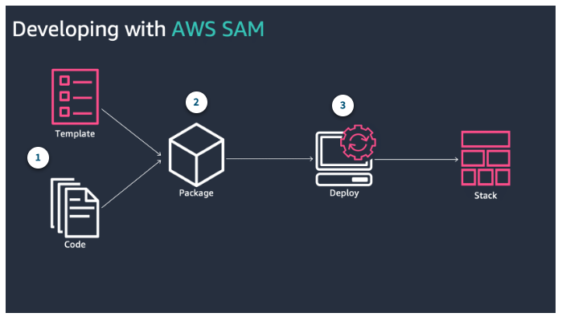
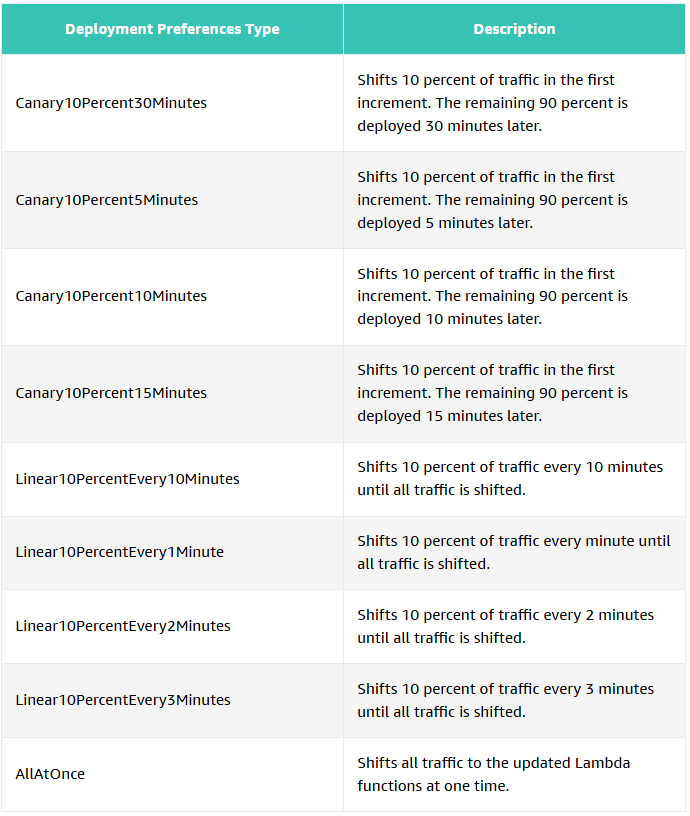
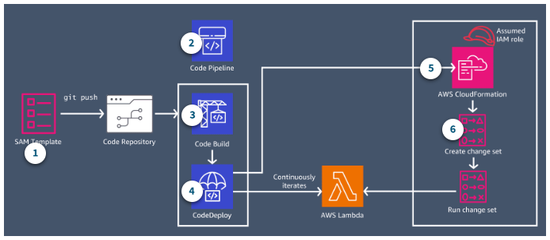
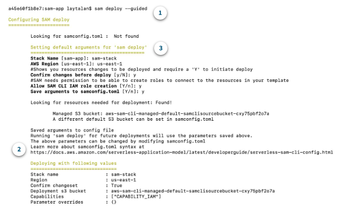
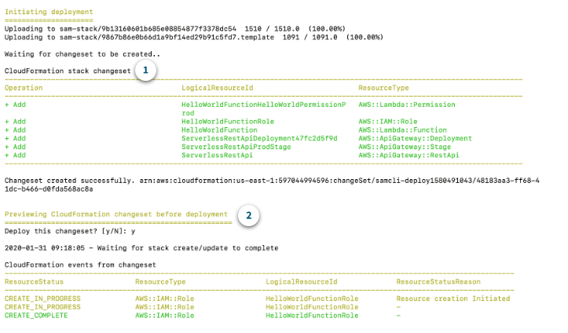

#### `PREVIOUS TOPIC:` [CloudFormation](6_Serverless-CloudFormation.md)

-----

# Serverless Application Deployment [^](../../README.md#3-aws-certified-developer-associate)

1. Understanding Serverless Deployments

## Managing Serverless Deployments
- Well-designed serverless applications are decouples, stateless, and use minimal code.
- The goal is to maintain the simplicity of the design and low-code implementation as the project grows.
- The distributed nature of serverless applications creates the need for a standardized process for customers.

## AWS Serverless Application Model (AWS SAM)
- Open source framework used to build serverless applications.
- Provides with a shorthand syntax to express functions, APIs, databases, event source mappings
- During deployments, SAM transforms and expands SAM syntax into an AWS CloudFormation syntax who then provisions resources with reliable deployment capabilities.
- Made up of two (2) main components: **SAM templates** and **SAM CLI**

### SAM Templates
- an extension of the AWS CloudFormation templates with some additional components to make easier to work with.
- Requires the use of the transform directive and a resource block with a corresponding type.
  - **Transform directive:** takes an entire template written in AWS SAM syntax and transforms and expands it into a compliant AWS CloudFormation template
  - **Resource Type:** dictate what type of resource that will be provisioned such as:
    - `AWS::Serverless::Api`
    - `AWS::Serverless::Application`
    - `AWS::Serverless::Function`
    - `AWS::Serverless::LayerVersion`
    - `AWS::Serverless:SimpleTable`

### SAM CLI

- Use the SAM CLI to emulate the environment and perform local tests on the local code.
- After the code and templates are validated, use the `SAM package` command to create deployment package, which is essentially a .zip file that SAM stores in Amazon S3.
- `SAM deploy` command instructs the AWS CloudFormation to deploy the .zip file to create resources inside the AWS Console.

### Serverless Pattern Collection
A repository of serverless examples that demonstrates integrating two or more AWS services using either AWS SAM or AWS CDK.

- `Quick Link:` [Serverless Patterns Collection](https://serverlessland.com/patterns)

2. Deployment Pipeline Automation

## Lambda Versioning and Aliases
When a Lambda function is created, there is only one version called `$LATEST`. Anytime a version is publish, Lambda takes a snapshot copy of $LATEST to create the new version. This copy cannot be modified.

### Lambda Alias
- a pointer to a specific function version.
- By default, an alias points to a single Lambda version
- When the alias is updated to point to a different function version, all incoming request traffic will be redirected to the updated Lambda function version.
- **Traffic shifting** helps validate that the new Lambda version works as expected, before sending all production traffic to it.

## Deployment Strategies

### All-at-once Deployment
- Instantly shift traffic from the original (old) Lambda function to the updated (new) Lambda function, all at one time.
- Can be beneficial when the speed of deployments matter.
- The new version of the code is released quickly, and all users get to access it immediately.

### Canary Deployment
- Deploy the new version of application and shift a small percentage of production traffic to point to that new version.
- After validating that the version is safe and not causing errors, direct all traffic to the new version of the code.

### Linear Deployment
- Similar to canary deployment. Direct a small amount of traffic to the new version at first.
- After a specified period of time, automatically increment the amount of traffic to point to the new version until 100% of production traffic is reached.

## Deployment Preferences with AWS SAM
- Traffic shifting with aliases is directly integrated into AWS SAM by embedding the deployment type to the template (deployment preferences section)
- `AWS CodeDeploy` uses the deployment preferences section to manage the function rollout as part of the AWS CloudFormation stack update.

### Deployment Preference Types

### AWS SAM Components
- **Hooks** - Sanity checks to test and perform actions against the code
- **Pre-traffic hook** - Started before the alias can accept traffic
- **Post-traffic hook** - Started after traffic shift
- **Alarms** - Helpful to trigger the rollback process

## Creating a Deployment Pipeline
- CI/CD pipeline helps automate the steps required to release software deployment and standardize on a core set of quality checks
- CI/CD pipeline is mainly made up of four steps:
  - `Source` - The actual source code, peer reviewing
  - `Build` - Code compilation, unit tests, code linting, quality checks, check styles, container creation, images and function deployment packages
  - `Test` - Perform integration testing with other systems, load testing, UI testing, and security testing
  - `Production` - Deploy to production environment, monitor code in production to quickly detect errors.

### Pipeline Process

1. With AWS SAM template in the code repository
2. When a code is pushed on the target repository branch, CodePipeline copies the source code into an S3 bucket and passes it to CodeBuild.
3. AWS CodeBuild gets the source code, tests, lints, runs security checks, installs dependencies, and prepares the SAM template for deployment
4. AWS CodeDeploy is started by SAM to manage the Lambda deployment configuration previously defined in the template.
5. CodeDeploy calls CloudFormation to create or update CloudFormation stack using changesets.
6. AWS CloudFormation is used to create or update an AWS CloudFormation stack.

## AWS SAM Pipelines
- a feature of AWS SAM that automates the process of creating a continuous delivery pipeline.
- Provides templates for popular CI/CD systems such as AWS CodePipeline, Jenkins, GitHub Actions, Bitbucker Pipelines, Gitlab CI/CD.

### SAM Pipelines Commands
AWS SAM Pipelines is composed of two (2) commands:
- **sam pipeline bootstrap** - a configuration command that creates the AWS resources and permissions required to deploy application artifacts from the code repository into the AWS environments.
- **sam pipeline init** - an initialization command that generates a pipeline configuration file that CI/CD system can use to deploy serverless applications using AWS SAM.

## SAM template commands

- ``sam delpoy --guided``
  - This mode walks through the parameters required for deployment, provides default options, and saves input for the given application
  - The configurations chosen in the default arguments will be saved to the **samconfig.toml** file. Change configurations by modifying this file.

------
`NEXT TOPIC` [Security - AWS IAM]()

