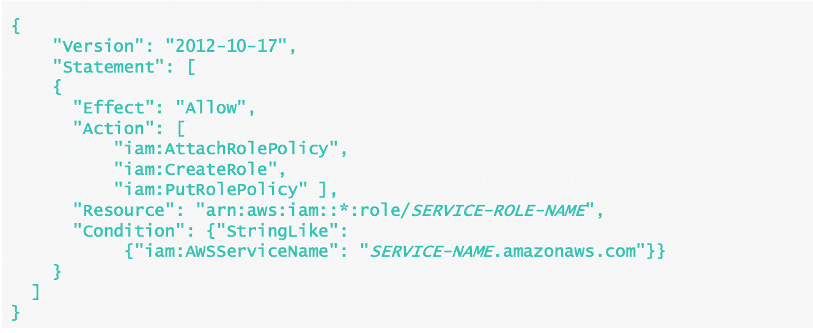
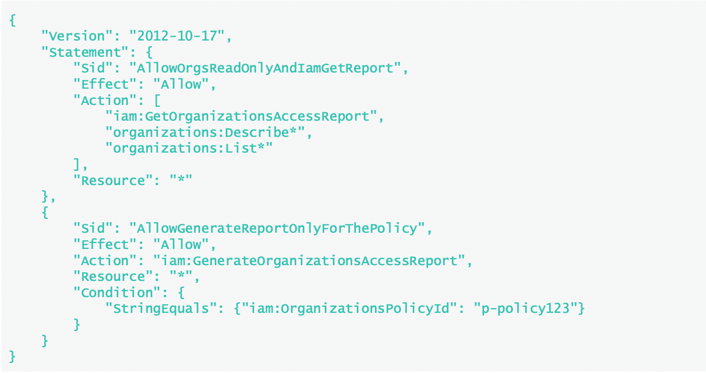
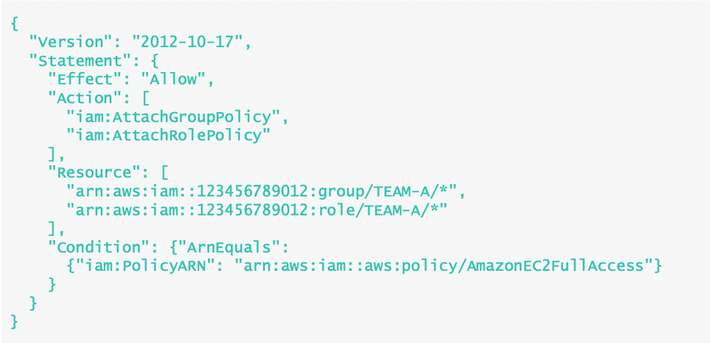
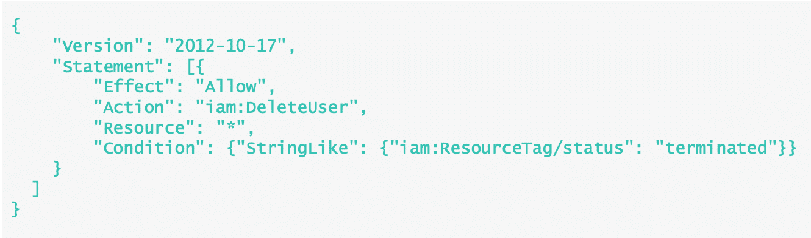
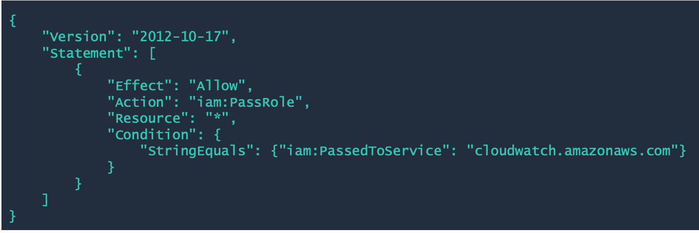
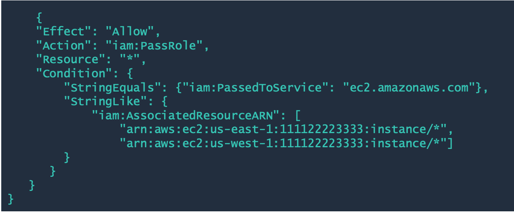

# IAM - Access Control Deep Dive

<div>
<details>
<summary>1. General Ideas</summary>

## Important
- User access points are called API endpoints.
- Every action taken in the AWS account is via APIs.
- All the API endpoints support HTTP and TLS encryption during the transmission to protect request/response from being viewed in transit.
- No matter the means used to access AWS, each API request is authenticated and authorized via IAM and recorded by AWS CloudTrail as it crosses the AWS API interface.

## Specifying Principals in a Policy

### 1. AWS Accounts
- When used as the principal in a policy, authority is delegated to the account within that account.
- The permission in the policy statement can be granted to all identities, including IAM users and roles in that account.
- Specified using ARN or a shortened form that consists of the aws prefix followed by the account number

```json
{"Principal": {"AWS": "arn:aws:iam:123456789012:root" } }
```
```json
{ "Principal": { "AWS": "123456789012" } }
``` 

### 2. IAM Users
- When one principal is mentioned in the element, permission is granted to each principal.
- This is a logical OR and not a logical AND because authentication is done one principal at a time.
- The username is case-sensitive. Wildcard (*) is cannot be used.

```json
{"Principal": {"AWS": "arn:aws:iam:123456789012:user/myUserName"} }
```

```json
{
  "Principal": {
    "AWS": [
      "arn:aws:iam:123456789012/username1",
      "arn:aws:iam:123456789012/username2"
    ]
  }
}
```

### 3. Federated Users
- Manage identities outside of AWS using Identity Provider (IdP) and give permissions to use AWS resources in the account.
- IAM supports SAML-based IdPs and web identity providers such as Login with Amazon, Amazon Cognito, Facebook, or Google.

```json
{
  "Principal": { "Federated": "www.amazon.com" }
}
```

```json
{
  "Principal": { "Federated": "arn:aws:iam::123456789012:saml-provider/provider-name" }
}
``` 

### 4. IAM Roles
Delegate access to users, applications, or service that does not usually have access to AWS resources

```json
{"Principal":  { "AWS":  "arn:aws:iam:123456789012:role/<role-name>"} }
```

### 5. AWS Services
- IAM roles that can be assumed by an AWS Service is called **Service roles**.
- Service roles must include a **trust policy**, which are resource-based policies that are attached to a role that define which principals can assume the role.
- A **Service Principal** is an identifier that is used to grant permissions to a service.
- The common format of an identifier is `long_service_name.amazonaws.com`.

```json
{
  "Version": "2012-10-17",
  "Statement": [
    {
      "Effect": "Allow",
      "Principal": {
        "Service": [
          "elasticmapreduce.amazonaws.com",
          "glue.amazonaws.com"
        ]
      },
      "Action": "sts:AssumeRole"
    }
  ]
}
```

</details>
</div>


<div>
<details>
<summary>2. Attributes and Tagging</summary>

## Attribute-based Access Control (ABAC)
- authorization strategy that defines permissions based on attributes. These attributes are called tags.
- Tags can be attached to IAM principals (users or roles) and AWS resources.
- These ABAC policies can be designed to allow operations when the principal's tag matches the resource tag.

### Benefits of ABAC Method

1. **Scalable**
2. **Manageable**
3. **Granular Permissions**


## Role-based Access Control (RBAC)
- The traditional model of access control
- Implement role-based access control by creating policies for each job function.
- IAM users, groups, or application can assume these policies via roles.
- Each policy contains permissions that allow access to a specific set of resources.


</details>
</div>


<div>
<details>
<summary>3. IAM Condition Keys</summary>

## IAM Condition Keys
- The condition key specified can be a service-specific or a global condition key.
- Service-specific condition keys have the service's prefix. For example, Amazon EC2 lets write a condition using the `ec2:InstanceType` key, which is unique to that service.


### `iam:AWSService`
- Used to control access for a specific service role.
- Many AWS services require that roles to be used to allow the service to access resources in other services on the user's behalf.

> **Service Role** - A role that a service assumes to perform action on the user's behalf

To allow an IAM entity to create a specific service role, add the following policy to the IAM entity that needs to create the service role.
This policy allows to create a service role for the specified service and with a specific name




### `iam:OrganizationsPolicyId`
- Provides the IAM entity access to specific SCPs. For those account that are members of an AWS OU.

The example shown here is an IAM policy that allows viewing service last accessed information for SCP with the p-policy123 ID. This policy also allows the requester to retrieve the data for any Organizations entity in their organization.



### `iam:PermissionsBoundary`
Checks that the specified policy is attached as a permissions boundary on the IAM principal resource.

### `iam:PolicyARN`
- checks the ARN of a managed policy in requests that involve the same managed policy.
- For example, create a policy that allows users to attach only the IAMUserChangePassword AWS managed policy to a new IAM user, group, or role.



- In the policy above, the iam:PolicyARN condition ensures that permissions are allowed only when the policy being attached matches the AWS managed policy in the condition.
- The user is allowed to attach policies to only the groups and roles that include the path /TEAM-A/

### `iam:ResourceTag`
- Checks that the tag attached to the identity resource, either a user or role, matches the specified key name and value provided.


A policy that shows how a policy that allows deleting users with only the status=terminated tag 

## Condition Keys for Passing roles
- To pass a role to an AWS service, a user must have the proper permissions
- In order to allow a user to pass a role to an AWS service, the `iam:PassRole` action must be added to its IAM policy.

### 1. `iam:PassedToService`
- specifies the service principal of the service to which a role can be passed
- used to restrict users so that they can pass roles only to specific services and ensure that users create service roles only for the services specified.
- A service principal is the name of a service that can be specified in the Principal element of a policy in the following format: `SERVICE_NAME_URL.amazonaws.com`

```text
"Condition": { "StringEquals": { "iam:PassedToService": "cloudwatch.amazonaws.com" } }
```



For example, a user might create a service role that trusts Amazon CloudWatch to write log data to an Amazon S3 bucket on their behalf. In this case, the trust policy must specify cloudwatch.amazonaws.com in the Principal element. If a user with the policy below attempts to create a service role for Amazon EC2, the operation will fail. The failure occurs because the user does not have permission to pass the role to Amazon EC2.


### 2. `iam:AssociatedResourceArn`
- Specifies the ARN of the resource to which this roles will be associated at the destination service.
- Use this condition key in a policy to allow an IAM entity to pass a role but only if that role is associated with the specified resource.


- The `iam:PassedToService` and `iam:AssociatedResourceArn` condition keys allows an IAM entity to pass any tole to the Amazon EC2 service to be used with instances in the us-east-1 or us-west-1 Region.
- The IAM user or role would not be allowed to pass roles to other services, and it does not allow Amazon EC2 to use the rolw with instance in other regions.

</details>
</div>


