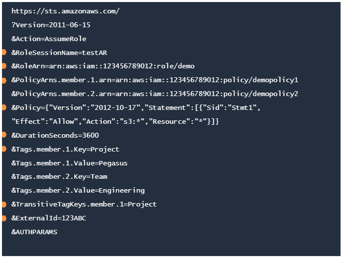
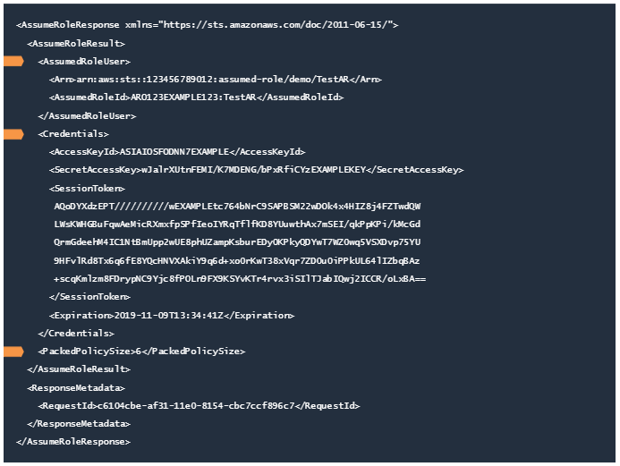
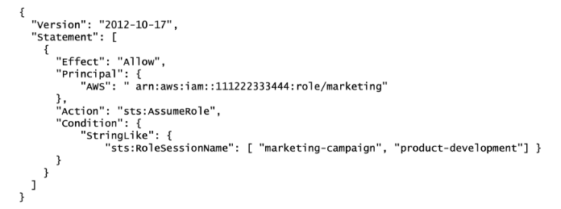
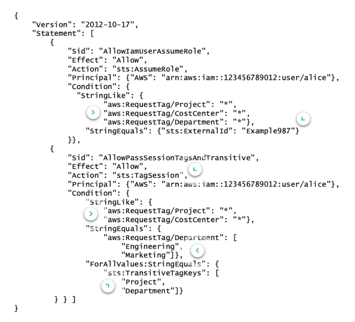
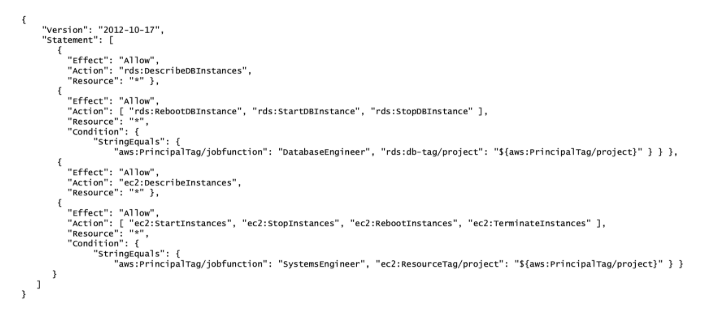
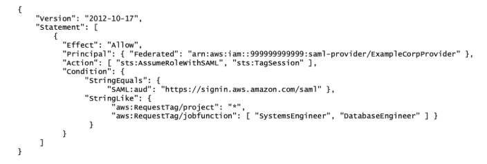
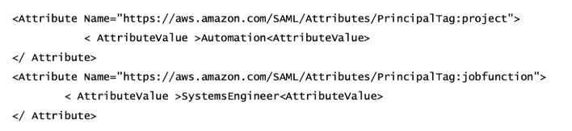

#### [Security - Access Control](1_Security-Access-Control.md)
------
# IAM - Access Delegation Deep Dive [^](../../README.md#3-aws-certified-developer-associate)

<div>
<summary>
<details>1. AWS Security Token Service (AWS STS)</details>

## AWS Security Token Service (AWS STS)
- Create and provide trusted IAM users or authenticated users (federated users) with temporary security credentials that can control access to AWS resources.
- Temporary security credentials are required when assuming an IAM role, they work almost identically to the long-term access key credentials.
- Temporary security credentials can be configured to last from **few minutes to several hours**
- Temporary security credentials are not stored with the user but are generated dynamically and provided to the user when requested.
- AWS STS is available as a global resource by default.
- all AWS STS API requests go to a single endpoint at `https://sts.amazonaws.com`
- The `AssumeRole API` request is made when a user or application requires temporary credentials to access AWS resources.
- The temporary credentials consists of:
  - **access key ID**
  - **secret access key**
  - **security token**
- Each time a role is assumed and a set of temporary security credentials is generated, an **IAM role session** is created.

## The `AssumeRole` request
Typically use for account or cross-account access.


- `DurationSeconds` - Last for 1 hour by default. However, this can be updated to specify the duration and further control the session. Value from **900 seconds (15 minutes) up to 12 hours**
- `Policy` - includes the IAM policy wanted to be use as an inline session policy. The resulting session's permission are the intersection of the role's identity-based policy and the session policy.
- `PolicyArns.member.N` - Includes the ARNs of the IAM managed policies that is wanted to be used as managed session policies. Provide up to **10 managed policy ARNs**.
- `Tags.member.N` - Lists the session tags that is wanted to pass with the role. Each session tag consists of a key name and an associated value.
- `SerialNumber` and `TokenCode` - Include MFA information when AssumeRole is called with these parameters.

## The `AssumeRole` response
The AssumeRole call returns a set of temporary security credentials for users who have been authorized by AWS STS.




</summary>
</div>

<div>
<summary>
<details>2. Managing Role Sessions</details>

## Scoping Down Permissions
- By default, all users assuming the same role get the same permissions for their role session.
- To further restrict overall permissions, users or systems can set a session policy when assuming a role.

### Session Policy
- A Session Policy is an inline permissions that users pass in the session when assuming the role.
- The policy can be passed by the user itself or configure the broker to insert the policy when the identities federate in to AWS.
- Reduces the number of roles needed to create because multiple users can assume the same role yet have unique session permissions.

### How Session Policies are applied

#### Identity-Based Policy
- When a session policy is passed, the resulting permissions are the **intersection** of the IAM entity's identity-based policy and the session policies.
- Use AWS managed or customer managed policies as session policies and also apply the same session permissionn for multiple sessions

#### Resource-Based Policies
- For resource-based policies, the ARN of the user or role is specified as a principal. Hence the permissions from the resource-based policy are added to the role or user's identity-based policy before the session is created.
- The session policy limits the total permissions granted by the resource-based policy and the identity-based policy
- The resulting permissions are the intersection of the session policies and either the resource-based policy or the identity-based policy.

### Use Case

#### Session Policy created by a IAM role assumer to access only a certain S3 bucket
```json
{
  "Version" : "2012-10-17",
  "Statement": [{
    "Sid": "Statement1",
    "Effect": "Allow",
    "Action": ["s3:GetBucket", "s3:GetObject"],
    "Resource": ["arn:aws:s3:::NewHireOrientation", "arn:aws:s3:::NewHireOrientation/*"]
  }]
}
```

#### Pass the session policy using AWS CLI which calls the AssumeRole API 
```bash
aws sts assume-role \
--role-arn "arn:aws:iam:111122223333:role/SecurityAdminAccess" \
--role-session-name "s3-session" \
--policy file://policy.json
```

## Naming Individual Session
For more control, Amazon STS provides a condition key called `sts:RoleSessionName` that controls how IAM principals and applications name their role sessions when assuming an IAM role.

For example, the policy below allows IAM users to assume the role to which the policy is attached.

```json
{
  "Version": "2012-10-17",
  "Statement": [
    {
      "Sid": "RoleTrustPolicyRequireUsernameForSessionName",
      "Effect": "Allow",
      "Action": "sts:AssumeRole",
      "Principal": {"AWS": "arn:aws:iam::111122223333:root"},
      "Condition": {
        "StringLike": {"sts:RoleSessionName": "${aws:username}"} }
    }
  ]
}
```

This policy does not allow anyone using temporary credentials to assume the role because the username variable is present for only IAM users.

### Ways to name a role session

#### 1. AWS Service
In some cases, AWS sets the role session name on the user's behalf.

| IAM Role for                 | Session Name (Example)                            |
|------------------------------|---------------------------------------------------|
| Amazon EC2 Instance          | Instance ID (i-0502a47dcf551c555)                 |
| AWS Lambda Function          | Function name (aws-ct-processing)                 |
| Amazon Cognito Identity Pool | Cognito identity credentials are the session name |

#### 2. SAML-Based
When the `AssumeRolewithSAML` API is used, AWS sets the role session name value to the attribute provided by the identity provider which is defined by the administrator.

#### 3. User-Defined
In other cases, you provide the role session name when assuming the IAM role. For example, when assuming an IAM role with APIs such as AssumeRole or AssumeRoleWithWebIdentity, the role session name is a required input parameter that you set when making the API request

### Use Cases


- The principal will restrict who can access the IAM role.
- Use the `sts:RoleSessionName"` condition to define the acceptable role session names.

## CloudTrail event of AssumeRole call

```json
{
  "eventVersion": "1.05",
  "userIdentity": {
    "type": "AWSService",
    "invokedBy": "lambda.amazonaws.com"
  },
  "eventTime": "2019-08-26T11:15:26Z",
  "eventSource": "sts.amazonaws.com",
  "eventName": "AssumeRole",
  "awsRegion": "us-west-2",
  "sourceIPAddress": "lambda.amazonaws.com",
  "userAgent": "lambda.amazonaws.com",
  "requestParameters": {
    "roleSessionName": "backend-logic-fn",
    "roleArn": "arn:aws:iam::123456789012:role/backend-logic-fn-role"
  },
  "responseElements": {
    "credentials": {
      "sessionToken": "AgoJb3JpZ……2luX2VjEJz",
      "accessKeyId": "ASIAUF7B273EXAMPLE",
      "expiration": "Aug 26, 2019 11:15:26 PM"
    }
  }
}

```

</summary>
</div>

<div>
<summary>
<details>3. Session Tagging</details>

## Session Tags
- attributes passed in an IAM role session when assuming a role or federating a user using the AWS CLI or AWS API.
- Use for access control in IAM policies and for monitoring.
- To be able to add session tags, the `sts:TagSession` action must be allowed in the IAM policy.



### Considerations for Session Tags

1. Session tags are principal tags specified while requesting a session.
2. Session tags must follow the [rules](https://docs.aws.amazon.com/IAM/latest/UserGuide/id_tags.html#id_tags_rules_creating) for naming tags in IAM and AWS STS.

> IAM roles and IAM users are NOT case-sensitive when it comes to tags. (e.g. Department=marketing, department=hr, the result will be Department=hr)

3. New session tags override existing assumed role or federated user tags with the same tag key, regardless of case.
4. Session tags cannot be passed using the AWS Management Console
5. Session tags are valid for only the current session
6. Use Session tags to control access to resources or to control the tags that can be passed into a subsequent session
7. Pass a maximum of 50 session tags
8. View the principal tags for the session, including its session tags, in the AWS CloudTrail logs.

## Role Chaining
- Occurs when a role is used to assume a second role through the AWS CLI or API.
- Assume one role and then use the temporary credentials to assume another role and continue from session to session.
- By default, tags are not passed to subsequent role sessions. However, session tags can be set as transitive to ensure that those session tags pass to subsequent sessions in a role chain.

### Use Case

- This is the policy attached to an IAM Role
- The policy allows specific actions related to EC2 to SystemsEngineer and RDG to DatabaseEngineer.


- This is the modified role trust policy which trusts a SAML IdP.
- Notice the condition that requires the jobfunction and project attributes to be included as session tags when engineers assume this role.


- The SAML IdP configuration must be updated to include jobfunction and project attributes as session tags in the SAML.
- This tells AWS about the external identity provider (IdP)


</summary>
</div>

-----
#### [Identity Federation](3_Security-Identity-Federation.md)