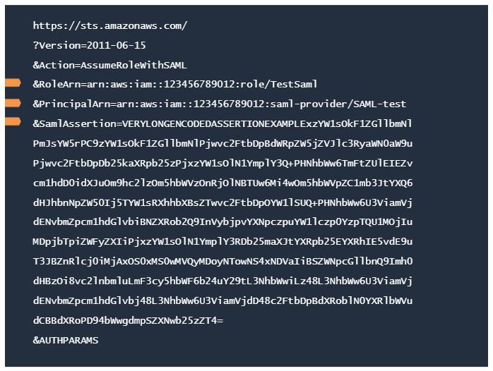
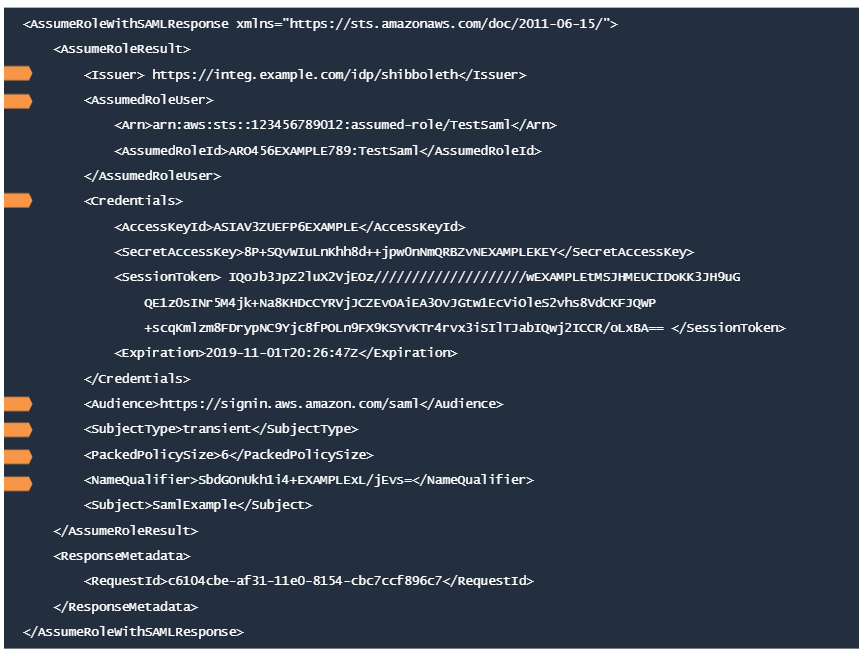
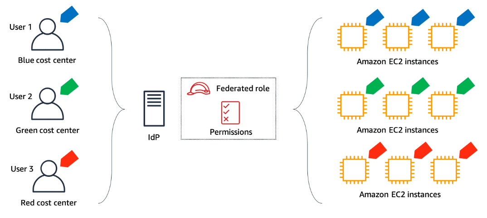
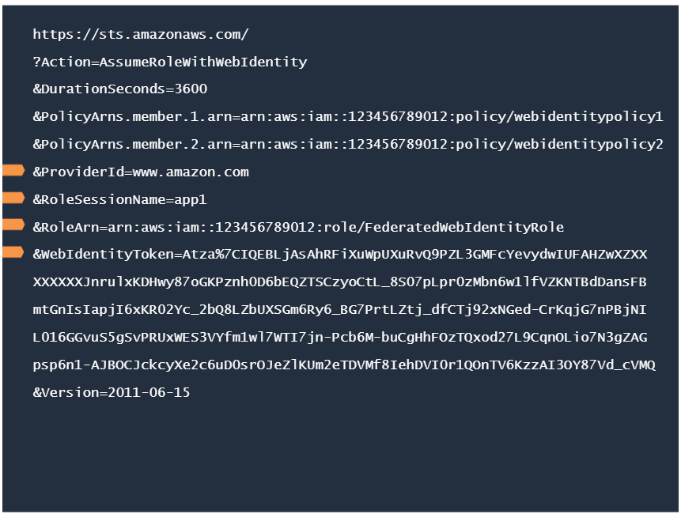
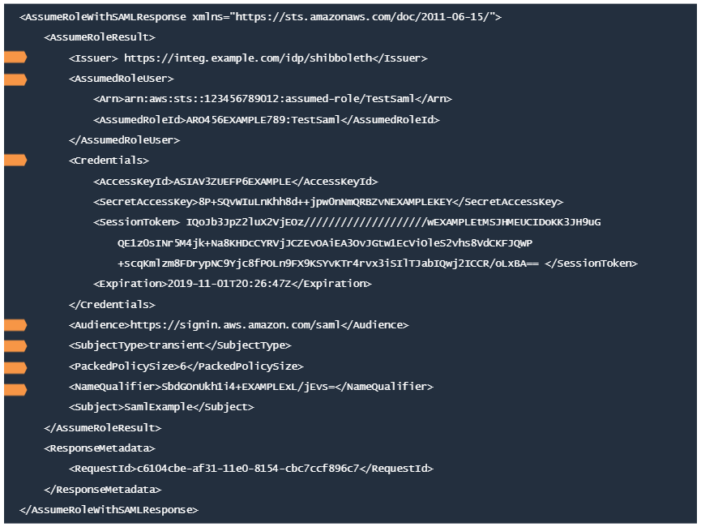
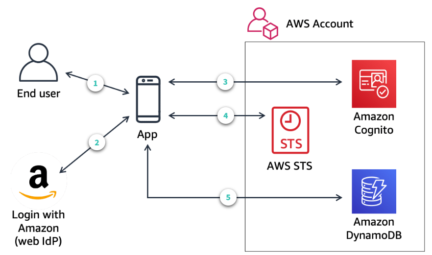

#### [Access Delegation](2_Security-Access-Delegation.md)

----
# IAM - Access Federation Deep Dive [^](../../README.md#3-aws-certified-developer-associate)

1. Federating Users in AWS

## Federation Process

1. **Trust**
   - A trust relationship is configured between the Identity Provider (IdP) and the service provider.
   - The service provider trusts the IdP to authenticate users and relies on the information provided by the IdP about the users.
2. **IdP**
   - After authenticating a user, the IdP returns a message (called _assertion_) containing the user's sign-in name and other attributes that the service provider needs to establish a session with the user and to determine the scope of the resource access.
3. **Service Provider**
   - Receives the assertion from the user.
   - Validates the level of access requested
   - Sends the user the necessary credentials to access the desired resources.
4. **Access Granted**
   - With the right credentials from the service provider, the user now has direct access to the requested resources via an established session

AWS supports commonly used open identity standards, including Security Assertion Markup Language 2.0 (SAML), OIDC, and OAuth 2.0.

## AWS Services that support identity federations
- `AWS IAM Identity Center` - SSO to AWS accounts and centrally managed access to resources
- `AWS IAM` - Fine-grained access to AWS
- `Amazon Cognito` - Access to Web and mobile apps

2. SAML-Based Federation

#### `Quick Link:` [SAML 2.0-based Federation Overview](https://docs.aws.amazon.com/IAM/latest/UserGuide/id_roles_providers_saml.html)

## The `AssumeRoleWithSAML` Request
- The SAML IdP must be configured to issue the claims that the AWS requires before the **AssumeRoleWithSAML** request can be called.
- Additionally, IAM must be used to create a SAML provider entity in the AWS account that represents the identity provider.
- an IAM role must be created that specified the SAML provider in the trust policy of the IAM policy that represents the IdP.

> `&RoleArn` - ARN of the role that the federated user is assuming

> `&PrincipalArn` - ARN of the SAML provider configured in the IAM that describes the IdP.

> `&SamlAssertion` - Base-64 encoded SAML authentication response that the IdP provides. The Service Provider uses this response to grant access to resources.

### Optional Parameters

- **Duration Seconds**
  - Role session lasts ranging from 900 seconds to the maximum session of 12 hours.
  - The default is 3600 seconds.
  - Session depends also on the time specified in the SAML authentication response's `SessionNotOnOrAfter` value (whichever is shorter).
- **Policy**
  - Includes the IAM policy that you want to use as an inline session policy.
  - The resulting session's permissions are the intersection of the role's identity-based policy and the session policies.
- **PolicyArns.member.N**
  - Includes the ARNs of the IAM managed policies that you want to use as managed session policies.
  - The policies must exist in the same account as the role.
  - Up to 10 managed policy ARNs.

## The `AssumeRoleWithSAML` Response
- The `AssumeRoleWithSAML` call returns a set of temporary security credentials for users who have been authenticated via a SAML authentication response.
- This operation provides a mechanism for tying an enterprise identity store or directory to a role-based AWS access without user-specific credentials or configuration.

> `<Issuer></Issuer`: Refers to the entity ID of the IdP which is a URL that uniquely identifies the SAML identity provider. SAML Assertions sent to the service provider must match this value exactly in the attribute of the SAML assertion.

> `<AssumedRoleUser></AssumedRoleUser>`: contains the ARN of the issued temporary credentials and the unique identity of the role ID and role session name.

> `<Credentials></Credentials>`: Contains the temporary security credentials, which include an access key ID, a secret access key, a security (or session) token, and the session expiration time.

> `<Audience></Audience>`: Specifies the specific audience of the SAML assertion that it is intended for. The audience is the service provider and is typically a URL.

> `<SubjectType></SubjectType`: format of the name identifier of the subject field. An identifier intended to be used for a single session only is called a **transient identifier**.

> `<PackedPolicySize></PackedPolicySize>`: A percentage value that indicates the packed size of the combined session policies and session tags that were passed in the request. The request fails if the packed size is greater than 100%, which means the policies and tags exceeded the allowed space

> `<NameQualifier></NameQualifier>`: a hash value based on the concatenation of the user response value, the AWS account ID, and the name of the SAML provider in IAM. The combination of a NameQualifier and the Subject can be used to uniquely identify a federated user.

### Using ABAC for identity federation

An IdP is configured to include "CostCenter" as a session tag when users federate into AWS using an IAM role.
All federated users assume the same role but are granted access only to AWS resources belonging to their cost center.

- The IAM role for this scenario would then grant access to project resources based on the CostCenter tag with the ec2:ResourceTag/CostCenter condition key.
- whenever users federate into AWS using this role, they get access to only the resources belonging to their cost center based on the CostCenter tag included in the federated session

3. Web-Based Federation

## The `AssumeRoleWithWebIdentity` Request
- An identity token from a supported IdP and an IAM role to be assumed must be available before the application can call the `AssumeRoleWithWebIdentity`.
- Calling the `AssumeRoleWithWebIdentity` does not require the use of AWS security credentials. Therefore, it is possible to distribute an application (e.g. on mobile devices) that requests temporary security credentials without including long-term AWS credentials in the application.
- There is no need to deploy server-based proxy services that use long-term AWS credentials.
- The identity of the caller is validated by using a token from the web identity provider.

## The `AssumeRoleWithWebIdentity` Response
- The temporary security credentials returned by the API consists of:
  - **access Key ID**
  - **secret access key**
  - **security token**

## Amazon Cognito for Mobile Applications
- Lets add user sign-up, sign-in, and access controls to web and mobile apps.
- define roles and map users to different roles so that the app can access only the resources that are authorized for each user.
- Support sign-in with social identity providers such as Apple, Facebook, Google, and Amazon, and enterprise identity providers via SAML 2.0.

4. IAM Identity Center for User Federation

## IAM Identity Center
- Centrally manage federated access to multiple AWS accounts and business applications.
- Provide users with SSO access to all assigned accounts and applications from one place.
- Use identity center directory, existing Microsoft Active Directory, or external IdP.

## AWS Access via Permission Sets
- A **permission set** is a collection of administrator-defined policies that IAM Identity Center uses to determine a user's effective permissions to access a given AWS account.
- Permission sets can contain either AWS-managed policies or custom policies.
- Permission sets are provisioned o the AWS account as IAM roles and are presented to users as such.
- Users who have multiple permission sets must choose one of the roles when they sign in to the AWS access portal

