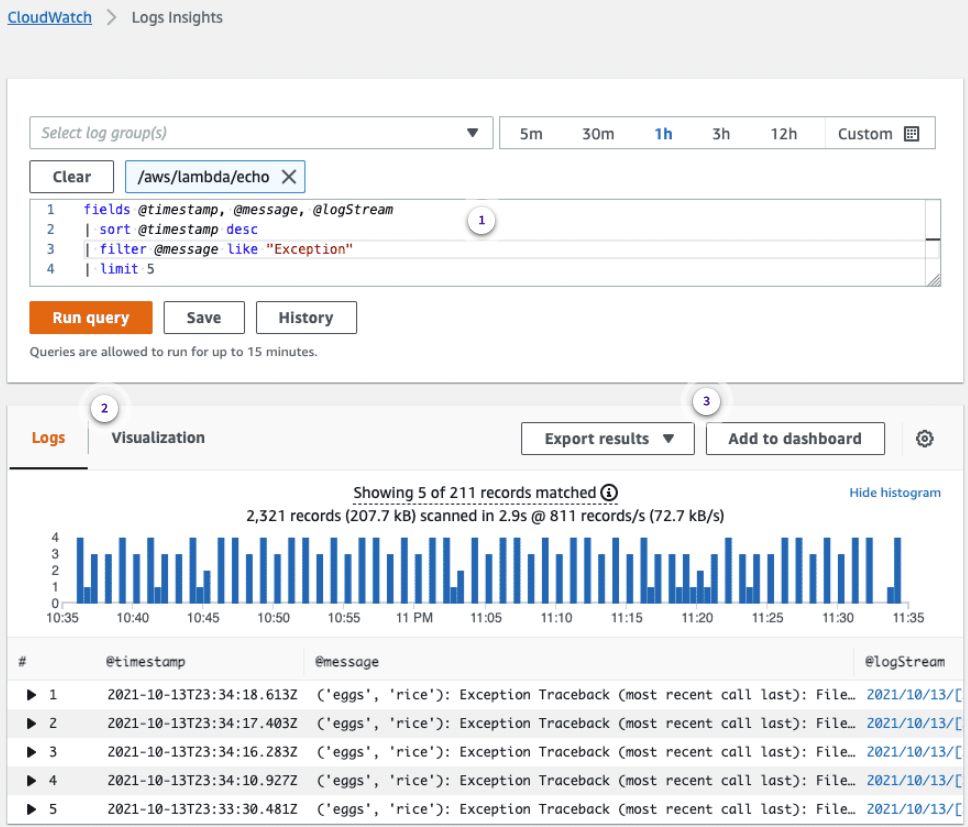

# Troubleshooting - Lambda [↑](../README.md#1-aws-cloud-practitioner-notes)

<div>
<details>
<summary>1. Troubleshooting Resources</summary>

## Identifying Problems

### Identify the problem
- What errors are you getting?
- Can you reproduce the issue?

### Collect Data
check metrics, logs, or traces for the function in question in the Lambda console

### Analyze the Data
- Analyze data to pinpoint one or more possible root causes
- It might be helpful to use tool for analyzing data such as Amazon CloudWatch Logs insights

### Review Documentation
Search the product and service documentation for known issues and solutions

### Try Documented Solutions
Apply the documented solutions one at a time and test. If there is a series of proposed fix, apply one at a time. Then test until the problem is fixed

## Obtain information from AWS CLI

```bash
aws lambda get-function --function-name echo --region us-east-1
```

## Function Metrics
- Lambda automatically monitors Lambda functions on your behalf and reports metrics through CloudWatch.
- Metrics are automatically tracked such as:
  - Number of requests
  - Invocation duration for each request
  - number of requests that results in error.

### Important CloudWatch metrics
- **Invocations**
- **Duration**
- **Error count and success rate**
- **Throttles**
- **IteratorAge**
- **Asynchronous invocation metrics**
  - `AsyncEventsReceived`: The number of events that Lambda successfully queues for processing. A mismatch between this metric and Invocations can indicate disparity in processing, events being dropped, or a potential queue backlog.
  - `AsyncEventAge`: The time between Lambda successfully queues the event and when the function is invoked. This metric increases when the events are being retried due to invocation failures or throttling
- **Concurrent executions** - The number of function instances that are processing events

## Function Logs
Lambda automatically integrates with Amazon CloudWatch Logs and pushes all logs from code to a log group in CloudWatch Logs associated with a Lambda function.

## Investigate using CloudWatch Logs Insights

### System Fields

- `@message`: Contains the raw, unparsed log event. This is the equivalent to the message field in `InputLogEvent`
- `@timestamp`: Contains the event timestamp in the log event's timestamp field.
- `@ingestionTime`: Contains the time when CloudWatch Logs received the log event.
- `@logStream`: Contains the name of the log stream that the log event was added to. Log streams group logs through the same process that generated them
- `@log`: A log group identifier in the form of **account-id:log-group-name**. When querying multiple log groups, this can be useful to identify which log group a particular event belongs to.




</details>
</div>

<div>
<details>
<summary>2. Common Lambda Issues</summary>

## Function Timeout Issues
The function tries to access a resource or endpoint that it cannot reach, which results in configured Lambda function timeout.

### Symptoms
- Non-zero error metrics coupled with duration metrics that reach the configured function timeout.
- Function's CloudWatch logs contains occurrences of **Task timed out after X seconds** with no subsequent context or details as to why the task timed out.

### Possible Causes
1. Function hangs on block of code, network, or API call
2. Invalid network path
3. Lack of internet access

### Resolution Options
1. **Check Lambda Logs**
2. **Check Lambda Errors**
3. **Check Amazon VPC settings** - There might be misconfiguration in internet gateway
4. **Change the AWS SDK Settings** - Configure the retry count and timeout settings to give enough time for API call to get a response.

## Throttle Issues
Occurs when too many invocation requests are sent to a Lambda function or a function's code sends too many requests to a downstream API.

### Symptoms
- Lambda function is producing **Rate Exceeded** and **429 TooManyRequestsException** errors
- Throttles that are not occurring in the Lambda but in the API calls.
- Lambda function Throttle metric presents non-zero data points.

### Possible Resolutions

1. **Confirm resource being throttled**
   - Throttling on invocation requests
   - Throttling on API calls made during invocation
2. **Check functions concurrency metrics**
   - Compare the **ConcurrentExecutions** metric (Maximum) to the **Throttles** metric (Sum) for the same timestamp.
   - Check if the function's concurrency scaling rate is exceeded
   - Check for spikes in Duration metrics for the function. There might be not enough compute resources.
   - Check for an increase in Error metrics for the function. Errors can lead to retries and cause an overall increase in invocations
3. **Configure Reserved Concurrency**
   - If a function is configured to have zero reserved concurrency, it will throttle because it can't process any events.
   - Review the maximum statistic in CloudWatch for the function
   - Increase the reserved concurrency for the function by calling the **PutFunctionConcurrency** API.
4. **Use Exponential Backoff in the application**
5. **Configure a DLQ**

## Deployment Package Issues
When a function is updated, Lambda deploys the change by launching new instances of the function with the updated code or settings.
Deployment errors prevent the new version from being used and can arise from issues with deployment package, code, permissions, or tools.

### Symptoms
- Unable to import module error (e.g. **Unable to import module 'index': No module named index**)
- Permission denied error (e.g. **module initialization error: [Errno 13] Permission denied: '/var/task/lambda_function.py'**)

### Possible Causes
- Deployment package was created with an improper file structure
- Deployment package's contents do not have the required file permissions (UNIX permissions: 644 on files, 755 on directories)
- The deployment package contains one or more binaries that have been compiled for a platform or architecture that is incompatible with the underlying environment Lambda.

### Resolution

1. Confirm which file or folder is the cause of the error
2. Update the permissions for the deployment package

## Access Denied Issues
Prevent Lambda functions from running. Occurs when a Lambda function tries to access other AWS services in a different account and the Lambda runtime role does not have correct permissions

### Resolution
Configure Lambda function's runtime role to assume an IAM role in another account

#### Inline policy
```json
{
  "Version": "2012-10-17",
  "Statement": {
    "Effect": "Allow",
    "Action": "sts:AssumeRole",
    "Resource": "arn:aws:iam::222222222222:role/role-on-source-account"
  }
}
```

#### Trust policy
```json
{
  "Version": "2012-10-17",
  "Statement": [
    {
      "Effect": "Allow",
      "Principal": {
        "AWS": "arn:aws:iam::111111111111:role/my-lambda-execution-role"
      },
      "Action": "sts:AssumeRole"
    }
  ]
}
```

#### Python Function Code
```jupyter
import boto3
def lambda_handler(event, context):
  sts_connection = boto3.client('sts')
  acct_b = sts_connection.assume_role(
      RoleArn="arn:aws:iam::222222222222:role/role-on-source-account",
      RoleSessionName="cross_acct_lambda"
  )
  ACCESS_KEY = acct_b['Credentials']['AccessKeyId']
  SECRET_KEY = acct_b['Credentials']['SecretAccessKey']
  SESSION_TOKEN = acct_b['Credentials']['SessionToken']
  # create service client using the assumed role credentials, e.g. S3
  client = boto3.client(
      's3',
      aws_access_key_id=ACCESS_KEY,
      aws_secret_access_key=SECRET_KEY,
      aws_session_token=SESSION_TOKEN,
  )
  return "Hello from Lambda"
```

</details>
</div>


