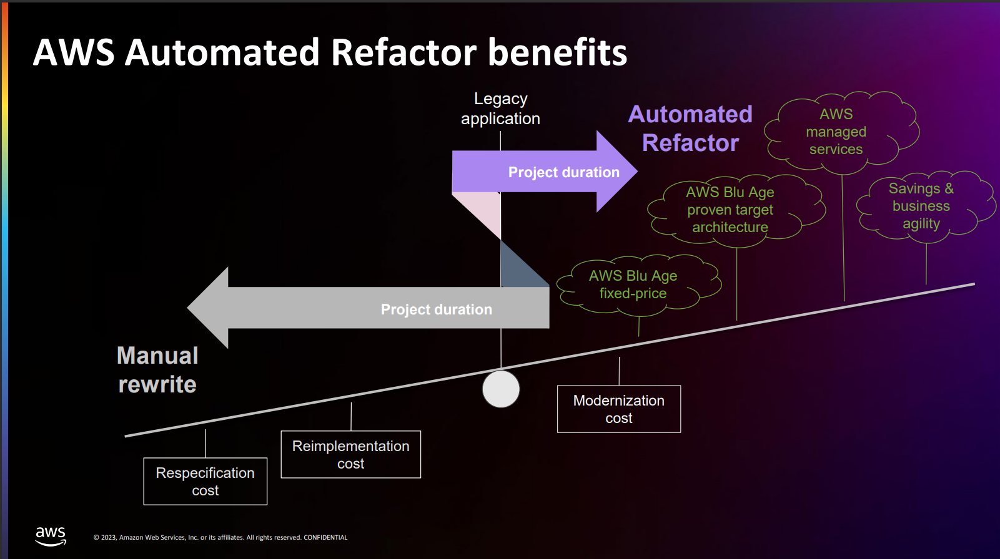

# AWS Blu Age L2 Training Notes

### AWS Blu Age Quality Gate

#### `6 Pillar of Quality Gate`
1. **Codebase and DB Modernization Completeness** - with AWS Blu insights
2. **Same or equivalent performance** - with same test dataset
3. **Functional Equivalence**
4. **Code Quality** -- with SonarQube
5. **Test Coverage** -- with JaCoCo

## Introduction to BluAge
- A company existing 20 years ago and brought by AWS. Now navigatable in the AWS Console.
- A transformation engine for object-oriented application.
- Re-architecture an application in an automated manner.
- The only refactory strategy that is fully integrated in the cloud environment.

**AWS Mainframe Modernization** service is a platform for assess, migration, modernization, execution, and operation of mainframe applications.

