# AWS Blu Age L2 Training Notes

### AWS Blu Age Quality Gate

#### `6 Pillar of Quality Gate`
1. **Codebase and DB Modernization Completeness**
   - Blu Insights tracks artifacts status and their associated test cases to monitor and report the progress of their transformations
2. **Functional Equivalence** - with same test dataset
   - _Selenium_, _Protractor_, _Cypress_, _Selenium Grid_, _ReST Assured_, _and Blu Age Compare_  are used to validate functional equivalence.
3. **Performance**
   - Same or equivalent performance as the legacy application using the same test data to test workload, throughput, response time, stress, etc.
4. **Code Quality**
   - SonarQube with SonarWay profile is used to measure and track code quality during and after the modernization.
5. **Test Coverage**
   - JaCoCo is used to verify that the test cases provided are sufficient to guarantee functional equivalence.

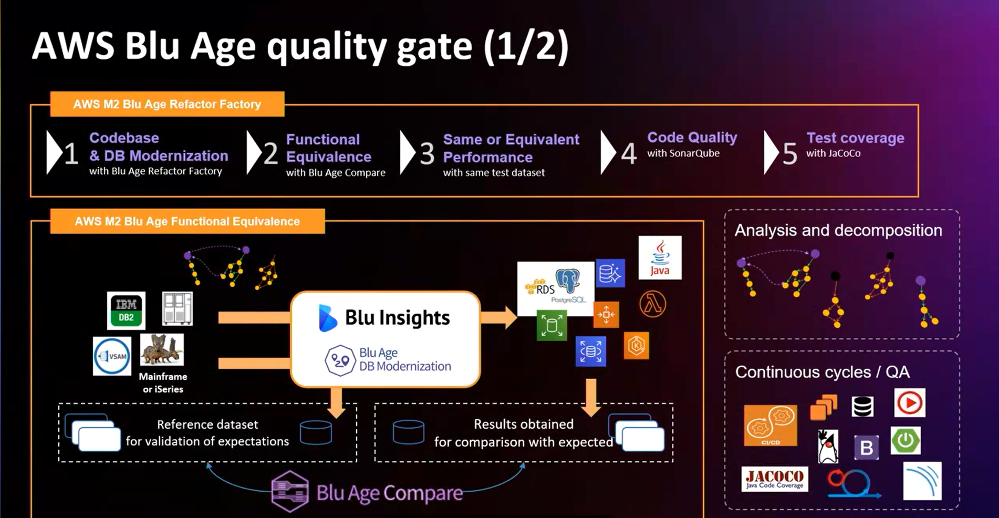

## Introduction to BluAge
- A company existing 20 years ago and brought by AWS. Now navigatable in the AWS Console.
- A transformation engine for object-oriented application.
- Re-architecture an application in an automated manner.
- The only refactor strategy that is fully integrated in the cloud environment.

**AWS Mainframe Modernization** service is a platform for assess, migration, modernization, execution, and operation of mainframe applications.

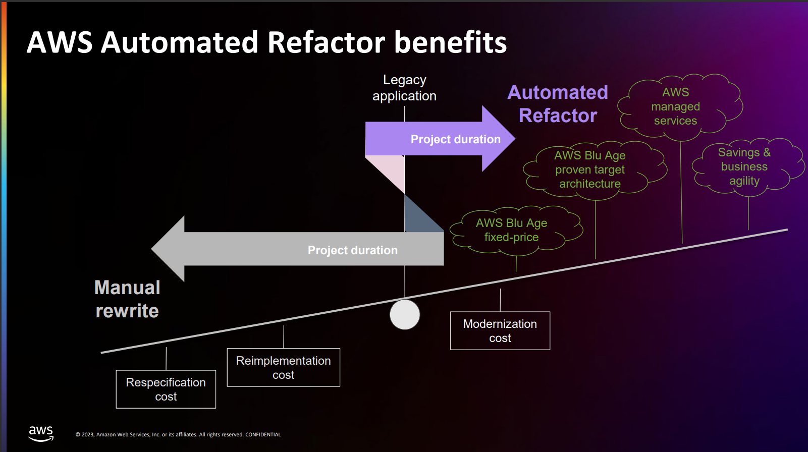

## AWS Mainframe Modernization Automated Refactor

### General Notes
- From monolithic workload to distributed workload.
- Customers pay for the result and not the productivity.
- Functional equivalence with the given amount of test cases.
- SonarQube profile to promote adaptability since each profile has their own rules.
- It is crucial to get the proper test case for the program.
- `Blu Age Compare` tool to compare datasets (legacy and modernized). Used after using the AWs Blu Insights tool.
- Unit test cases are not done. Only regression testing is done.
- The application is going to be modernized as a full-stack.

### Value Proposition
- Modernized application under Java/Spring programming language and framework.
- Cloud infrastructure and services enabled.

### Automated Refactoring Benefits
- High degree of **automation** in modernization, generated code preserves the original logic.
- **Integrated data migration** to RDB automatically, data structuring solution.
- **Risk reduction** due to the minimization of manual intervention in the conversion process, except to complement the transformation ruleset.
- **Preservation of comments, execution flow and functional data processing** from legacy code, simplifying the understanding of new code by original application analysts.
- Application architecture generated already containerized, ready for **deployment into AWS Cloud environments**.
- **AAAA rating** of the quality of modernized code according to _SonarQube_: ease of maintenance, reliability, and security.
- **Consistent structure and maintainability** of the generated code.

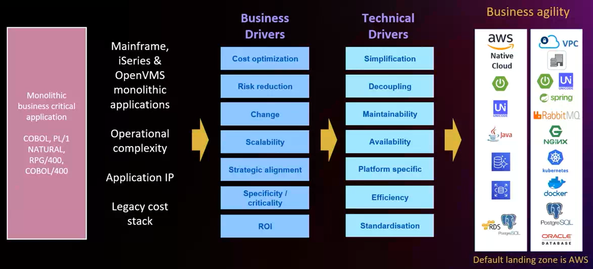

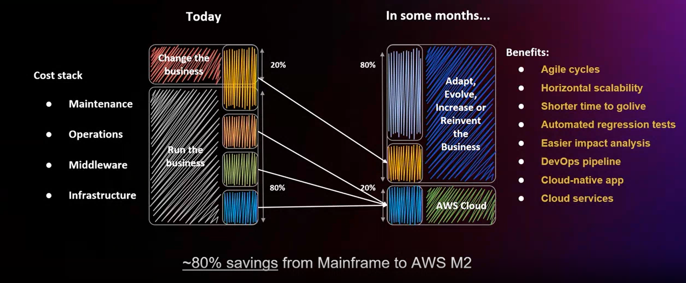

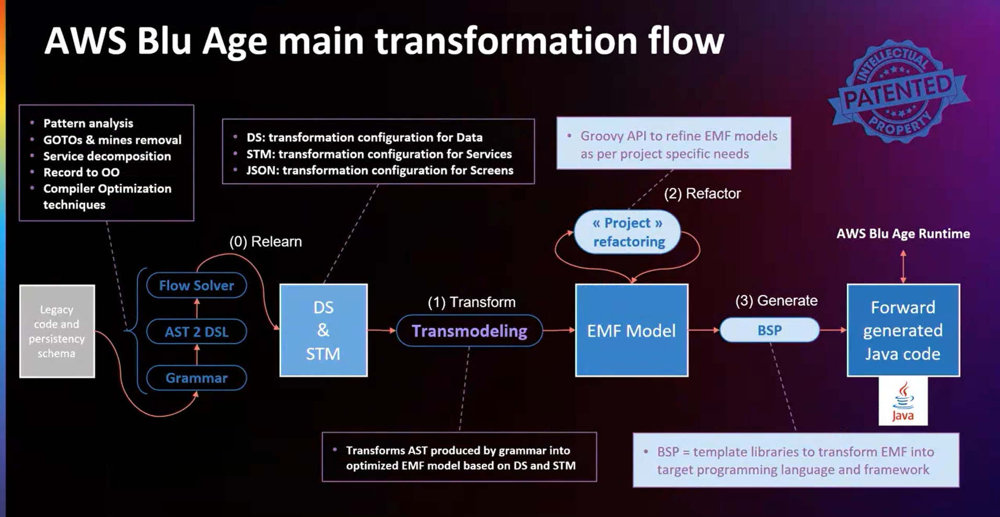

## AWS Blu Age Refactor Factory

### General Notes
- Hours of transformation, months of validation and testing

#### AWS Blu Age Automated Refactor Project Methodology

- **(00)** Assessment
- **(01)** Calibration
- **(02)** Mass Modernization
- **(03)** Mass Testing & DevOps
- **(04)** GoLive

#### Best Practices
- **Benefits for the application owner**
  - Focus on adoption of the target ecosystem
  - Do not define the transformation as a pure IT project.
  - Leverage AWS Cloud + Agility + DevOps
  - Discuss with decision makers and not developers.
- **Involve those with business knowledge**
  - Build the test strategy with the application owner.
  - Low workload for them
  - Secure the testing path
  - Make them actors of the decision.
- **Source of truth = live production platform**
  - Given version of the legacy application: source code + data
  - On which we record the test cases: scenarios + datasets
- **Among the project life**
  - Live application evolve and has been maintained
  - Different re-sync checkpoints shall occur.
  - Driving to replay and rerun the regression.
- **Volumetric Perspective**
  - x10k test per application
  - Datasets measured in TB

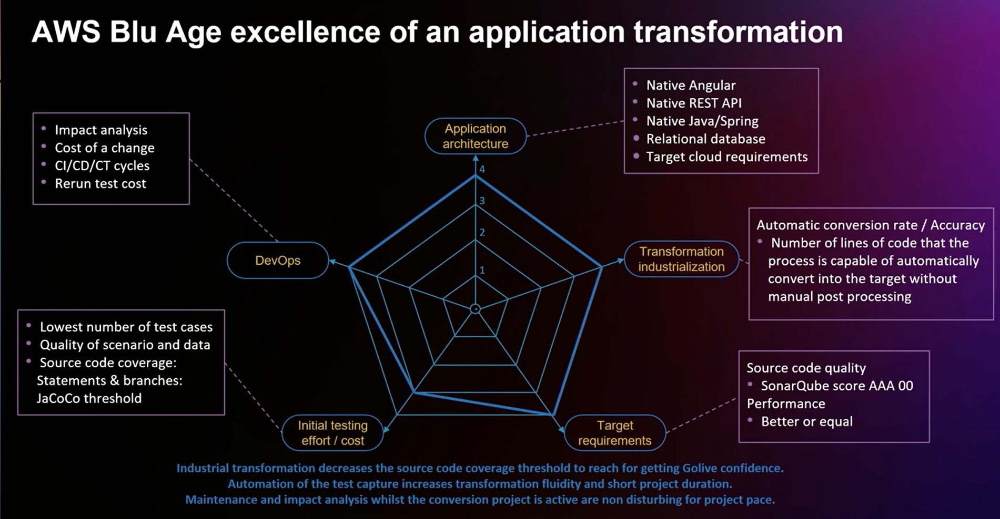

#### AWS Blu Age Process Efficiency and Excellence
- **Predictability**
  - Instrumentation
  - Collection and central storage
  - Analysis, diagnosis, visualization
- **Scaling Efficiency**
  - Increasing capacity and increasing resources
  - Design patterns: autoscaling, background, jobs, caching, CDN, partitioning

#### Applications related
- `AWS Blu Age Codebase`
- `AWS Blu Age Transformation Center`
- `AWS Blu Insights Projects`
- `AWS Blu Insights Capture`
- `AWS Blu Age Quality Gate` **(Capitalized into a CI)**
- `AWS Blu Age Compare Tool` **(Capitalized into a CI)**

### AWS Blu Insights Screen Capture
- Mainframe & Midrange capture scripts leveraging native-legacy tools.
- Record legacy-end user scenarios, replay exact same scenarios
- Built-in **TN3270** & **TN5250** to play the application by an end-user

### AWS Mainframe Modernization Data Replication
Precisely Data Replication for AWS Mainframe Modernization

#### Use Cases

1. Data Analytics
2. New Channels
3. Processing offload
4. Data science, AI/ML
5. Augmentation patterns
6. Large Migration transitional architectures

### Assess and Transform with AWS Blu Insights

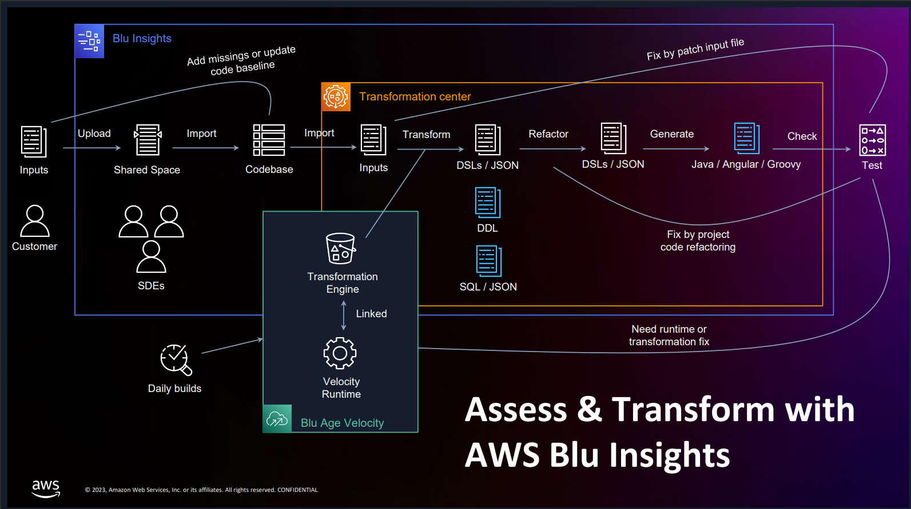

## Fixed Price Proposals

### When to talk about budget?
- Are both the budget and duration of the project okay?
- Does the customer want to go for Java?
- Involve AWS in a customer facing meeting to detail the process, the methodology, the expected results, etc.
 
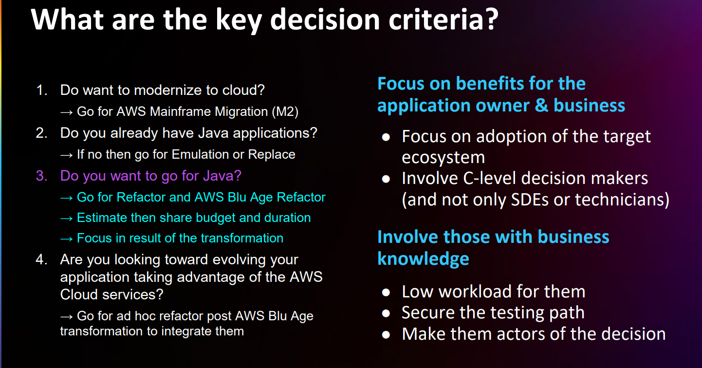

### AWS Blu Age Transformation Cost

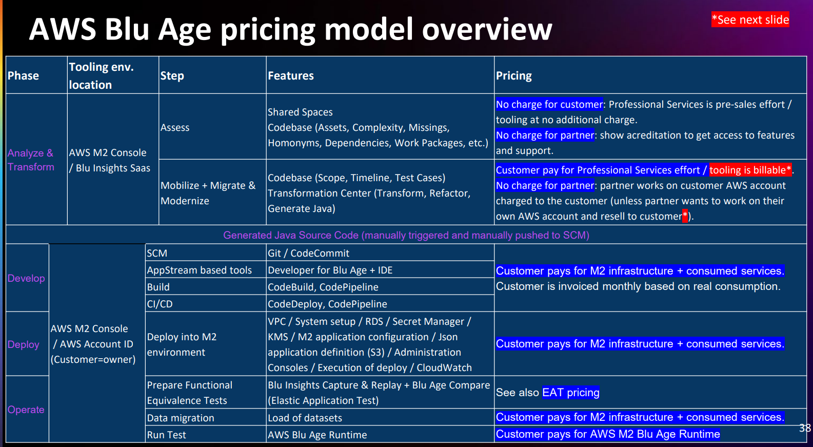

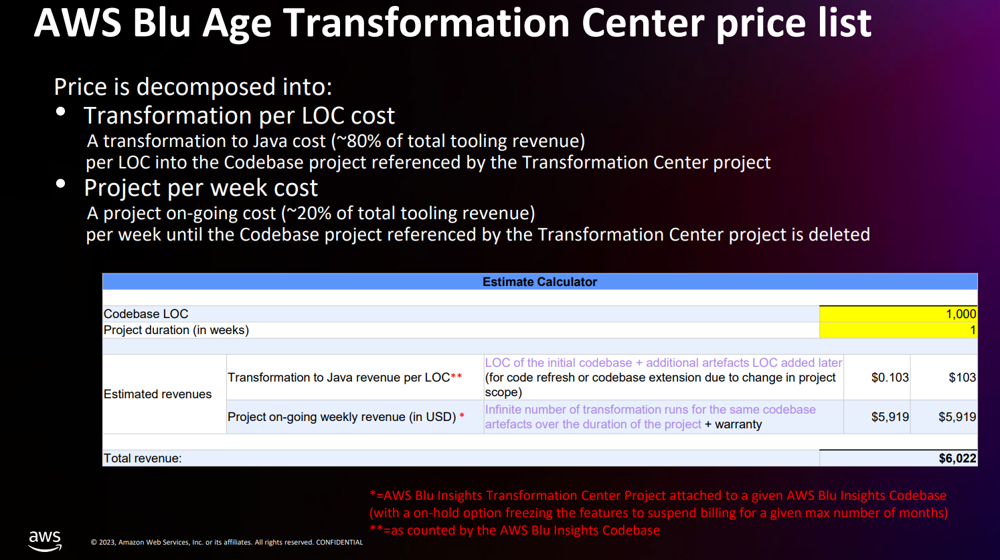

### AWS Blu Age Runtime Cost: Managed vs Custom

#### How are runtime licensed?
There are two ways of deploying the Java Application:

1. **AWS Blu Age Managed Runtime:** Into the AWS Mainframe Modernization Cloud environment available from the AWS Console taking advantage of the managed services.
2. **AWS Blu Age Custom Runtime:** Through a classical Customer's EC2 environment or on-premise, without the advantages above. The infrastructure is paid and provision by self.

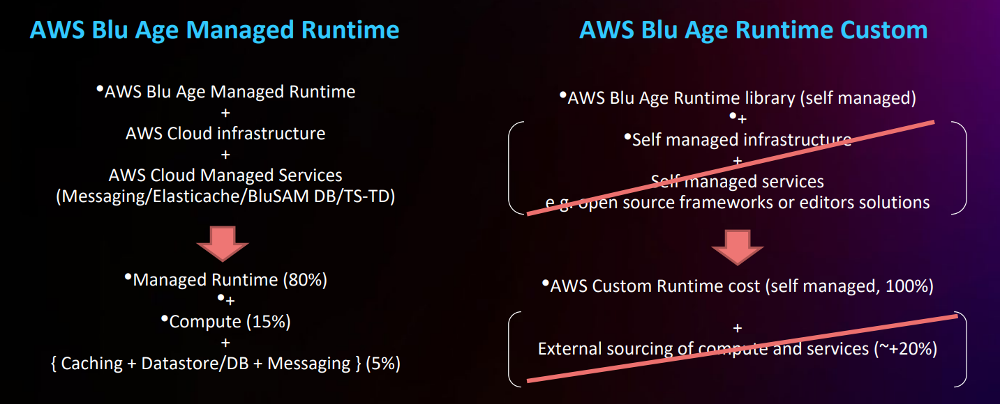

### Fixed-Price Processing and Tooling
The mechanism to qualify and fixed-price an AWS MK2 Refactor opportunity is broken down into **3 major stages**.

- With a standardized questionnaire (customized per family of mainframe programming language) completed with customer.
- The answers are entered into the corresponding **Blu Insights Business Form** which based on _abacas_ consolidated from previous projects who automate the calculation of the duration and the row budget in a comprehensible format.
- The relevant **key size metrics** are calculated automatically from the application programming languages & persistence submitted through **AWS Blu Insights**
  - LOC counts
  - Artifacts classification
  - Cyclomatic complexity
  - Homonym recognition
  - Missing artifacts
  - Dependency graph between programs and data
- The templated **SOW** details the contractual scope, milestones, keys of payment, project deliverables, and a project timeline. 
- The **SOW** also details the operating model (RASCI), the migration plan and the acceptance criteria, reports & KPIs through the validation strategy and workflow for the acceptance.
- The transformation process is monitored in a continuous and automated process with standard dashboards leveraging tools and mechanisms from AWS Blu Insights.
- The AWS Blu Age Quality Gate controls and monitors the achievements of each success criteria leveraging the [five ad-hoc mechanisms](#aws-blu-age-quality-gate-five-ad-hoc-mechanisms).
- Aside the fixed-price engagement, the **ROM TOOL Estimates** evaluates the future infrastructure costs for carrying out the tests during the transformation project (PIR) and for the execution of the workload transferred from Mainframe to the AWS Cloud Target (ARR). 

#### AWS Blu Age Quality Gate Five Ad-Hoc Mechanisms
1. **Transformation Completeness**
   - Each artifact is transformed, refactored, and forward generated into Java by the transformation chain powered with AWS Blu Age Engines.
   - At early stage, the Transformation Center (TC) feature reports each technical deviation resulting from the transformation through status reports.
2. **Functional Equivalence**
   - Each test case is composed of a business scenario and two datasets.
   - These datasets are migrated executing the scripts automatically generated by `AWS Blu Age Velocity`.
   - Each test runs are automated using open source tools such as **Cypress** and **Selenium** coupled with `AWS Blu Age Compare` to check results.
   - The end-to-end CI/CD/CT pipeline is choreographed using `AWS CodeBuild & CodePipeline`.
3. **Same or Equal Performance**
   - Once functional equivalence is achieved, the same tools are used as per the functional equivalence with a specific attention to the non-functional requirements such as data volume, response time, elapse, load, throughput, etc.
4. **Code Quality**
   - Delivering codes respecting rule of readability, reliability, security, maintainability, coding style, etc.
   - Each generated component is controlled by editing a report produced by `SonarQube` in the CI with the rules agreed with the customer.
5. **Testing Coverage**
   - This indicator provided with `JaCoCo` is key before going into integration, system acceptance and validate the UAT.

