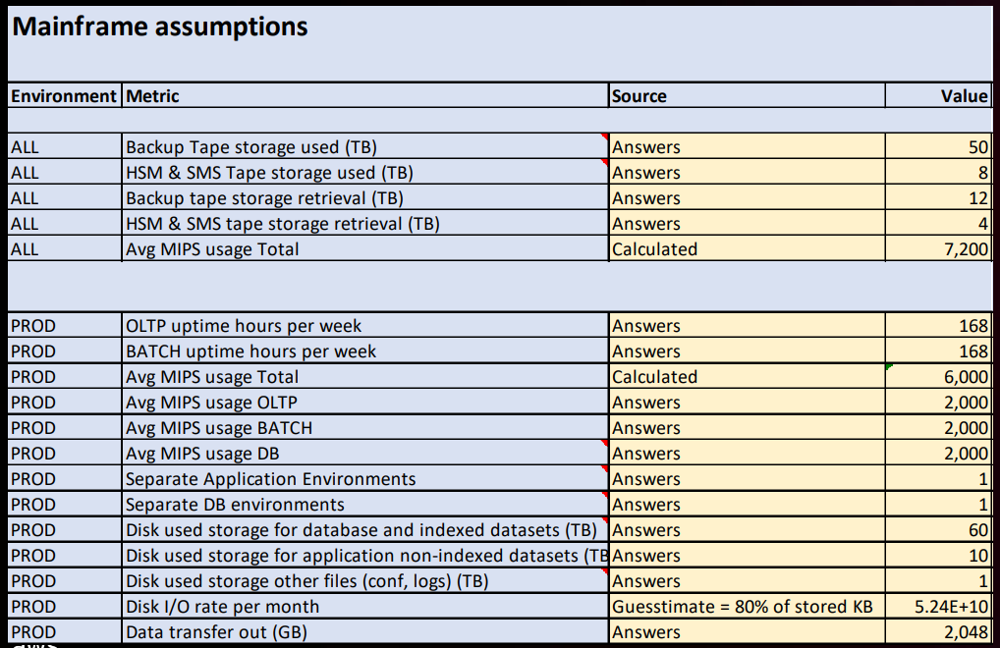
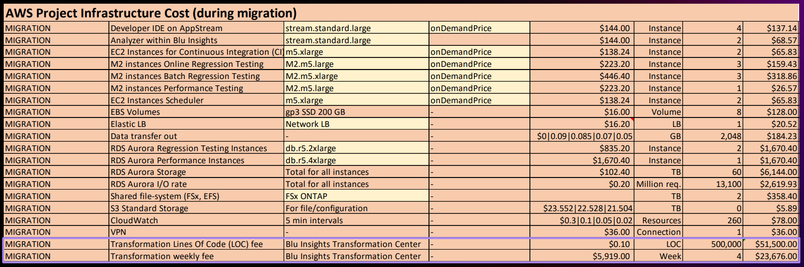

# Course 3: Evaluating Cost with AWS Blu Estimate and AWS Blu Age Scope Of Work [↑](../../README.md)

- [General Notes](#general-notes-)
- [Estimates (labor, infrastructure, tooling & ARR)](#estimates-labor-infrastructure-tooling--arr-)
- [Other Cost Estimates](#other-cost-estimates-)
  - [Mainframe Sizing Worksheet](#mainframe-sizing-worksheet-)
  - [Review of Customer Summary](#review-customer-summary-)
- [AWS Blu Age SOWS](#aws-blu-age-sows-)
  - [Roles and Responsibility Distributions](#roles-and-responsibility-distribution-)
  - [AWS Blu Age Professional Service SOWS](#aws-blu-age-professional-services-sow-)
  - [Real World Customer Example](#a-real-world-customer-example-)

## General Notes [↑](#course-3-evaluating-cost-with-aws-blu-estimate-and-aws-blu-age-scope-of-work-)
- The Solutions Architect usually pitch the estimates and SOWs.
- It is crucial to get the Mainframe Annual Cost from the customer so that it can be compared to the AWS estimates.
- a `milestone` is a result of something in the past. 

## Estimates (labor, infrastructure, tooling & ARR) [↑](#course-3-evaluating-cost-with-aws-blu-estimate-and-aws-blu-age-scope-of-work-)
How to make cost estimates using **Blu Estimate** and the **AWS ROM tool** for the migration cost.

Migration Cost is the cost of the infrastructure during the migration and the running cost once the migration is completed.

### Estimates of the transformation labor cost
Below are the fields inside the estimates questionnaire.

- **General Information**
  - Project Name
  - Partners
  - Customer Name
  - Description of the legacy business domain
  - Customer region
  - Desired Project Kickoff
  - Desired Go Live
- **Legacy Input**
  - Main legacy technologies
  - Additional legacy technologies
  - Total lines of Code (LoC)
  - Database & persistence
- **Legacy Components**
  - Screens (UI)
  - Batches (jobs)
  - Transactions (services)
- **Legacy Workload** _(optional)_
- **Legacy Database**
  - Volume size (max number of records)
  - Tables / Files of DB2
  - Tables / Files of VSAM
  - Flat Files:
  - Stored procedures
  - Database triggers
  - Queues
  - Views / Logical files
- **Target Technology**
  - Architecture: _Angular/Java/Spring/RDBMS_
  - Database: _Amazon RDS, Aurora, PostgreSQL_
  - EBCDIC to Unicode conversion
  - Cloud: _AWS, other cloud vendors_
  - Migration service price: 0.18$
- **Test Cases**
  - Screen Test Cases number
  - Batches Test Cases number
  - Transactions Test Cases Number
  - Reports Test Cases Number
  - Test Unit Price
- **POC Pilot**
  - Lines of code
  - Number of Test Cases
  - PoC / Pilot Test Unit Price

#### Manager Results

    

#### Project Scope & Assumptions
A summary of the form above.

    

#### Summary Results

    

#### Project Tooling
shows more details on estimates such as the tools used as well as the usage.

    

## Other cost estimates [↑](#course-3-evaluating-cost-with-aws-blu-estimate-and-aws-blu-age-scope-of-work-)
Includes the cost for the build and run.

### Mainframe Sizing Worksheet [↑](#course-3-evaluating-cost-with-aws-blu-estimate-and-aws-blu-age-scope-of-work-)
- shows the number of storages for persistence.
- 

  

  

  

### Review Customer Summary [↑](#course-3-evaluating-cost-with-aws-blu-estimate-and-aws-blu-age-scope-of-work-)

  

## AWS Blu Age SOWs [↑](#course-3-evaluating-cost-with-aws-blu-estimate-and-aws-blu-age-scope-of-work-)

  

### Roles and Responsibility distribution [↑](#course-3-evaluating-cost-with-aws-blu-estimate-and-aws-blu-age-scope-of-work-)

  

### AWS Blu Age Professional Services SOW [↑](#course-3-evaluating-cost-with-aws-blu-estimate-and-aws-blu-age-scope-of-work-)
- **Service Overview**
  - Calibration
  - Mass Modernization
  - Mass Testing
  - Support (Starts at the end of Calibration Phase)
- **Project Scope**
  - List of functionalities (screen, batch, backend)
    - Screen Test cases
    - Batch Test cases
    - Backend Test cases
- **Target deployment stack of the modernized code**
- **Schedule of Deliverables, Milestones, and Charges**
  - Milestone Schedule
    - Support
    - Prerequisite
  - Mass Modernization Deliverables
  - For each Mass Testing Iteration Deliverables
  - Support Deliverables
  - Acceptance Process
- Environments
  - AWS Internal Project environment
  - AWS Customer account
- **Governance**
- **Project Status Meetings**
- **Project Managers**
- **Amendment Process**
- **Engagement Related Expenses**
- **Customer Responsibilities**
  - Define what is to be expected of the customer
  - There are deliverables for the customer as well.
  - If the input is not on time, the output will not be on time as well.
- **Additional Terms**

### A real-world customer example [↑](#course-3-evaluating-cost-with-aws-blu-estimate-and-aws-blu-age-scope-of-work-)
- **AWS Blu Age POC SOW includes**
  - Firm fixed-price with a clear duration (e.g. 2 months)
  - A clear scope down to specific COBOL programs, screens, batch jobs, test data and test cases.
  - Cover 1 or 2 particular technical challenges the customer want to prove in the POC (e.g. screens, batch jobs, and util reproduce)
  - Activities in POC mainframe code transformation, test data migration and functional equivalent tests
  - Acceptance criteria of deliver modernized code, test reports, code quality analysis and mass transformation project proposal.
- **Customer prerequisites & commitments**
  - Provide source code, recorded test data, test cases **on-time**.
  - Cleaned data without valid regulated or sensitive information (e.g. PCI, PII)
- **AWS ProServe POC SOW Includes**
  - T&M price with design and AWS landing zone setup with AWS best practices.
  - Deploy AWS Blu Age modernized application in customer landing zone.
  - Document application AWS target architecture.
  - Assess existing integrations and document on their possible target state.
- **Recommended roles**
  - AWS Infra architecture for landing zone setup
  - AWS Application architect with Java development skill
  - AWS Engagement Manager manage overall POC project.
- **Customer need to review the Java Code**
  - Java code are reviewed by the customer's developer
  - Questions were raised regarding program structure, work flow in batch
  - Customer's COBOL programmer and Java developers both involved
  - AWS Blu Age Developer and ProServe Application Architect support in the workshop
- **Customer want to test the code themselves**
  - Customer need to learn how to use Blu Age testing tool to compare the results, and evaluate the performance
  - Customer need to test against the deployed application in AWS
  - AWS Pipeline is used to provide agility and simplicity for new releases.