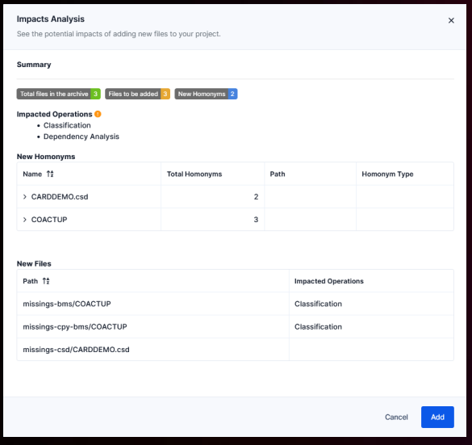

# Course 4: Importing and Classifying the Customer's Codebase [↑](../../README.md)

- [Preliminary Steps](#preliminary-steps-)
- [Blu Insights Features](#blu-insights-features-)
- [AWS Blu Insights Codebase Project](#aws-blu-insights-codebase-project-)
  - [Classifying Files](#classification-)
  - [Dependencies](#dependencies-)
  - [Addressing Missing Artefacts](#addressing-a-mising-artefact-)
  - [Homonyms](#homonyms-)

## Preliminary Steps [↑](#course-4-importing-and-classifying-the-customers-codebase-)
- Import the code sent by the customer
- Launch the code classification
- Detect and list the missing artefacts using the dependency analysis and import them once they are sent by the customer.

## Blu Insights Features [↑](#course-4-importing-and-classifying-the-customers-codebase-)
1. **Share Spaces:** Allow the customer to upload their code.
   - Everything can be shared but code always has to be in an archive to be able to import in a Codebase project.
2. **Codebase:** Create AWS Blu Insights project from code.
3. **Business:** Deal with sale opportunities.
4. **To-Dos:** Manage tasks for teams.
5. **Version Manager:** To handle code refreshes.
6. **Time Tracker:** To produce invoices.
7. **Library/Training:** AWS Blu Insights documentation for manuals.
8. **System Utilities:** To list all system utilities potentially in the code base projects.
9. **Transformation Center:** To transform the legacy code to modern Java code.
10. **Capture & Replay:** To record test cases and re-run them on modernized applications.

## AWS Blu Insights Codebase Project [↑](#course-4-importing-and-classifying-the-customers-codebase-)

- **Dashboard:** main view with key metrics (customizable)
- **My Stuff:** Customizations for the project (notifications, filters, my dashboards, etc.)
- **People:** Manage project members and profiles
- **Settings:** deactivate/reactivate features, delete the projects.
- **Assets:** Assess the codebase
- **Management:** To review everything that was created to manipulate the projects
- **Others:** To-Dos, Documents, Schedule, Management, Catch-up (add code)

### `Classification` [↑](#course-4-importing-and-classifying-the-customers-codebase-)
- Conducted under the Assets bar of the Codebase.
- It reads each file and type it using **heuristics**.
- Analyze the files and return the file types as well as the number of files under that type.
- When new codes are added to the assets, classifying is needed to be conducted again.

#### Heuristics
- File Formats  ( )
- Specific keywords
- Textual code patterns
- Grammars are not used at this stage.
- Entirely detailed in the documentation.

#### LISTCAT files
- Important files during conversion process.
- It stores the files that are manipulated my the mainframe.

### `Dependencies` [↑](#course-4-importing-and-classifying-the-customers-codebase-)
Once the types are classified. It is now time to check if the source code is complete in terms of its dependencies. 
This is done through the `Dependencies` option in  the Assets tab.

- **Computed based on file types:**
  - A COBOL program << copies >> a copybook.
  - A JCL << execute >> a program.
- **Can create dots of 2 kinds:**
  - **File:** one for each file
  - **Node:** contained in a file or a missing artefact used by an existing artefact.
- **Can then be used extensively and recursively to build scopes:**
  - POC
  - Work packages: to drive the project progress. 

#### Sample filter entries
- `node type like 'missing'`: Type this in the filter part if you want to see how many nodes are missing.
- `node type = 'MISSING PROGRAM'`: Check to see how many programs are missing.

### `Addressing a Mising Artefact` [↑](#course-4-importing-and-classifying-the-customers-codebase-)
- Notify the customer about the missing programs, codes, artefacts, etc.
- The customer will upload the files in the shared space.
- Once the files are available, these can be done through the **Catch-up** option in the Codebase.
- A summary of the impacts of the files on the project will appear. 
- With the new files added to the project, it is needs to be classified.

### `Homonyms` [↑](#course-4-importing-and-classifying-the-customers-codebase-)
- Files that have the same names.
- Comparison of files can be conducted here by selecting the two files and then click the compare option that will appear.