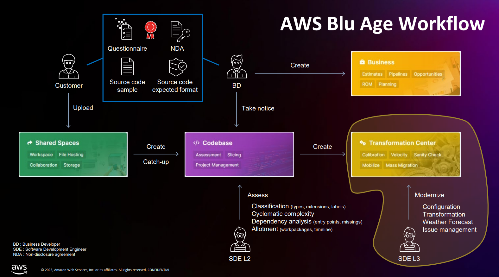
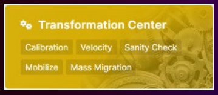
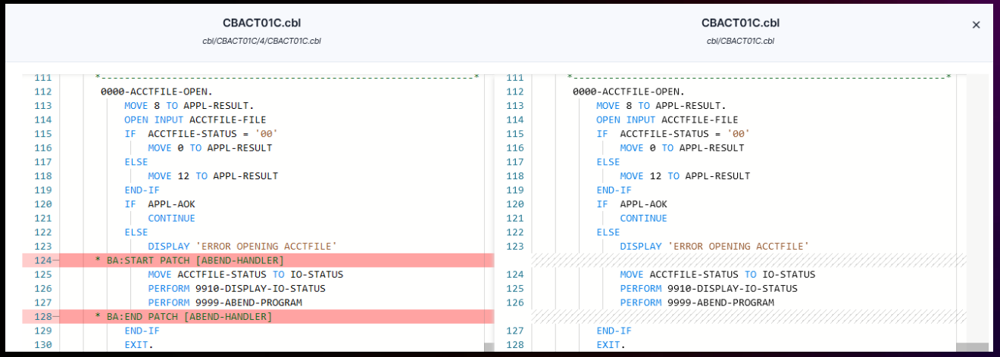
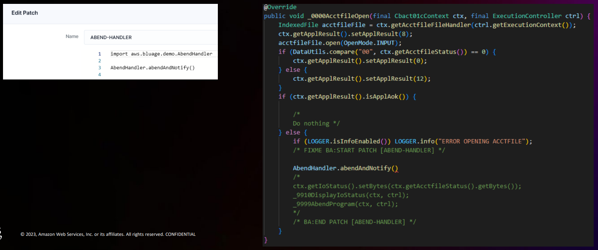

# Course 6: Modernizing Legacy Code with AWS Blu Insights Transformation Center
Learn what transformation means in AWS Blu Age Workflow and what is `AWS Blu Insights Transformation Center`.

### General Notes:
- Legacy files are transformed to Blu Age accommodated files, JSON and/or DSLs (Domain Specific Language)

## AWS Blu Age Workflow / Transformation
1. Transform - Legacy codes to JSON/DSL files
2. Refactor
3. Generate - Java, SpringBoot, Angular, TypeScript

### `Statuses`

#### Status per transformation action
- `Not requested`: The transformation action has not been requested.
- `Pending`: The transformation action is waiting.
- `In Progress`: The transformation action is running.
- `Done`: The transformation action ended successfully.
- `Error`: The transformation action ended with errors: at least one common output has not been produced or an unexpected error occurred.

#### Status per transformation action per input
- `Ignored`: No output expected
- `Pass through`: Input and output are equal (refactor only)
- `Success`: All outputs generated without any errors.
- `Warning`: All outputs generated but contains some errors.
- `Error`: Some outputs are not generated.
- `Fatal`: An unexpected error occurred.

## AWS Blu Insights Transformation Center
`AWS Blu Insights Transformation Center` is the central place to transform legacy codebase to modern codebase.

It powers up **AWS Blu Age Transformation Engine (Velocity)** usage.

- Run transformations at scale.
- Efficient transformation scope completion.
- Easily monitor and supervise transformation results.
- Download targeted transformation output.
- Customize transformation configuration.
- Simply access and manage transformation issues.
- Quickly improve transformation rate.
- Advanced patch mechanism
- Provide a dedicated To-Dos/Document places.

#### Advanced patch mechanisms
Identify input lines and enclose with BA (Blu Age) tags.
- `BA:START PATCH [METHOD_NAME]`
- `BA:END PATCH [METHOD_NAME]`

