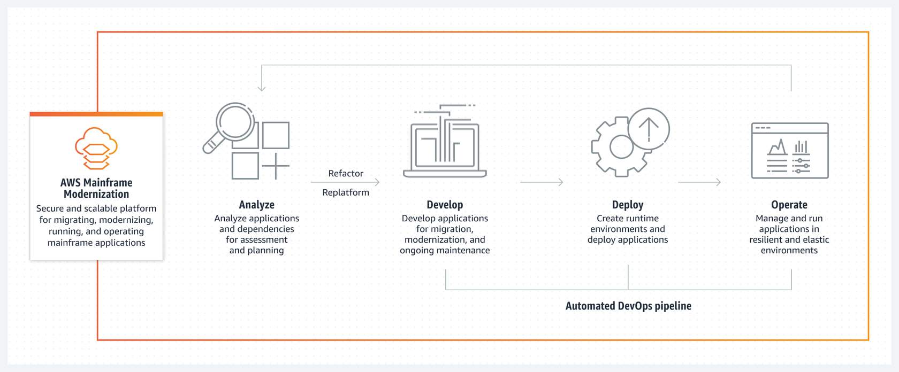
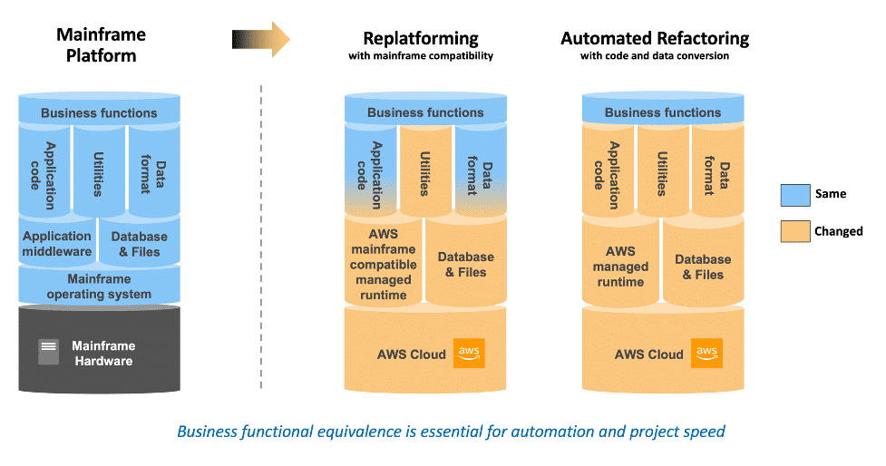

# Module 2: Getting Started with AWS Mainframe Modernization Service

- [Introduction to AWS Mainframe Modernization](#introduction-to-aws-mainframe-modernization-)
- [Architecture and Use Cases](#architecture-and-use-cases-)

## References:
- [AWS M2 User Guide](https://docs.aws.amazon.com/m2/latest/userguide/what-is-m2.html)
- [AWS M2 Benefits](https://aws.amazon.com/mainframe/)
- [AWS Costing/Pricing](https://aws.amazon.com/mainframe-modernization/pricing/?did=ap_card&trk=ap_card)

## Introduction to AWS Mainframe Modernization [↑](#module-2-getting-started-with-aws-mainframe-modernization-service)
AWS Mainframe Modernization helps migrate and modernize mainframe applications to AWS managed runtime environments.

- The service offers tools and resources to help with planning and performing migration and modernization.
- Analyze mainframe programs and create, update, or modify them using programming languages such as COBOL or PL/I.
- Test application functionality and deploy in a managed runtime.
- It is also possible to create an automated pipeline for continuous integration and delivery (CI/CD) of an application.

    

### Supported Major Migration Patterns
AWS Mainframe Modernization offers support for two (2) major migration patterns.

    

#### 1. Automated Refactor
- Using `AWS Blu Age toolchain`, the automated refactor pattern helps accelerate modernization by turning the whole 
legacy application stack (including its data layer) into a modernized, Java-based application while maintaining 
functional equivalence. 
- A multi-tier application with an Angular-based front end, a Java backend with API support, and a data layer that can 
access modern data sources are created as part of this automatic refactor process. 
- The refactor process offers comparable capability to the legacy stack to boost project automation and help realize 
significant benefits.

#### 2. Re-platform
- The `Micro Focus Enterprise toolchain powered replatform pattern` is concentrated on maintaining the 
applications' language, code, and artifacts to lessen the impact on application assets and teams.
- Customer can keep up their application skills and enterprise with this pattern. Although the application 
modifications are minimal, this pattern also facilitates the ability to modernize processes and infrastructure. 
- The processes are modified to adhere to best practices for application development and IT operations. The 
infrastructure is upgraded to a modern, cloud-based managed service.

### Problems that AWS Mainframe Modernization Solve
AWS M2 offers a comprehensive suite of features to help migrate and modernize mainframe applications.

- `Asses`: AWS M2 provides application knowledge, insight, and analysis. M2 can be used to evaluate, scope, and plan 
  a migration and modernization project. This reveals application dependencies and complexities helping create a 
  modernization strategy with business and technical assessments.

- `Refactor`: AWS M2 and the AWs Blu Age automated refactor helps sped up the modernization of legacy assets. It is 
  possible to convert legacy application PL, establish macroservices or microservices, and update user experience 
  and application software components. Legacy languages such as **COBOL, PL/1, NATURAL, RPG/400, and COBOL/400** can 
  be transformed to Java frameworks and services that are more agile.

- `Re-platform`: Applications written in COBOL and PL/I can be re-platformed onto the mainframe-compatible managed 
  runtime in the cloud using AWS M2. This approach is about **porting** application programs where a large portion 
  of the application source code is recompiled without modifications (powered by the **Micro Focus Enterprise 
  Solution**).

- `Developer IDE`: AWS M2 provides an on-demand IDE which helps developers quickly create code through intelligent 
  editing and debugging, fast code compilation, and unit testing. 

- `Managed Runtime`: The managed runtime environment for AWS M2 continuously monitors clusters to help ensure the 
  availability of enterprise workloads with self-healing computing and automatic scaling. Designed for 
  mission-critical business applications that require high availability, reliability, and security.

- `CI/CD`: To speed migration, improve quality, and shorten the time-to-market for introducing new business 
  functionalities. Both refactor and re-platform patterns have CI/CD pipelines available.

### Benefits of AWS M2
- Cost efficiency
- Fully Managed Service
- Agility
- Quality of service
- Proven toolchains
- Faster Modernization

## Architecture and Use Cases [↑](#module-2-getting-started-with-aws-mainframe-modernization-service)
- AWS M2 helps efficiently create and manage the runtime environment on AWS for mainframe applications. It can also 
  **manage** and **monitor** modernized applications.
