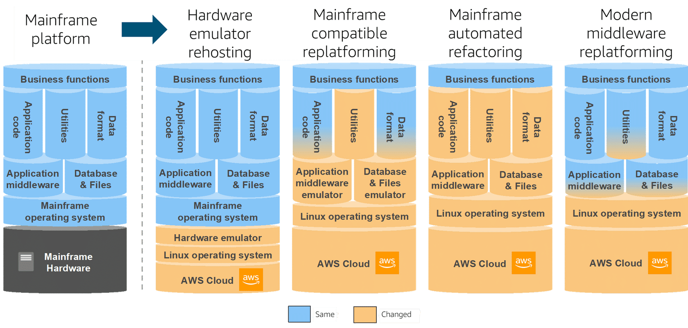
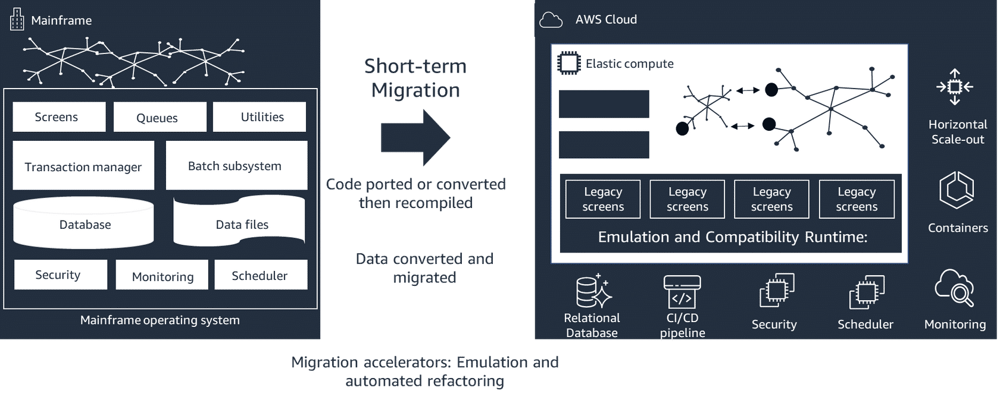
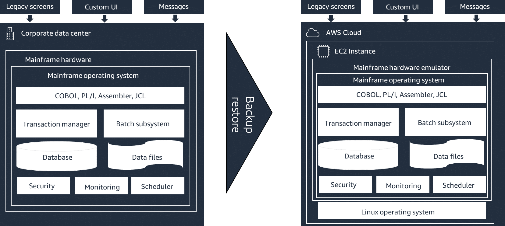
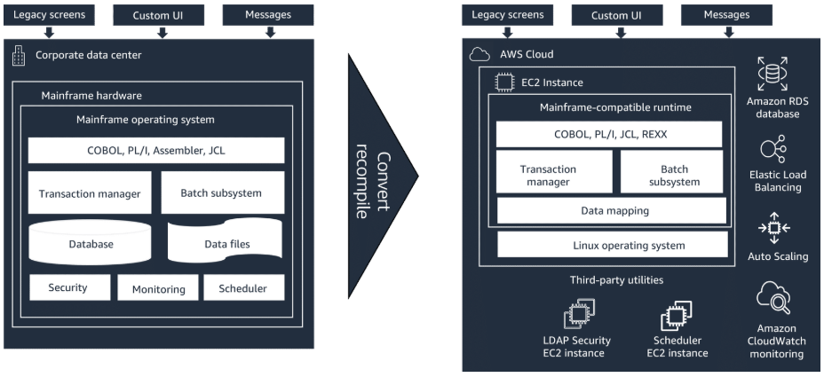
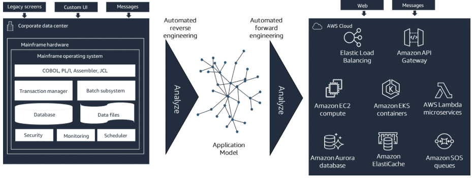

# Module 3: Mainframe Modernization Patterns and Best Practices [↑](../README.md)
This module presents patterns as a toolbox for use in modernizing with AWS.

The two pattern families are geared toward moving workloads off the mainframe, or augmenting the mainframe workloads.

### `Roles and Responsibilities`
Below is how the roles and responsibilities interact with **short-term migration and modernization patterns and mainframe augmentation patterns**.

- **Business Developer**
  - Describes the strategy at high-level for customer executives.
  - Explain how the AWS approach is focused mostly on customer goals and uses the best pattern based  on those goals.
  - Engage mostly on the Assess phase of MAP.
- **Delivery Architect and Consultant**
  - Considers these options when designing the modernization plan and architecture for each of the customer's workloads (during the Mobilize phase).
  - Ensures the specific business goals and technical constraints are addressed.
- **Executive and Manager**
  - Ensures all the requirements are in place for the migration to start and complete successfully, including the right partner and AWS ProServe.
- **Software Development Engineers and Product Owner**
  - Understands how each reflects into the modernized application architecture, technology stack, KPIs, and maintenance in its target environment.
- **Solutions Architect**
  - Map these strategies for the customer needs, helping define the target architecture using the pattern with the best fit for their first workloads during the Assess phase.

## Mainframe Modernization Patterns [↑](#module-3-mainframe-modernization-patterns-and-best-practices-)
There are two families of patterns: [Migration and Modernization](#migration-and-modernization) and [Augmentation](#augmentation)

-----

#### `Migration and Modernization`
- Move the mainframe workloads in a 1-year to 2-year time frame.
- Shorter duration minimizes risks and provides faster ROI.

| Details                                | Description                                                                       |
|----------------------------------------|-----------------------------------------------------------------------------------|
| **Hardware emulator rehosting**        | The entire software stack is moved as-is.                                         |
| **Mainframe-compatible replatforming** | Code is ported and recompiled onto a mainframe-compatible runtime.                |
| **Automated refactoring**              | Code and data are automatically converted and refactored to a cloud-native stack. |
| **Modern middleware replatforming**    | Applications and data are migrated to similar modern middleware on AWS.           |

**QUICK LINK:** [Deep Dive to Short-Term Migration and Modernization](#short-term-migration-and-modernization-deep-dive)

#### `Augmentation`
- Keep the mainframe and benefit from the AWS value proposition in parallel.
- Extend the mainframe workloads capabilities through integration with AWS.

| Details                          | Description                                                                                                                                                                                               |
|----------------------------------|-----------------------------------------------------------------------------------------------------------------------------------------------------------------------------------------------------------|
| **Data Analytics**               | Customer use data replication techniques between the mainframe data stored and AWS, allowing to use AWS services and available partner tools to do analytics and get insights from mainframe data on AWS. |
| **New channels & New Functions** | Customer use AWS to augment their mainframe workloads with new channels, such as mobile or voice, and new features using AWS services.                                                                    |
| **Development and test**         | Customers offload and scale mainframe development and test environment on AWS for more agility and cost reduction.                                                                                        |
| **Backup and Archival storage**  | Customers replace their backup and archival storage (such as virtual tape hardware) with cost-optimized cloud storage backup solutions.                                                                   | 

**QUICK LINK:** [Deep Dive to Mainframe Augmentation](#mainframe-augmentation-pattern-deep-dive)

-----

<table>
  <tr>
    <th style="text-align:left; background-color:grey; color:black; width:750px">Note:</th>
  </tr>
  <tr>
    <td>Within short-term migration and modernization patterns, this training focuses on patterns that move the mainframe workloads within a 1-year to 2-year time frame. 
Manual rewrite or manual reengineering do not appear in this course because typical mainframe workloads with millions of lines of code take a lot of time to migrate and are risky. 
    </td>
  </tr>
</table>

### Mainframe Strategies [↑](#module-3-mainframe-modernization-patterns-and-best-practices-)
Mainframe migration and modernization differ from the **Six Rs** migrations and modernization strategies used for distributed x86-based.

Two main reasons for the difference:
1. Different hardware architectures between mainframes and x86.
2. Different types of toolsets for migration and modernization.

Below are the Lift and Reuse Short-term Migration and Modernization Patterns.
These first three strategies reuse code and data with no manual code development, which reduces risks and accelerated the migration and modernization.

#### `Hardware Emulation`
Rehosting the mainframe software stack unchanged to the cloud, where the mainframe hardware instructions are emulated by software.

#### `Mainframe Compatible Replatforming`
Move and recompile application to execute mostly unchanged in a mainframe-compatible runtime.

#### `Automated Refactoring`
Converts mainframe-specific languages and data formats to modern languages and data formats, while maintaining functional equivalence.

### Repurchasing and Reengineering Strategies [↑](#module-3-mainframe-modernization-patterns-and-best-practices-)
Repurchasing and reengineering strategies introduce manual code development, new data definitions, new tests, and take longer.

Manual work increases the risks, increases the duration, and typically inflates the project cost drastically.

#### `Repurchasing`
Replaces an existing mainframe application with Commercial Off-The-Shelf (COTS) product.

#### `Reengineering`
Writing a new application from scratch to replace the existing mainframe application with similar or enhanced functionality.

### Retain and Retire Strategies [↑](#module-3-mainframe-modernization-patterns-and-best-practices-)
**Retain Strategy** means that assessed mainframe workloads will be retained and reevaluated in the future.

In the **Retire Strategy**, customers retire a mainframe application, but can still move and archive the corresponding data onto AWS if necessary, allowing the data
to be available in case the data becomes useful in the future.

## Short-term Mainframe Migration and Modernization Patterns [↑](#module-3-mainframe-modernization-patterns-and-best-practices-)
The diagram below compares the impact for each of the four (4) migration and modernization patterns.

  

- **Hardware Emulator Rehosting**
  - The mainframe operating system and the applications stay the same.
  - The software including business functions, application code, utilities, data format, application middleware, database, and files stay the same.
  - The mainframe hardware is changed to include hardware emulator, Linus operating system, and AWS Cloud.
  - A real lift-and-shift method.
- **Mainframe Compatible Replatforming (most popular)**
  - The mainframe-compatible runtime replaces the mainframe middleware APIs and OS APIs required by the application.
  - This is a porting of the application where much of **the application source code is recompiled without changes**.
  - There are some necessary adaptations for changed dependencies.
  - The code and data stay mostly the same, the utilities and middleware are changed and are not mainframe ones anymore.
  - Focuses on preserving the application language, code, and artifacts  in order to minimize the impact to the application assets and teams.
  - Helps customer maintain the applicaiton knowledge and skills and facilitates a modernization of the infrastructure and the processes.
  - Changes infrastructure to a modern cloud-based managed service while the processes are changed to follow best practices for application development and IT operations.
- **Mainframe Automated Refactoring (most popular)**
  - Code, data, and dependencies are automatically converted to a modern language, data store, and frameworks.
  - Guarantees functional equivalence with the same business functions. The business functions stays the same.
  - The entire  software stack in is changed with modern technology.
  - Focuses on accelerating modernization by converting the complete legacy application stack and its  data layer into a modern Java-based application while preserving functional equivalence.
  - Creates a multi-tier application with a web-based frontend, an API-enabled Java backend, and a  data layer accessing modern data stores.
  - Provides equivalent functionality to the legacy stack to increase project automation resulting in speed, quality, and lower cost for achieving business benefits quicker.
- **Modern Middleware Replatforming**
  - Applies only to modern language middleware, and runtime that are available across mainframe and x86 systems.
  - Applies only to Java, PHP, and RDB.
  - Allows the reuse of the application code and databases.
  - The OS change is mostly abstracted  by the middleware. This means that the application code and the data stay the same.

### Tool-based Workload Migration and Modernization

  

## Short-term Migration and Modernization Deep Dive

### Mainframe Hardware Emulator Rehosting
Emulation of hardware instruction set requires on-the-fly instruction translation, which has a performance impact. A performance benchmark is recommended,  for example using instance families
with powerful processors to overcome the instruction translation performance impact.

**Examples**
1. **IBM**
   - The IBM mainframe hardware emulator called **IBM Z Development and Test (ZD&T)** restricts the use to only non-production workloads such as development and test environments.
2. **UNISYS**
   - The Unisys mainframe hardware emulator called **ClearPath Forward** allows its use with production workloads.

In the following illustration, the migration and modernization is a rehost lift-and-shift of the mainframe operating system from the mainframe hardware to the emulator running on Amazon EC2. 
The applications, data, and interfaces are unchanged, so the amount of required testing is reduced. Now, completion of the migration and modernization is in **days or weeks**.

  

For IBM mainframe, this pattern is limited to development and test only. Therefore, it is not a viable pattern for migrating production workloads. 
It is a valid pattern for migrating development and test environments to AWS, or for creating a continuous integration and continuous delivery 
(CI/CD) pipeline on AWS with deployment back onto the mainframe.

### Mainframe Compatible Replatforming
The mainframe-compatible runtime provides middleware and operating system APIs compatible with the ones available in the mainframe, which is necessary for the application code.

This allows the porting and recompiling the source application for native x86 execution. Because there is no on-the-fly instruction translation, there is no related performance impact.

#### `Areas Supported by Mainframe Compatible Replatforming`

1. Indexed-file access
2. Transaction Management
3. Mainframe screens
4. Legacy protocols
5. Temporary Storage
6. Batch support

Mainframe data formats like Virtual Storage Access Method (VSAM) or Queued Sequentital Access Method (QSAM) are retained or mapped to a relational data store such as Amazon Aurora or Amazon RDS.

The illustration below is a pattern where complete code recompilation is necessary because of the changed in platform, middleware, dependencies, and data formats. This is a replatforming project
where the programs and business functions are incrementally migrated and thoroughly tested. It is not a lift-and-shift.

  

This process can last between months and years depending on the number of lines of codes and complexity.

The Mainframe-compatible runtime can run on EC2 instances or on Amazon ECS, AWS EKS, or other containers.

Dependencies for security, scheduling, printing, orm essage queueing can be provided as managed services, in their own EC2 instances or containers.

### Mainframe Automated Refactoring
Guarantees a transformation result in an object-oriented and service-oriented modern application. Since the process is automated, it is quick and greatly reduces risk.

#### `Automation Process`
1. **Automated reverse engineering**
   - The source code is ingested and an application model showing program and data dependencies is created.
   - This helps to outline a detailed strategy with different components, data mapping, conversion rules, and ways to decompose work packages.
2. **Incremental automated conversions**
   - No manual code rewrite is needed. This is followed by extensive testing.
   - This process can take months to years depending on the number of lines of code and complexity.

  

- An elastic web architecture is typically generated.
- There is flexibility to tune the transformation rules for other target components.
- The service-enabled stack allows exposing services through Amazon API Gateway or integrating with Alexa for Business.

### Modern Middleware Replatforming
- This pattern applies to middleware or runtimes that are available on both the mainframe and x86 operating systems. 
- This type of modern middleware often shares the same code base across systems. For example: _IBM WebSphere Application Server_, _PHP or Perl runtimes_, or _Java virtual machines_.
- In this type of project, the middleware remains the same, but is hosted on a different OS. Since the middleware is availableacross operating systems, the application code and data are moved
to the cloud with minimal to no changes.

## Mainframe Augmentation Pattern Deep Dive
