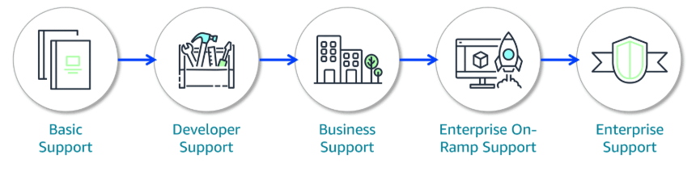

#### `PREVIOUS MODULE:` [Monitoring and Analytics](9_Monitoring-and-Analytics.md)

-----------

# Pricing and Support [↑](../README.md#1-aws-cloud-practitioner-notes)

- [AWS Pricing Concepts](#aws-pricing-concepts-)
- [AWS Pricing and Billing Services](#aws-pricing-and-billing-services-)
  - [AWS Organizations](#aws-organizations)
  - [AWS Billing and Cost Management Dashboard](#aws-billing-and-cost-management-dashboard)
  - [AWS Budgets](#aws-budgets)
  - [AWS Cost Explorer](#aws-cost-explorer)
  - [AWS Pricing Calculator](#aws-pricing-calculator)
- [AWS Support](#aws-support-)
  - [Basic Support](#1-basic-support)
  - [Developer Support](#2-developer-support)
  - [Business Support](#3-business-support)
  - [Enterprise On-Ramp Support](#4-enterprise-on-ramp-support)
  - [Enterprise Support](#5-enterprise-support)
- [Additional Support Resources](#additional-resources-)
- [AWS Marketplace](#aws-marketplace-and-aws-partner-network-)

## `AWS Pricing Concepts` [↑](#pricing-and-support-)

### Main Concepts of AWS Pricing
1. **Pay as you go:** Adapt to changing business needs and reduce the risk of over-provisioning or missing capacity.
2. **Save when you commit:** Savings Plans offer savings over on-demand prices when committing to a 1 or 3-year plan.
3. **Pay less by using more** 

### Driving Factors of Cost
1. **Compute**
   - Pay from the time you launch a resource until the time you stop the instance.
2. **Storage**
   - Pricing depends on how much storage have been provisioned or how much are being used.
   - For Amazon S3, consider the following six cost components:
     1. Storage Pricing
     2. Request and data retrieval pricing
     3. Data transfer and transfer acceleration pricing
     4. Data management and analytics pricing
     5. Replication pricing
     6. Price to process data with Amazon S3 Object Lambda
3. **Data Transfer**
   - In most cases, there is no charge for inbound data transfer or for data transfer between AWS services within the same Region. There are some exceptions, so be sure to verify data transfer rates before beginning
   - **Outbound Data Transfer**
     - is aggregated across services and then charged at the outbound data transfer rate.
     - The more data transferred, the less being paid per gigabyte.
     - For data storage and transfer, it is typically paid per gigabyte.

## AWS Pricing and Billing Services [↑](#pricing-and-support-)

### AWS Organizations
- Provides centralized management and governance of AWS environment.
- Create, group, and manage accounts.
- Apply security policies at the account level and consolidate billing with multiple accounts using a single payment method.
- **Use Cases:**
  - Consolidate multiple AWS accounts into one central organizations.
  - Implement organization-wide policies.
- **More Information:** [AWS Organizations](https://docs.aws.amazon.com/organizations/latest/userguide/orgs_introduction.html)

### AWS Billing and Cost Management Dashboard
- Centralizes cost management, showing current charges, usage, forecasts, and detailed breakdowns.
- Also provides tools to manage payments, view invoices, set budgets, and consolidate billings.
- **Use Cases:**
  - Visualizations and billing reports of monthly AWS spend.
  - Setup and manage payment methods.
- **More Information:** [AWS Billing User Guide](https://docs.aws.amazon.com/awsaccountbilling/latest/aboutv2/view-billing-dashboard.html)

### AWS Budgets
- Helps set custom budgets and sends alerts when cost, usage, or Savings Plans and Reserved Instances (RIs) 
utilization or coverage exceed defined thresholds.
- **Use Cases:**
  - Set up alerts for when projected costs exceed predefined thresholds. 
  - Forecast future expenses based on current usage trends.
- **More Information:** [Managing Costs with AWS Budgets](https://docs.aws.amazon.com/cost-management/latest/userguide/budgets-managing-costs.html)

### AWS Cost Explorer
- Helps visualize, analyze, and manage AWS costs and usage with interactive graphs, reports, and forecasts.
- Provides insights into spending patterns, trends, and reserved instance recommendations.
- View data up to the last 13 months and forecast how much likely to spend for the next 12 months.
- **Use Cases:**
  - Analyze historical spending trends to identify cost-saving opportunities.
  - Forecast future AWS costs based on current usage patterns to budget effectively.
- **More Information:** [Analyzing cost and usage with AWS Cost Explorer](https://docs.aws.amazon.com/cost-management/latest/userguide/ce-what-is.html)

### AWS Pricing Calculator
- A web-based planning tool that can be used to create estimates.
- Input specific configurations such as instance types, storage options, and data transfer volumes. Then, based on the configurations, the user will receive a detailed cost breakdown to help budget for AWS resource allocations.
- **Use Cases:**
  - Estimate potential costs before deployment.
  - Compare costs of different AWS services and configurations.
- **More Inforation:** [Generating estimates with AWS Pricing Calculator](https://docs.aws.amazon.com/cost-management/latest/userguide/pricing-calculator.html)

## `AWS Support` [↑](#pricing-and-support-)

### 1. Basic Support
- Included for all AWS Customers.
- Includes access to documentation, whitepapers, and AWS re:Post.
- Core AWS Trusted Advisor checks.
- Technical account management is not included.

### 2. Developer Support
- Recommended for experimenting or testing in AWS.
- Response times: **< 24 hours** for general guidance and **< 12 hours** when systems impaired.
- Core AWS Trusted Advisor checks.
- Technical account management not included.

### 3. Business Support
- Recommended minimum tier for production workloads in AWS.
- Response times:
  - Includes previous plan response times.
  - **< 4 hours** when production system is impaired.
  - **< 1 hour** when production system is down.
- Full set of AWS Trusted Advisor checks
- Technical account management not included.

### 4. Enterprise On-Ramp Support
- Recommended for production and business critical workloads in AWS.
- Response times:
  - Includes previous plan response times.
  - **< 30 minutes** when business-critical system is down
- Full set of AWS Trusted advisor checks.
- Pool of technical account managers (TAMs) provide proactive guidance.

### 5. Enterprise Support
- Recommended for business critical and mission-critical workloads in AWS
- Response times:
  - Includes previous plan response times.
  - **< 15 minutes** when business- or mission-critical system is down.
- Full set of AWS Trusted advisor checks and prioritized recommendations by AWS account team.
- A designated TAM provides consultative architectural and operational guidance.

#### Technical Account Manager (TAM)
- serves as primary AWS contact, offering expert guidance on using AWS services, optimizing architectures, managing costs, and connecting with AWS programs and experts.
- For example, when building an app using multiple AWS services, the TAM can advise on the best integration approach.

### Additional Resources [↑](#pricing-and-support-)

#### AWS re:Post
- Community driven QnA platform where users can seek help, share knowledge, and find solutions related to AWS services and technologies.
- Also houses [AWS Knowledge Center](https://repost.aws/knowledge-center)

#### AWS Trust and Safety Center
- Provides information on how to report activity or content on AWS that you suspect is abusive.
- **More Information:** [AWS Trust and Safety Center](https://repost.aws/aws-trust-and-safety)

#### AWS Solutions Architects
- For business and enterprise support customers, AWS SAs provide architectural guidance, best practice recommendations, and help in designing scalable and secure applications.

#### AWS Professional Services
- Consulting service that offers deeper, project-based support.
- Help with complex migrations, scurity audits, performance tuning, and more.
- **More Information:** [AWS Professional Services](https://aws.amazon.com/professional-services/)

#### Self Support at AWS
- Extensive documentation and self-support resources that can be used to research, answer a question, or troubleshoot an issue.
- Includes user guides for AWS services, SDK guides, blog posts, and white papers for specific solutions.

## `AWS Marketplace and AWS Partner Network` [↑](#pricing-and-support-)

### AWS Marketplace 
- a digital catalog that includes thousands of software listings from independent software vendors.
- Find, test, and buy software that runs on AWS.
- Includes the following:
  - **Software as a Service (SaaS):** Business applications such as project management tools.
  - **ML and AI:** Prebuilt models for image recognition, natural language processing, and more. ML algorithms with training custom models.
  - **Data and Analytics:** Business intelligence platforms for visualization and reporting.

### AWs Partner Network (APN)
- a global community that uses AWS technologies, programs, expertise, and tools to build solutions and services for customers.
- Partners and AWS provide innovative solutions, solve technical challenges, and deliver customer value.
- There are many benefits to becoming a partner:
  - **Funding Benefits:** Unlock various funding benefits to help build, market, and sell with AWS.
  - **AWS Partner Events:** Webinars, virtual workshops, and in-person learning opportunities.
  - **AWS Partner Training and Certification**

-----

`NEXT MODULE:` [Migrating to the AWS Cloud](11_Migrating-to-the-AWS-Cloud.md)

----

