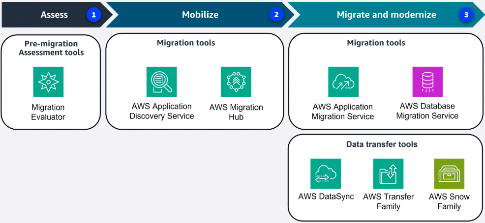
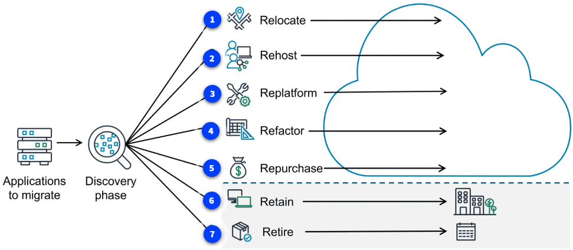

`PREVIOUS MODULE:` [Pricing and Support](10_Pricing-and-Support.md)
----

# Migrating to the AWS Cloud [↑](../README.md#1-aws-cloud-practitioner-notes)

- [Three Phases of Migration](#three-phases-of-the-migration-process)
- [AWS CAF](#aws-cloud-adoption-framework-aws-caf-)
  - [Functional and Business Stakeholders](#functional-and-business-related-stakeholders)
- [7 Migration Strategies](#the-7-migration-strategies-)
- [Migration Services and Tools](#migration-services-and-tools-)
  - [AWS Migration Evaluator](#1-aws-migration-evaluator)
  - [AWS Application Discovery Service](#1-aws-application-discovery-service)
  - [AWS Migration Hub](#2-aws-migration-hub)
  - [AWS Application Migration Service](#1-aws-application-migration-service)
- [Database Migrations](#database-migrations-)

## `Three Phases of the Migration Process`

  

#### 1. Assess Phase
- Build the business case for the migration and assess the readiness.
- One of the services used in this phase is the `Migration Evaluator`.

#### 2. Mobilize Phase
- Prepare the organization and mobilize the resources needed for the migration.
- Two services that might be used are `AWS Application Discovery Service` and `AWS Migration Hub`.

#### 3. Migrate and Modernize
- Use the strategy, plan, and the best practices to migrate and modernize.
- Tools to support include `AWS Application Migration Service` and `AWS Database Migration Service (AWS DMS)`.
- If transferring data, might use `AWS DataSync`, `AWS Transfer Family`, and `AWS Snow Family`.

## `AWS Cloud Adoption Framework (AWS CAF)` [↑](#migrating-to-the-aws-cloud-)
- Framework that brings AWS experience and best practices into companies preparing to migrate to the AWS Cloud.
- Provides tools to help accelerate the migration journey, organize resources, and align management during the transition.
- **Benefits:**
  - Reduce business risk and improve sustainability and corporate transparency.
  - Reduce operational costs, increase productivity, and improve customer experience in new cloud environment.
- **Use Cases:**
  - Migrate technology like legacy infrastructure and applications.
  - Migrate and optimize business processes, operations, and even create new business models with the move to the cloud.

### Functional and Business-related Stakeholders
There are six perspective of AWS CAF

#### 1. Business
- Ensures that IT aligns with business needs and that IT investments link to key business results.
- Create strong business case for cloud adoption and prioritize cloud adoption initiatives.
- **Roles:** Business managers, Finance managers, Budget owners, Strategy stakeholders

#### 2. People
- The people perspective supports development of an organization-wide change management strategy for successful cloud adoption.
- Evaluate organizational structures and roles, assess new skill and process requirements, and identify gaps.
- **Roles:** Human resources, staffing, people managers

#### 3. Governance
- Focuses on skill and processes to align IT strategy with business strategy.
- This perspective helps maximize business value and minimize risks.
- Update the staff skills and processes necessary to maintain business governance in the cloud.
- **Roles:** Chief Information Officer (CIO), Program managers, Enterprise architects, Business analysts, Portfolio managers

#### 4. Platform
- Includes principles and patterns for implementing new solutions in the cloud and migrating on-premises workloads to the cloud.
- Use a variety of architectural models to understand and communicate the structure of IT systems and their relationships.
- **Roles:** Chief Technology Officer (CTO), IT managers, Solutions Architects

#### 5. Security
- Ensure that the organization meets security objectives for visibility, auditability, control, and agility.
- Structure the selection and implementation of security controls that meet the organization's needs.
- **Roles:** Chief Information Security Officer (CISO), IT security managers, IT security analysts

#### 6. Operations
- Enable, run, use, operate, and recover IT workloads to the level agreed upon with business stakeholders.
- Define how day-to-day, quarter-to-quarter, and year-to-year business is conducted.
- Align with and support the operations of the business.
- **Roles:** IT operations managers, IT support managers

## `The 7-Migration Strategies` [↑](#migrating-to-the-aws-cloud-)
Often, organizations will use a combination of these strategies across their application portfolio. By carefully considering each option and aligning with specific applications and objectives.

  

1. **Relocate** 
   - Changing the hosting location to the cloud. 
   - This could be if applications are already virtual machines (VMs) or containers running on premises and then moving to the cloud.
2. **Re-host**
   - Also known as **lift-and-shift**, involves moving applications without changes.
   - In a scenario of a large legacy migration, in which the company is looking to implement its migration and scale quickly to meet a business case, the majority of applications are rehosted.
3. **Re-platform**
   - also known as **lift, tinker, and shift**, involves making a few cloud optimizations to realize a tangible benefit.
   - Optimization is achieved without changing the core architecture of the application.
4. **Refactor**
   - Also known as **Re-architecting**, involves reimagining how an application is architected and developed by using features built for the cloud.
   - Refactoring is driven by a strong business need to add features, scale, or improve performance that would otherwise be difficult to achieve in the application's existing environment.
5. **Repurchase**
   - Involves moving from a traditional license to a software-as-a-service (SaaS) model.
   - For example, a business might choose to implement this strategy by migrating from a customer relationship management (CRM) system to a new sales force software.
6. **Retain**
   - Retaining consists of keeping applications that are critical for the business in the source environment.
   - This might include applications that require major refactoring before they can be migrated or work that can be postponed until a later time.
7. **Retire** 
   - The process of removing applications that are no longer needed.

## `Migration Services and Tools` [↑](#migrating-to-the-aws-cloud-)

### Assess Phase
In the assess phase, it is important to have the right tools to build the business case for your migration. 

#### 1. `AWS Migration Evaluator`
- Migration assessment service that helps create a business case for AWS cloud planning and migration.
- It does this with data driven approach, analyzing current state, target state, and developing a migration readiness plan with projected cloud costs.
- **Benefits:**
  - Removing the guesswork when migrating.
  - Provides visibility into multiple cost-effective cloud migration scenarios.
  - Gives insights on reusing existing software licensing, which can further reduce costs.
- **Use Cases:**
  - Conduct broad-based discovery, take a snapshot of current on-premises footprint to fine-tune licensing, view server dependencies, and gain visibility into multiple migration scenarios.
  - Estimate and reduce cloud costs.

### Mobilize Phase

#### 1. `AWS Application Discovery Service`
- Discovers on-premises server inventory and connections.
- It gathers configuration, performance, and connection details for both servers and databases to create a detailed migration plan.
- **Benefits:**
  - Get a comprehensive snapshot of on-premise inventory.
  - Integrate discovery data with other services like Migration Hub and protect the data Application Discovery Service collects
- **Use Cases:**
  - Can be used to conduct discovery and inventory, map the connections and dependencies, and generate a migration plan.

#### 2. `AWS Migration Hub`
- Centralized hub to take users from discovery, assessment, planning, and execution of migration.
- It provides tools , guidance, and automated recommendations to collaborate with team and track the migration.
- **Benefits:**
  - With the Migration Hub, you can have one location to go for your migration and, expert guidance in the form of prescriptive journey templates.
  - Cost savings because there is no charge to use the Migration Hub.
- **Use Cases:**
  - For migration assessment and planning and migration completion and collaboration with teams.
  - Use for modernization efforts like fast-tracking application refactoring.

### Migrate and Modernize Phase
Start moving the resources to the cloud. Migration Hub can be used to track progress.

#### 1. `AWS Application Migration Service`
- A tool to move and improve on-premises and cloud-based applications.
- Helps customers streamline, expedite, and reduce the cost of migrating and modernizing applications.
- **Benefits:**
  - Include support to migrate from any source infrastructure that runs a supported OS. it makes it possible to modernize applications during migration
  - Maintain normal business operations during the application replication process and reduce costs by using one tool for a wide range of application.
- **Use Cases:**
  - Use for on-premises applications running on physical servers or infrastructure, cloud-based applications, or moving between AWS Regions.

## `Database Migrations` [↑](#migrating-to-the-aws-cloud-)
Migrating your database to the cloud can provide an opportunity to redesign and improve your database architecture. 
Because legacy systems and requirements change over time, you might also consider whether to migrate to an AWS managed database service or an open source database to reduce licensing costs.

