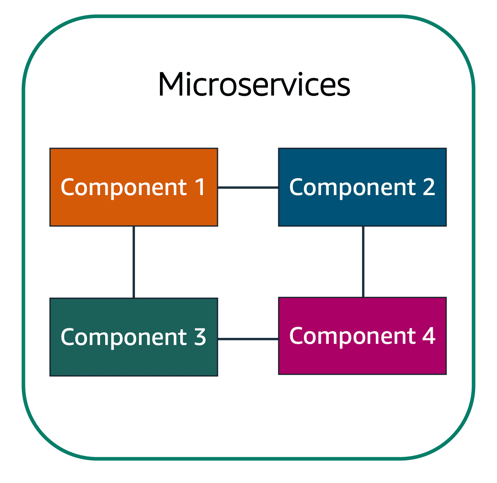
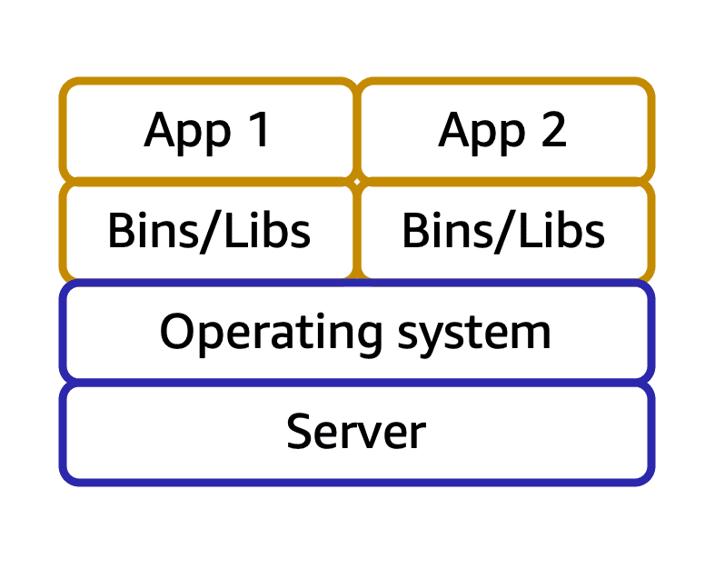

# Compute in the Cloud [↑](AWS-Practitioner-Essentials-Notes.md)

- [Amazon EC2](#amazon-elastic-compute-cloud-ec2-)
- [EC2 Instance Types](#amazon-ec2-instance-types-)
- [EC2 Pricing Options](#amazon-ec2-pricing-)
- [Amazon EC2 Auto Scaling](#scalability-and-elasticity-)
- [Elastic Load Balancing](#elastic-load-balancer-elb-)
    - [`Amazon EventBridge`](#amazon-eventbridge)
    - [`Amazon SNS`](#amazon-simple-notification-service-amazon-sns)
    - [`Amazon SQS`](#amazon-simple-queue-services-amazon-sqs)
- [Serverless Computing](#additional-compute-services-serverless-computing)
    - [Lambda](#1-aws-lambda)
    - [Container](#2-aws-container-service)
    - [AWS Fargate](#3-aws-fargate)

## `Amazon Elastic Compute Cloud (EC2)` [↑](#compute-in-the-cloud-)
- Provides resizable compute capacity in the cloud as Amazon EC2 instances.
- An Amazon EC2 instance enables the use of a virtual server to run applications in the AWS cloud.
- Provision and launch EC2 instance within minutes.
- Pay only for the compute time used when an instance is running, not when it is stopped or terminated.
- Save cost by paying only for server capacity needed or wanted.

## `How Amazon EC2 works` [↑](#compute-in-the-cloud-)
### 1. Launch
- Launch an instance by selecting a template with basic configurations for your instance.
- These configurations include the operating system (OS), application server, or applications.
- The instance type (specific hardware configurations of the instance) can also be selected.
- Specify the security settings to control the network traffic that can flow into and out of the instance.
### 2. Connect
- The instance can be connected in several ways.
- Programs and applications have multiple different methods to connect directly to the instance and exchange data.
- Users can also connect to the instance by logging in and accessing the computer desktop.
### 3. Use
- After connecting, the instance can now be used.
- Run commands to install software, add storage, copy and organize file, and more.

## `Amazon EC2 Instance Types` [↑](#compute-in-the-cloud-)
### 1. General Purpose
- Balanced resources (compute, memory, and networking resources)
- Diverse workloads such as application servers, gaming servers, backend for enterprise apps, small - medium DBs.
- Web servers and code repositories

### 2. Compute Optimized
- For compute intensive tasks like gaming servers, High Performance Computing (HPC), Scientific modeling.
- Compute optimized applications are ideal for high-performance web servers, compute-intensive
  application servers, and dedicated gaming servers.

### 3. Memory Optimized
- Utilizes hardware accelerators.
- Designed to deliver fast performance for workloads that process **large datasets** in memory.
- `Memory`
    - In computing memory is a temporary storage area.
    - It holds all the data and instructions that a CPU needs to be able to complete actions.
    - Before a computer program or application is able to run, it is loaded from storage into memory.
    - This preloading process gives the CPU direct access to the computer programs.

### 4. Accelerated Computing Instances
- Use hardware accelerators, or coprocessors, to perform some functions more efficiently than is
  possible in software running on CPUs. Tasks like Floating point number calculations, Graphics processing,
  Data Pattern matching.
- `Hardware Accelerator`: Is a component that can expedite data processing.
- Ideal for workloads such as graphics applications, game streaming, and application streaming.

### 5. Storage Optimized
- Good for high performance for locally stored data.
- Designed for workloads that require high, sequential read and write access to large datasets on **local storage**.
- Examples are Distributed file systems, Data warehousing applications,
  and high-frequency online transaction processing (OLTP) systems.
- `Input/Output Operations Per Second (OIPS)`
    - Is a metric that measures the performance of a storage device.
    - It indicates how many different input or output operations a device can perform in a second.

## `Amazon Machine Image (AMI)`
AMIs are pre-built virtual machine images that have the basic components for what is needed to start an instance.

### AMI Components
- An AMI includes operating system, storage setup, architecture type, permissions for launching, and an extra software that is already installed.
- You can use AMI to launch several EC2 instance that all have the same setup.
- AMIs provide repeatability through a consistent environment for every new instance.
- Development and testing are consistent because configurations are identical and deployments are automated which helps scaling, reduces errors, and streamlines managing large-scale environments.

### Three ways to use AMIs
1. Create specific AMI by building a custom AMI with specific configurations and software tailored according to needs.
2. Use pre-configured AWS AMIs which are set up for common OS and software.
3. Purchase AMIs from the AWS marketplace, where third-party vendors offer specialized software designed for specific use cases.

## `Amazon EC2 Pricing` [↑](#compute-in-the-cloud-)
### 1. On-Demand
- ideal for short-term, irregular workloads that cannot be interrupted.
- No upfront costs or minimum contracts apply.
- The instance can run continuously until it is stop, and pay for only the compute time used.
- Example: developing and testing applications and running applications that have unpredictable usage patterns.

### 2. Reserved Instances
- billing discount applied to the use of On-Demand Instances in an AWS account.
- At the end of the term, the Amazon EC2 instance can still be used without interruption.
  However, On-Demand rates will be charged until one of the following is done.
    1. Terminate the Instance
    2. Purchase a new reserved instance that matches the instance attributes.

`Standard Reserved Instances:`
- Good fit if the EC2 instance type and size is known for steady-state applications.
- The following is required to be indicated upon availing:
    - **Instance type and size**: for example, `m5.xlarge`
    - **Platform description (OS):** for example, MS Windows Server or Red Hat Ent. Linux
    - **Tenancy:** Default tenancy or dedicated tenancy

`Convertible Reserved Instances:`
- If the EC2 Instances are needed to run in different AZs or different instance types.
- `Note:` You trade in a deeper discount when you require flexibility to run your EC2 Instances.

### 3. Savings Plans
- Reduce cost for 1-year or 3-year term.
- Savings up to 72% compared to On-Demand rates.
- There is no need to specify up front what EC2 instance type and size, OS, and tenancy to get a discount.
- There is no need to commit to a certain number of EC2 instances as it does not include EC2 capacity reservation options.

### 4. Spot Instances
- ideal for workloads with flexible start and end times, or that can withstand interruptions.
- These are unused Amazon EC2 computing capacity and offer a cost savings of 90% off.
- Use cases examples are background processing job that can start and stop as needed (such as data processing for a customer survey).
- If there is a Spot Instance request and there is no EC2 capacity available, the request is not successful until capacity becomes available.
- There is a chance that the instance may be interrupted once capacity is no longer available (Unexpected interruptions).

### 5. Dedicated Hosts
- Physical servers with Amazon EC2 instance capacity that is fully dedicated for use.
- There are existing per-socket, per-core, or per-VM software licenses available to help maintain license compliance.
- The most expensive pricing.

## `Scalability and Elasticity` [↑](#compute-in-the-cloud-)
- Involves beginning with only the resources needed and designing the architecture to automatically respond
  to changing demand by scaling out or in. Pay for only the resource used.
- There is no need to worry about lack of computing capacity.

### Amazon EC2 Auto Scaling
- Enables to automatically add or remove Amazon EC2 instances in response to changing application demand.
- Maintain a greater sense of application availability by automatically scaling instances in and out as needed.
- There are two approaches in Amazon EC2 Auto Scaling:
    1. _Dynamic scaling_ responds to changing demand.
    2. _Predictive scaling_ automatically schedules the right number of EC2 instances based on predicted demand.

  

### Auto Scaling Notes:
- When an _Auto Scaling Group_ is created, Set the minimum number of Amazon EC2 instances at one.
- **minimum capacity:** is the number of EC2 instances that launch immediately after the group is created.
- **desired capacity:** instance even though the application needs a minimum. If this is not set, the
  desired capacity will be the minimum capacity by default.
- **maximum capacity:** Maximum instance the group will scale out in response to increased in demand.

With Amazon EC2 scaling, you pay for only the instances you use, when you use them. This is a cost-effective
architecture that provides the best customer experience while reducing expenses.

## `Elastic Load Balancer (ELB)` [↑](#compute-in-the-cloud-)
- an application that takes in request and routes to the instances to be processed.
- ELB is automatically scalable with no change in the hourly cost.
- Single URL that each front-end uses. Single point of contact for all incoming web traffic to Auto Scaling group.
- Promotes de-coupled architecture.

`Elastic Load Balancing:` is a major AWS service that automatically distributes incoming application traffic
across multiple resources, such as Amazon EC2 instances.

## Messaging and Queueing [↑](#compute-in-the-cloud-)
### Tightly Coupled Architecture
- Applications communicating directly without **buffer**.
- When there is change in a certain component, it affects other components as well or even the whole system.

### Loosely Couple Architecture
- Single failure won't cause cascading failures.

To help maintain application availability when a single component fails, an application can be designed
through a **microservices** approach.

  

### Amazon EventBridge
- a serverless service that helps connect different parts of an application using events, helping to build scalable event-driven systems.
- Events are routed from sources like custom apps, AWS services, and third-party software to other applications.
- Simplifies the process of receiving, filtering, transforming, and delivering events, so you can quickly build reliable applications.
- Example:
    - Customers use an online food delivery service to order meals from local restaurants through a mobile app. When a customer places an order, several steps need to happen simultaneously.
        1. The payment service must verify and process the customer's payment.
        2. Notify the restaurant to start preparing the meal.
        3. Inventory management where the system checks if the ingredients for the order are available.
        4. Delivery driver is notified to pick up and deliver the meal.

### Amazon Simple Notification Service (Amazon SNS)
- a publish/subscribe (pub/sub) service.
- Using _Amazon SNS topics_, a publisher publishes messages to subscribers.
- Subscribers can be web servers, email addresses, AWS Lambda functions, or several other options.

### Amazon Simple Queue Services (Amazon SQS)
- A message queueing service.
- Allows to send, store, receive messages between software components at any volume without losing messages
  or requiring other services to be available.
- In Amazon SQS, an application sends messages into a queue. A user or service retrieves the message from the queue,
  processes it, and then deletes it from the queue.
- `SQS Queues`: Where messages are placed until they are processed.
- `Payload`: The data contained within a message. Encrypted until delivery.

## Additional Compute Services (Serverless Computing)
You cannot see or access the underlying infrastructure that hosts your application. All the management such as
provisioning, scaling, high availability is handled by the cloud provider (AWS).

Another benefit of serverless computing is the flexibility to scale serverless applications automatically.
Severless computing can adjust the applications' capacity by modifying the units of consumption, such as throughput and memory.

### Unmanaged, Managed, Fully-managed Services

1. **Unmanaged Services**
    - Like **Amazon EC2**, AWS takes care of the underlying physical infrastructure but customer is responsible for setting up, securing, and maintaining the OS, network, and applications.
2. **Managed Services**
    - Reduce the amount of infrastructure need to manage.
3. **Fully-managed Services**
    - Like **serverless ones**, abstraction is taken further.
    - Eliminating the need to provision or manage any servers.
    - The underlying infrastructure is fully managed by AWS, so customer can focus entirely on writing and deploying the code.

### 1. AWS Lambda
- Upload a code into a Lambda Function that is invoked through a configured **Trigger**.
- This function is run in an environment that is not to be taken care of by the user.
- Lambda automatically scales the function to meet demand.
- Not for longer running processes since it is designed to run for less than **15 minutes**
- Pay only for the compute time.
- For example, a Lambda function might involve automatically resizing uploaded images to the AWS Cloud. Whereas the trigger
  is when a new image is uploaded.

  

### 2. AWS Container Service
- There is access in underlying environment but there is still efficiency and portability.
- Automatically scale containers, handle health checks, and manage their lifecycle based on traffic demand.
- The container is a `Docker` container. (Widely known platforms that uses OS level virtualization to deliver software)
- `Container`: is a package or object for a code and dependencies. Runs on top of an EC2 instances and are isolated from one another.

  

Suppose that a company’s application developer has an environment on their computer that is different
from the environment on the computers used by the IT operations staff. The developer wants to ensure
that the application’s environment remains consistent regardless of deployment, so they use a
containerized approach. This helps to reduce time spent debugging applications and diagnosing
differences in computing environments.

- Container Orchestration Tools:
    - **Amazon Elastic Container Service (ECS)**
        - is a highly scalable, high-performance container management system that enables you
          to run and scale containerized applications on AWS.
    - **Amazon Elastic Kubernetes Service (EKS)**
        - is a fully managed service that you can use to run Kubernetes on AWS.

### 3. AWS Fargate
- There is no need for EC2 instances.
- Serverless compute platform for ECS and EKS.
- focus more on innovating and developing your applications, and you pay only for the resources that are required
- to run your containers.

### Summary

Running Docker container-based workloads on AWS, select Orchestration tools

<strong>Amazon EC2 or AWS Fargate</strong>

Host short running functions, Service oriented applications, event driven applications and 
no provisioning or managing servers

<strong>AWS Lambda</strong>

Host traditional applications, Full access to the OS

<strong>Amazon EC2</strong>

## `Useful Links:`

  <ul>
    <li><a href="https://aws.amazon.com/products/compute/#AWS_compute_services">More AWS Compute Services</a></li>
    <li><a href="https://aws.amazon.com/getting-started/hands-on/?awsf.getting-started-category=category%23compute&awsf.getting-started-content-type=content-type%23hands-on&getting-started-all.sort-by=item.additionalFields.content-latest-publish-date&getting-started-all.sort-order=desc&awsm.page-getting-started-all=2">Hands-On Tutorials</a></li>
  </ul>

