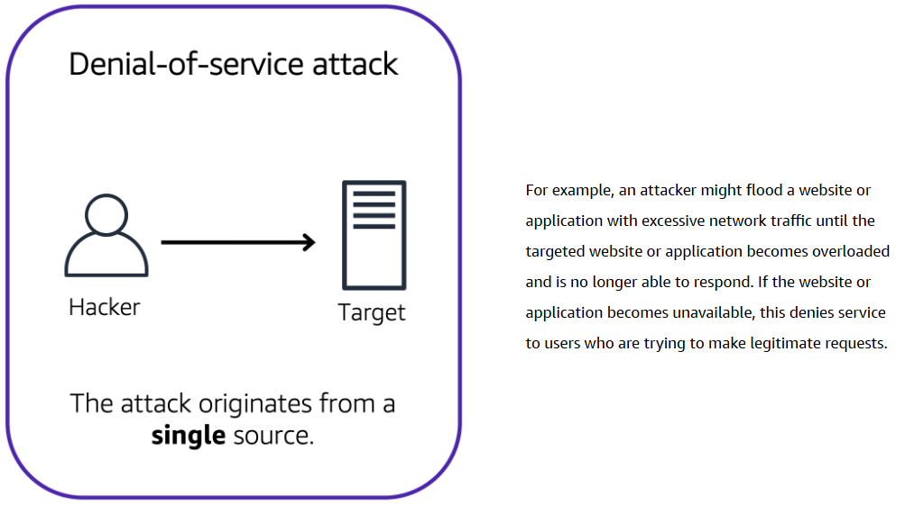
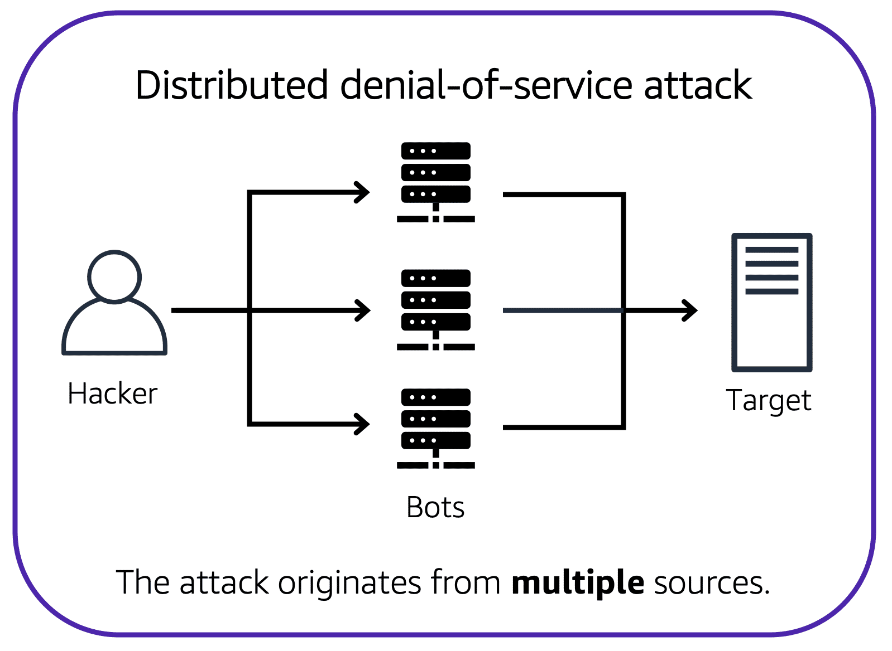
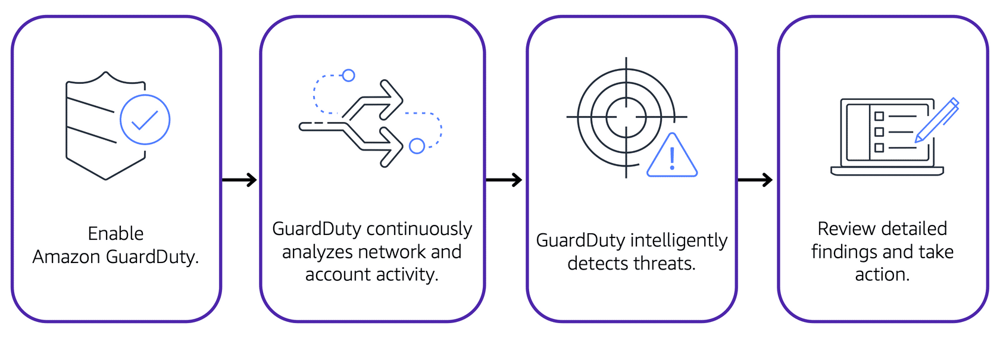

# Security in AWS [↑](AWS-Practitioner-Essentials-Notes.md)

- [Shared Responsibility Model](#aws-shared-responsibility-model-)
- [User Permissions and Access](#user-permissions-and-access-)
    - [Identity and Access Management (IAM)](#identity-and-access-management-iam-users)
    - [IAM Policies](#iam-policies)
    - [IAM Groups](#iam-groups)
    - [IAM Role](#iam-roles)
    - [Additional Access Management Services](#additional-access-management-services-)
- [AWS Organizations](#aws-organizations-)
- [Compliance](#compliance-)
  - [AWS Artifacts](#aws-artifacts)
- [Denial-of-Service (DoS) Attacks](#denial-of-service-dos-attacks-)
  - [Additional Security Services](#additional-security-services-)


## `AWS Shared Responsibility Model` [↑](#security-in-aws-)
The shared responsibility model divides into customer responsibilities (commonly referred to as “security in the cloud”)
and AWS responsibilities (commonly referred to as “security of the cloud”).

<div align="center">
  
</div>

## `User Permissions and Access` [↑](#security-in-aws-)
- Scoping users permissions.
- `AWS Account Root User`: Owner of the AWS account.

### Root User
When an AWS account is created, you begin with an identity called the **Root User**.

The root user is accessed by signing in with the email address and password that you used to create the AWS account.

<table>
  <tr>
    <th style="text-align:left; background-color:grey; color:black">Best Practice:</th>
  </tr>
  <tr>
    <td>Do not use the root user for everyday tasks. Instead, create an IAM user and assign permissions to create 
other users.
    </td>
  </tr>
</table>

### Identity and Access Management (IAM) Users

- Represents the person or application that interacts with AWS services and resources.
- Consists of name and credentials.
- No access given by default upon creation.


### IAM Policies
- IAM Policy is a JSON document which describes the permissions associated on a specific user.

Below is a sample IAM policy that is attached to users or groups.
```json
{
  "Version": "2012-10-17",
  "Statemenmt": {
    "Effect": "Allow",
    "Action": "s3:ListBucket",
    "Resource": "arn:aws:s3:::coffee_shop_reports"
  }
}
```
- Values:
    - **Effect**: Allow or Deny
    - **Action**: Any AWS API call
    - **Resource**: Which AWS resource the API call is for
    -
<table>
  <tr>
    <th style="text-align:left; background-color:grey; color:black">Best Practice:</th>
  </tr>
  <tr>
    <td>Follow the security principle of <strong>least privilege</strong> when granting permissions</td>
  </tr>
</table>

### IAM Groups
- To easily manage permission for users.
- Access control is done by assigning an IAM policy to the group instead of each user.
- Makes it easier to adjust permissions when an employee transfers to a different job.

### IAM Roles
- For users that has changing roles from time-to-time.
- Have associated permissions that allow or deny certain actions but for aa temporary amount of time.
- No username or password.
- Temporarily grant access to users.
- Once assigned, it supersedes other permissions associated to an identity.
- Useful for varying roles from time-to-time. With this, one user can have different roles but not both.

### Additional Access Management Services [↑](#security-in-aws-)
These services help streamline the administration of AWS environments while bolstering security practices.

#### 1. AWS IAM Identity Center
- Centralizes IAM across AWS accounts and applications.
- Can also connect to an existing identity source and provide workforce with SSO access to all connected AWS services and accounts.
- This is called **Federated Identity Management**
  - A system that allows user to access multiple applications, services, or domains using a single set of credentials.

#### 2. AWS Secrets Manager
- Provides a secure way to manage, rotate, and retrieve database credentials, API keys, and other secrets throughout their lifecycle.
- Helps keep applications, services, and IT resources safe.

#### 3. AWS Systems Manager
- Provides a centralized view of nodes across organization's accounts and regions and multi-cloud and hybrid environments.
- Quickly access node information such as ID and OS details, automate registry edits, user management, and security patching.

## `AWS Organizations` [↑](#security-in-aws-)
An AWS services where it is a central location to manage multiple AWS accounts.

When an AWS Organization is created, a root user is automatically created which is the parent container for all the
accounts in the organization.

- Centralized management
- Consolidated billing
- Implement hierarchical groupings of accounts.
- AWS service and API actions access control


### Service Control Policies (SCPs)
It is possible to centrally control permissions for the accounts in the organization by using the **Service Control
Policies (SCPs)**. SCPs enable to place restrictions on the AWS services, resources, and individual API actions that
users and roles in each account can access.

- SCPs can ba applied to the organization root, an individual member account, or an OU.
- SCPs affects all IAM users, groups, and roles within an account, including the AWS account root user.
- You can apply IAM policies to IAM users, groups, or roles. You cannot apply an IAM policy to the AWS account root
  user.

### Organizational Units
In AWS Organizations, accounts can be grouped into an Organizational Unit (OU) to make it easier to manage accounts
with similar business or security requirements.


## `Compliance` [↑](#security-in-aws-)

### AWS Artifacts
AWS Artifacts is a no-cost AWS service that provides on-demand access to AWS security and compliance reports and select
online agreements.

AWS Artifacts provide access to AWS security and compliance documents such as **_AWS ISO certifications_**, **_Payment Card
Industry (PCI)_** reports, and **_Service Organization Control_** (SOC) reports.

**Two sections of AWS Artifacts**
- `AWS Artifact Agreements:`
    - Review, accept, and manage agreements for an individual account and for all accounts in AWS Organizations.

- `AWS Artifact Reports:`
    - Provide compliance reports from third-party auditors.
    - Can be provided to auditors or regulators as evidence of AWS security controls.

### Customer Compliance Center
The [Customer Compliance Center](#https://aws.amazon.com/compliance/customer-center/) contains resources to help learn more about AWS compliance.

There is also access to compliance whitepapers and documentations on topics such as:
- AWS answers to key compliance questions
- An overview of AWS risk and compliance
- An auditing security checklist

## `Network and Application Attacks` [↑](#security-in-aws-)
### Denial-of-Service (DoS) Attacks
DoS Attack is a deliberate attempt to make a website or application unavailable to users.

Customers can call the coffee shop to place their orders. After answering each call, a cashier takes the order and gives it to the barista.

However, suppose that a prankster is calling in multiple times to place orders but is never picking up their drinks.
This causes the cashier to be unavailable to take other customers’ calls. The coffee shop can attempt to stop the false requests by blocking the phone number that the prankster is using.

<div align="center">
  
</div>

### Distributed Denial-of-Service (DDoS) Attacks
Multiple sources are used to start an attack that aims to make a website or application unavailable.

<div align="center">
  
</div>

## `AWS Network and Application Protection` [↑](#security-in-aws-)
AWS automatically protects against low-level, brute-force attacks through its built-in infrastructure and network architecture.

- **Security Groups**
- **Elastic Load Balancer:** Operates at region-level
- **AWS Regions**

### AWS Shield
An AWS Service that protects applications against DDoS attacks. Provides two levels of protection: **Standard** and
**Advanced**.

- **Standard**
    - Automatically protects all AWS customers at no cost.
    - Protects AWS resources from most common, frequently occurring types of DDoS attacks.
    - As network traffic comes into the application, AWS Shield uses a variety of analysis techniques to detect
      malicious traffic in real time and automatically mitigates it.

- **Advanced**
    - A paid service that provides detailed attack diagnostics and the ability to detect and mitigate sophisticated
      DDoS attack.
    - Integrates with other services such as `Amazon CloudFront`, `Amazon Route 53`, and ELB.
    - This can also be integrated with `AWS WAF` by writing custom ruled to mitigate complex DDoS attacks.

### AWS WAF
- A web application firewall that monitors network requests that come into web applications.
- When a request comes in, it checks the IP address against a web ACL.
- If the request comes from a blocked IP address on the web ACL, it denies access.
- Works together with `Amazon CloudFront` and Application ELB.
- Just like network ACLs, it blocks/allows traffic using web ACLs.

## `Additional Security Services` [↑](#security-in-aws-)

1. **AWS Key Management Service**
   - Enables to perform encryption operations through the cryptographic keys.
   - A **Cryptographic Keys** is a random string of digits used for encryption and decryption of data.
   - Used to create, manage, and user cryptographic keys and can also be used to control the use of keys across a wide range of services and in the application.
   - For example, user can specify which IAM users and roles can manage keys.
   - Keys in the AWS KMS can be disabled on demand.
2. **Amazon Macie**
   - Monitor sensitive **data at rest** to make sure it is safe.
   - Uses ML and automation to discover sensitive data stored in Amazon S3.
   - Use to assess security posture, which is especially helpful for meeting compliance requirements.
3. **AWS Certificate Manager (ACM)**
   - Centralizes management of SSL/TLS certificates that provide data **encryption in transit**.
   - Use to protect various AWS services and connected on-premises resources.
4. **Amazon Inspector**
    - Performs automated security assessments for EC2 instances, containers, and Lambda functions.
    - Checks applications for security vulnerabilities and deviations from security best practices, such as open access to Amazon EC2 instances and installations of vulnerable software versions.
    - After an assessment, Amazon Inspector provides with a list of security findings which is prioritized in severity levels.
5. **Amazon GuardDuty**
    - An AWS Service that provides an intelligent threat detection for AWS infrastructure and resources.
    - Identifies threat by continuously monitoring the network activity and account behavior within the AWS environment.
    - Uses known malicious IP addresses, anomaly detection, and machine learning to identify threats more accurately.
    - If Amazon GuardDuty detects any threats, you can review detailed findings about them from the AWS Management
      Console. Findings include recommended steps for remediation.
    - `AWS Lambda` can also be configured to take remediation steps automatically in response to GuardDuty's security
      findings.
6. **Amazon Detective**
   - Once a threat has been detected, this can be use to further investigate the root cause.
   - Helps analyze threats with interactive visualizations contained in a unified AWS Management Console view.
   - The visualizations include resource and user interactions over a configurable timeline with recommended steps for remediation.
7. **AWS Security Hub**
   - Brings multiple security services together into a single place and format.
   - Quickly see security and compliance state in one comprehensive view.
   - Automatically aggregates security findings from AWS and partner services and organizes into actionable, meaningful groupings called **insights**.
   - Helps accelerate Time To Resolution (TTR) with automated remediation.

<div align="center">
  
</div>

## `Additional Resources`
- [Security Best Practices in IAM](https://docs.aws.amazon.com/IAM/latest/UserGuide/best-practices.html)