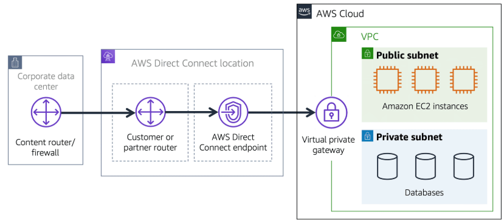
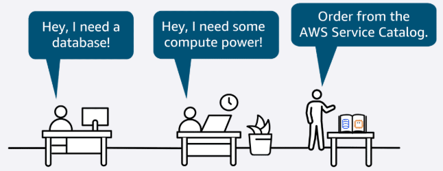

# AWS Practitioner Essentials

- [I. Introduction](#introduction-to-amazon-web-services-)
  - [Deployment Models for Cloud Computing](#deployment-models-for-cloud-computing-)
  - [Benefits of Cloud Computing](#benefits-of-cloud-computing-)
- [II. Compute](#compute-in-the-cloud-)
  - [Amazon EC2](#amazon-elastic-compute-cloud-ec2-)
  - [EC2 Instance Types](#amazon-ec2-instance-types-)
  - [EC2 Pricing Options](#amazon-ec2-pricing-)
  - [Amazon EC2 Auto Scaling](#scalability-and-elasticity-)
  - [Elastic Load Balancing](#elastic-load-balancer-elb-)
    - [`Amazon SNS`](#amazon-simple-notification-service-amazon-sns)
    - [`Amazon SQS`](#amazon-simple-queue-services-amazon-sqs)
  - [Serverless Computing](#additional-compute-services-serverless-computing)
    - [Lambda](#1-aws-lambda)
    - [Container](#2-aws-container-service)
    - [AWS Fargate](#3-aws-fargate)
- [III. AWS Global Infrastructure and Reliability](#aws-global-infrastructure-and-reliability-)
  - [AWS Regions](#aws-regions-)
  - [Availability Zones (AZs)](#availability-zones-azs-)
  - [Edge Locations](#edge-locations-)
    - [`Amazon CloudFront`](#amazon-cloudfront)
    - [`Amazon Route 53`](#amazon-route-53)
    - [`Amazon Outposts`](#amazon-outposts)
  - [Provisioning Resources](#provisioning-aws-resources-)
    - [AWS Management Console](#1-aws-management-console)
    - [AWS CLI](#2-aws-command-line-interface-cli)
    - [AWS SDKs](#3-aws-software-development-kits-sdks)
    - [Other Tools](#4-various-other-tools)
      - `Amazon Elastic Beanstalk`
      - `Amazon CloudFormation`
- [IV. Networking](#networking-)
  - [Amazon Virtual Private Cloud (VPC)](#amazon-virtual-private-cloud-amazon-vpc)
  - [VPC Components](#components-in-a-vpc-)
    - [`AWS Direct Connect`](#3-aws-direct-connect-)
  - [Network Security Layers](#network-security-layers-)
  - [Network ACLs](#network-access-control-list-network-acls-)
  - [Security Groups](#security-groups-)
  - [Global Networking](#global-networking-)
    - [Domain Name System](#domain-name-system-dns-)
    - [Amazon Route 53](#amazon-route-53-)
- [V. Storage and Databases](#storage-and-databases-)
  - [Instance Stores](#instance-stores-)
  - [Elastic Block Stores (EBS)](#amazon-elastic-block-store-amazon-ebs-)
  - [Amazon Simple Storage Service (S3)](#amazon-simple-storage-service-amazon-s3-)
  - [Amazon Elastic File System (EFS)](#amazon-elastic-file-system-amazon-efs-)
  - [Amazon Relational Database Service (RDS)](#amazon-relational-database-service-amazon-rds-)
  - [Amazon Aurora](#amazon-aurora-)
  - [Amazon DynamoDB](#amazon-dynamodb-)
  - [Amazon Redshift](#amazon-redshift-)
  - [Amazon Database Migration Service (DMS)](#amazon-database-migration-service-amazon-dms-)
  - [Other Amazon Database Services](#additional-database-services-)
- [VI. AI/ML and Data Analytics in AWS](#artificial-intelligence-ai-and-machine-learning-ml-on-aws-)
- [VII. Security in AWS](#security-)
  - [Shared Responsibility Model](#aws-shared-responsibility-model-)
  - [User Permissions and Access](#user-permissions-and-access-)
    - [Identity and Access Management (IAM)](#identity-and-access-management-iam-users)
    - [IAM Policies](#iam-policies)
    - [IAM Groups](#iam-groups)
    - [IAM Role](#iam-roles)
  - [AWS Organizations](#aws-organizations-)
  - [Compliance](#compliance-)
    - [AWS Artifacts](#aws-artifacts)
  - [Denial-of-Service (DoS) Attacks](#denial-of-service-dos-attacks-)
  - [Additional Security Services](#additional-security-services-)
- [VIII. Monitoring and Analytics in AWS](#monitoring-and-analytics-)
  - [`Amazon CloudWatch`](#amazon-cloudwatch-)
  - [`AWS CloudTrail`](#aws-cloudtrail-)
  - [`AWS Config`](#aws-config-)
  - [`AWS Audit Manager`](#aws-audit-manager-)
  - [`Governance in AWS`](#governance-in-aws-)
  - [`Trusted Advisor`](#aws-trusted-advisor-)
- [IX. Pricing and Support in AWS](#pricing-and-support-)

## Terminologies:
`Cloud Computing`: On-demand delivery of IT resources and applications through the internet with pay-as-you-go pricing.

`Memory`: A temporary storage are for processing.

`Hardware Accelerators`: A component that can expedite data processing.

`Input/Output Operations Per Second (OIPS)`: A metric that indicates how many I/O operations a
device can perform per second.

## Introduction to Amazon Web Services [↑](#aws-practitioner-essentials)

### `Deployment Models for Cloud Computing` [↑](#aws-practitioner-essentials)
When selecting a cloud strategy, a company must consider factors such as required cloud application components, 
preferred resource management tools, and any legacy IT infrastructure requirements.

#### 1. Cloud-Based Deployment
- Run all parts of the application in the cloud.
- Migrate existing applications to the cloud.
- Design and build new applications in the cloud.

#### 2. On-Premises Deployment (private cloud deployment)
- Deploy resources by using virtualization and resource management tools.
- Increase resource utilization by using application management and virtualization technologies.
- Resources are deployed on premises by using virtualization and resource management tools.

#### 3. Hybrid Deployment
- Connect cloud-based resources to on-premises infrastructure.
- Integrate cloud-based resources with legacy IT applications.
- For instance where legacy applications that are better maintained on premises, or government regulations
that require business to keep certain records on premises.


### `Benefits of Cloud Computing` [↑](#aws-practitioner-essentials)

#### Trade upfront expense for variable expense
`Upfront expense` refers to data centers, physical servers, and other resources that you would need to invest
before using them. `Variable expense` means you only pay for computing resources you consume instead of investing
heavily in data centers and servers before you know how you're going to use them.

#### Stop spending money to run and maintain data centers
Cloud computing provides the ability to focus less on data centers that requires more expenses and time managing
infrastructure and servers. Which gives more focus on applications and customers.

#### Stop guessing capacity
Pay only for the compute time that is used. You can also scale in or scale out in response to demand.

#### Benefit from massive economies of scale
Achieve a lower variable cost than getting your own by using cloud computing.
Because usage from hundreds of thousands of customers can aggregate in the cloud, providers, 
such as AWS, can achieve higher economies of scale. The economy of scale translates into 
lower pay-as-you-go prices. 

#### Increase speed and agility
Cloud computing flexibility makes it easier to develop and deploy applications.
When computing in data centers, it may take weeks to obtain new resources that is needed. By comparison,
cloud computing enables to access new resources within minutes.

#### Go Global in minutes
Enables to deploy applications to customers around the world quickly, while providing low latency.

----------

## Compute in the Cloud [↑](#aws-practitioner-essentials)
### `Amazon Elastic Compute Cloud (EC2)` [↑](#aws-practitioner-essentials)
- Provides resizable compute capacity in the cloud as Amazon EC2 instances.
- An Amazon EC2 instance enables the use of a virtual server to run applications in the AWS cloud.
- Provision and launch EC2 instance within minutes.
- Pay only for the compute time used when an instance is running, not when it is stopped or terminated.
- Save cost by paying only for server capacity needed or wanted.

### `How Amazon EC2 works` [↑](#aws-practitioner-essentials)
#### 1. Launch
- Launch an instance by selecting a template with basic configurations for your instance.
- These configurations include the operating system (OS), application server, or applications.
- The instance type (specific hardware configurations of the instance) can also be selected.
- Specify the security settings to control the network traffic that can flow into and out of the instance.
#### 2. Connect
- The instance can be connected in several ways.
- Programs and applications have multiple different methods to connect directly to the instance and exchange data.
- Users can also connect to the instance by logging in and accessing the computer desktop.
#### 3. Use
- After connecting, the instance can now be used.
- Run commands to install software, add storage, copy and organize file, and more.

### `Amazon EC2 Instance Types` [↑](#aws-practitioner-essentials)
#### 1. General Purpose
- Balanced resources (compute, memory, and networking resources)
- Diverse workloads such as application servers, gaming servers, backend for enterprise apps, small - medium DBs.
- Web servers and code repositories

#### 2. Compute Optimized
- For compute intensive tasks like gaming servers, High Performance Computing (HPC), Scientific modeling.
- The difference is, compute optimized applications are ideal for high-performance web servers, compute-intensive
application servers, and dedicated gaming servers.

#### 3. Memory Optimized
- Utilizes hardware accelerators.
- Designed to deliver fast performance for workloads that process large datasets in memory.
- `Memory`
  - In computing memory is a temporary storage area.
  - It holds all the data and instructions that a CPU needs to be able to complete actions.
  - Before a computer program or application is able to run, it is loaded from storage into memory.
  - This preloading process gives the CPU direct access to the computer programs.

#### 4. Accelerated Computing Instances
- Use hardware accelerators, or coprocessors, to perform some functions more efficiently than is 
possible in software running on CPUs. Tasks like Floating point number calculations, Graphics processing, 
Data Pattern matching.
- `Hardware Accelerator`: Is a component that can expedite data processing.
- Ideal for workloads such as graphics applications, game streaming, and application streaming.

#### 5. Storage Optimized
- Good for high performance for locally stored data.
- Designed for workloads that require high, sequential read and write access to large datasets on **local storage**.
- Examples are Distributed file systems, Data warehousing applications, 
and high-frequency online transaction processing (OLTP) systems.
- `Input/Output Operations Per Second (OIPS)`
  - Is a metric that measures the performance of a storage device.
  - It indicates how many different input or output operations a device can perform in a second.

### `Amazon EC2 Pricing` [↑](#aws-practitioner-essentials)
#### 1. On-Demand
- ideal for short-term, irregular workloads that cannot be interrupted.
- No upfront costs or minimum contracts apply.
- The instance can run continuously until it is stop, and pay for only the compute time used.
- Example: developing and testing applications and running applications that have unpredictable usage patterns.

#### 2. Reserved Instances
- billing discount applied to the use of On-Demand Instances in an AWS account.
- At the end of the term, the Amazon EC2 instance can still be used without interruption. 
However, On-Demand rates will be charged until one of the following is done.
  1. Terminate the Instance
  2. Purchase a new reserved instance that matches the instance attributes. 
  

`Standard Reserved Instances:`
- Good fit if the EC2 instance type and size is known for steady-state applications.
- The following is required to be indicated upon availing:
  - **Instance type and size**: for example, `m5.xlarge`
  - **Platform description (OS):** for example, MS Windows Server or Red Hat Ent. Linux
  - **Tenancy:** Default tenancy or dedicated tenancy

`Convertible Reserved Instances:`
- If the EC2 Instances are needed to run in different AZs or different instance types.
- `Note:` You trade in a deeper discount when you require flexibility to run your EC2 Instances.

#### 3. Savings Plans
- Reduce cost for 1-year or 3-year term.
- Savings up to 72% compared to On-Demand rates.
- There is no need to specify up front what EC2 instance type and size, OS, and tenancy to get a discount.
- There is no need to commit to a certain number of EC2 instances as it does not include EC2 capacity reservation options.


#### 4. Spot Instances
- ideal for workloads with flexible start and end times, or that can withstand interruptions.
- These are unused Amazon EC2 computing capacity and offer a cost savings of 90% off.
- Use cases examples are background processing job that can start and stop as needed (such as data processing for a customer survey).
- If there is a Spot Instance request and there is no EC2 capacity available, the request is not successful until capacity becomes available.
- There is a chance that the instance may be interrupted once capacity is no longer available (Unexpected interruptions).

#### 5. Dedicated Hosts
- Physical servers with Amazon EC2 instance capacity that is fully dedicated for use.
- There are existing per-socket, per-core, or per-VM software licenses available to help maintain license compliance.
- The most expensive pricing.

### `Scalability and Elasticity` [↑](#aws-practitioner-essentials)
- Involves beginning with only the resources needed and designing the architecture to automatically respond
to changing demand by scaling out or in. Pay for only the resource used.
- There is no need to worry about lack of computing capacity.

#### Amazon EC2 Auto Scaling
- Enables to automatically add or remove Amazon EC2 instances in response to changing application demand.
- Maintain a greater sense of application availability by automatically scaling instances in and out as needed.
- There are two approaches in Amazon EC2 Auto Scaling:
  1. _Dynamic scaling_ responds to changing demand.
  2. _Predictive scaling_ automatically schedules the right number of EC2 instances based on predicted demand.

<div align="center">
  
</div>

#### Auto Scaling Notes:
- When an _Auto Scaling Group_ is created, Set the minimum number of Amazon EC2 instances at one.
- **minimum capacity:** is the number of EC2 instances that launch immediately after the group is created.
- **desired capacity:** instance even though the application needs a minimum. If this is not set, the
desired capacity will be the minimum capacity by default.
- **maximum capacity:** Maximum instance the group will scale out in response to increased in demand.

With Amazon EC2 scaling, you pay for only the instances you use, when you use them. This is a cost-effective
architecture that provides the best customer experience while reducing expenses.

### `Elastic Load Balancer (ELB)` [↑](#aws-practitioner-essentials)
- an application that takes in request and routes to the instances to be processed.
- ELB is automatically scalable with no change in the hourly cost.
- Single URL that each front-end uses. Single point of contact for all incoming web traffic to Auto Scaling group.
- Promotes de-coupled architecture.

`Elastic Load Balancing:` is a major AWS service that automatically distributes incoming application traffic 
across multiple resources, such as Amazon EC2 instances.


### Messaging and Queueing [↑](#aws-practitioner-essentials)
#### Tightly Coupled Architecture
- Applications communicating directly without **buffer**.
- When there is change in a certain component, it affects other components as well or even the whole system.

#### Loosely Couple Architecture
- Single failure won't cause cascading failures.

To help maintain application availability when a single component fails, an application can be designed
through a **microservices** approach.

<div align="center">
  
</div>

#### Amazon Simple Notification Service (Amazon SNS)
- a publish/subscribe (pub/sub) service.
- Using _Amazon SNS topics_, a publisher publishes messages to subscribers.
- Subscribers can be web servers, email addresses, AWS Lambda functions, or several other options.

#### Amazon Simple Queue Services (Amazon SQS)
- A message queueing service.
- Allows to send, store, receive messages between software components at any volume without losing messages 
or requiring other services to be available.
- In Amazon SQS, an application sends messages into a queue. A user or service retrieves the message from the queue, 
processes it, and then deletes it from the queue.
- `SQS Queues`: Where messages are placed until they are processed.
- `Payload`: The data contained within a message. Encrypted until delivery.

### Additional Compute Services (Serverless Computing)
You cannot see or access the underlying infrastructure that hosts your application. All the management such as
provisioning, scaling, high availability is handled by the cloud provider (AWS).

Another benefit of serverless computing is the flexibility to scale serverless applications automatically.
Severless computing can adjust the applications' capacity by modifying the units of consumption, such as throughput and memory.

#### 1. AWS Lambda
- Upload a code into a Lambda Function that is invoked through a configured **Trigger**.
- This function is run in an environment that is not to be taken care of by the user.
- Lambda automatically scales the function to meet demand.
- Not for longer running processes since it is designed to run for less than **15 minutes**
- Pay only for the compute time.
- For example, a Lambda function might involve automatically resizing uploaded images to the AWS Cloud. Whereas the trigger
is when a new image is uploaded.

<div align="center">
  
</div>

#### 2. AWS Container Service
- There is access in underlying environment but there is still efficiency and portability.
- The container is a `Docker` container. (Widely known platforms that uses OS level virtualization to deliver software)
- `Container`: is a package or object for a code and dependencies. Runs on top of an EC2 instances and are isolated from one another.

<div align="center">
  
</div>

Suppose that a company’s application developer has an environment on their computer that is different 
from the environment on the computers used by the IT operations staff. The developer wants to ensure 
that the application’s environment remains consistent regardless of deployment, so they use a 
containerized approach. This helps to reduce time spent debugging applications and diagnosing 
differences in computing environments.

- Container Orchestration Tools:
  - **Amazon Elastic Container Service (ECS)**
    - is a highly scalable, high-performance container management system that enables you 
    to run and scale containerized applications on AWS.
  - **Amazon Elastic Kubernetes Service (EKS)**
    - is a fully managed service that you can use to run Kubernetes on AWS.

#### 3. AWS Fargate
- There is no need for EC2 instances.
- Serverless compute platform for ECS and EKS.
- focus more on innovating and developing your applications, and you pay only for the resources that are required 
- to run your containers.

#### Summary
<div>
<details>
<summary>Running Docker container-based workloads on AWS, select Orchestration tools</summary>
<strong>Amazon EC2 or AWS Fargate</strong>
</details>
</div>

<div>
<details>
<summary>Host short running functions, Service oriented applications, event driven applications and 
no provisioning or managing servers</summary>
<strong>AWS Lambda</strong>
</details>
</div>

<div>
<details>
<summary>Host traditional applications, Full access to the OS</summary>
<strong>Amazon EC2</strong>
</details>
</div>

### `Useful Links:` 
<div>
  <ul>
    <li><a href="https://aws.amazon.com/products/compute/#AWS_compute_services">More AWS Compute Services</a></li>
    <li><a href="https://aws.amazon.com/getting-started/hands-on/?awsf.getting-started-category=category%23compute&awsf.getting-started-content-type=content-type%23hands-on&getting-started-all.sort-by=item.additionalFields.content-latest-publish-date&getting-started-all.sort-order=desc&awsm.page-getting-started-all=2">Hands-On Tutorials</a></li>
  </ul>
</div>

----------

## AWS Global Infrastructure and Reliability [↑](#aws-practitioner-essentials)
### `AWS Regions` [↑](#aws-practitioner-essentials)
- Areas where a group of data centers is located.
- Are Geographically isolated areas.
- Contains multiple isolated and physically separate AZs within a geographic region.

1. `Compliance`
   - There might be a need to run data within a specific area only. 
   - A company might be under a requirement where all of its data is to reside within boundary of a country.
2. `Proximity` - Due to latency factor.
3. `Feature Availability`
4. `Pricing` - Each country has its own tax structure.

-----
`Amazon Bracket`: Amazon's Quantum Computing platform.

-----

### `Availability Zones (AZs)` [↑](#aws-practitioner-essentials)
- One or more data centers group together with redundant power, network, and connectivity in a region.
- located tens of miles apart from each other.

---
**Recommended:** A best practice is to run across at least two AZs in a region.

---

### `Edge Locations` [↑](#aws-practitioner-essentials)
A site that Amazon CloudFront uses to store cached copies of content closer to customers for faster delivery.

Cache a copy locally that is closed to customers/clients.

#### Amazon CloudFront
- Is a Content Delivery Network (CDN) of AWS
- Uses Edge locations all around the world to help accelerate communications with users.
- When a customer requests from a certain location, CloudFront retrieves the file from the cache.
  in the edge location and delivers the file to the customer.

#### Amazon Route 53
- A Domain Name System (DNS) owned by Amazon.
- Helps direct customers to the correct web locations with low-latency delivery.

#### Amazon Outposts
- Install a mini operational region directly in privately owned data center.
- Owned and operated by AWS but isolated within the building.

### `Provisioning AWS Resources` [↑](#aws-practitioner-essentials)
- Every action in AWS is an API call.

#### 1. AWS Management Console
- Browser based.
- Manage AWS resources visually.
- Useful for test environments, view AWS bills, view monitoring, work with non-technical resources.
- Great for learning and providing visualization for the user.

#### 2. AWS Command Line Interface (CLI)
- For a more systematic/programmatic approach
- Make API calls using the terminal on the machine.
- Makes action scriptable and repeatable.
- Can be run automatically, scheduled, or triggered.
- Can be used to launch an Amazon EC2 instance, connect EC2 instance to specific Auto Scaling group.

#### 3. AWS Software Development Kits (SDKs)
- Interact with AWS resources through various programming languages.
- Makes easy for developers to create programs that use AWS without using the low level APIs.
- Includes C++, Java, .NET, and more.

#### 4. Various Other Tools
`4.1. AWS Elastic Beanstalk`
- Service that helps provision Amazon EC2 based environments.
- Takes in information (application code and desired configs) and provides the environment for 
  the user.
- Provide the code and config settings, and it will deploy the resources necessary to perform the 
  following tasks:
  - Adjust capacity
  - Load balancing
  - Automatic Scaling
  - Application health monitoring
- Helps focus on business application and not the infrastructure

`4.2. AWS CloudFormation`
- Infrastructure as code tool used to define a wide variety of AWS resources in a declarative 
  way using text based documents (JSON or Yaml) called _CloudFormation Templates_.
- Supports the provisioning AWS resources: EC2 instance, Storage, Database, Analytics, ML.
- Manages all the API calls related for you.
- The AWS CloudFormation consumes the template and produces a structured working environment for 
  the user in parallel.
- Provisions resources in a safe, repeatable manner, enabling to frequently build infrastructure 
  and applications without having to perform manual actions.

----------

## Networking [↑](#aws-practitioner-essentials)
### `Amazon Virtual Private Cloud (Amazon VPC)`
- Provision a logically isolated section of the AWS cloud.
- The resources can be public or private facing. Public resources are in a public subnet while 
  private resources are under a private subnet.
- A networking service that can be used to establish boundaries around AWS resources.


`Subnet:` Group of IP addresses. A section of a VPC that can contain resources such as EC2 
instances or Amazon RDBs.

`Public Subnet:` Contains resources that need to be accessible by the public.

`Private Subnet:` Contains resources that should be accessibly only through private network.


### `Components in a VPC` [↑](#aws-practitioner-essentials)
#### 1. Internet Gateway (IGW)
- Allows public traffic from the internet to access resources in the VPC.
- It is a doorway for the public to use. Without IG, no once can access resources in the VPC.

#### 2. Virtual Private Gateway (VPG)
- To access private resources in a VPC.
- Allows protected internet traffic to enter into the VPC.
- Still prone to traffic since it uses the same path used by the public.
- VPG establish a virtual private network (VPN) connection between the VPC and a private network.
- Allows traffic into the VPC only if it is coming from an approved network.

<div align="center">
  
</div>

#### 3. AWS Direct Connect [↑](#aws-practitioner-essentials)
- AWS service that lets users establish a dedicated private connection between data center 
  and a VPC.
- Helps reduce network costs and increase the amount of bandwidth that can travel through the 
  network.
- Network traffic remains in the AWS network and never touches the public path which promotes 
  more security and prevents bottleneck and sudden increase in latency.

### `Network Security Layers` [↑](#aws-practitioner-essentials)
- Network Hardening
- Application Security
- User Identity
- Authentication and Authorization
- Distributed Denial of Service (DDoS) Prevention
- Data Integrity
- Encryption

#### Network Access Control List (Network ACLs) [↑](#aws-practitioner-essentials)
- A virtual firewall that controls inbound and outbound traffic **at the subnet level**.
- Checks the packets (message from the internet) permissions if it is allowed to enter or leave the 
  network. These permissions indicate who sent the packet and how the packet is trying to 
  communicate with the resources in a subnet.
- Only evaluates a packet if it crosses a **certain subnet**.
- Stateless (focuses on the list, it does not check if it originates from its own subnet or not.)
- By default, ACL allows all inbound and outbound traffic and can be customized by adding 
  personalized rules.
- for custom network ACLs, all inbound and outbound traffics are denied by default until rules 
  to specify is added.

---
`Stateless packet filtering`
- ACLs remember nothing and check packets that cross the subnet border inbound and outbound.
- After a packet has entered a subnet, it must have its permissions evaluated for resources 
  within the subnet, such as EC2 instances.

---

#### Security Groups [↑](#aws-practitioner-essentials)
- A virtual firewall that controls inbound and outbound traffic for an EC2 instance.
- By default, denies all inbound and outbound traffic. Then custom rules are configured to 
  allow certain traffics.
- Does not allow any IP address by default.
- **Instance level type of security**.
- Every newly launch instance is already assigned to a default security group.
- Can be modified to indicate what type of traffics can be accepted (HTTPS, OS, Admin).
- Stateful

---
`Stateful packet filtering`
- Security groups remember previous decisions made for incoming packets.
- When a packet response for a request returns to the instance, the security group remembers the 
  previous request. The security group allows the response to proceed, regardless of inbound 
  security group roles.

---

### `Network Traffics in VPC`
- When a data is requested from an application hosted in the AWS cloud, the request is sent as a 
  packet. A **packet** is a unit of data sent over the internet or a network.

### `Global Networking` [↑](#aws-practitioner-essentials)

#### Domain Name System (DNS) [↑](#aws-practitioner-essentials)
- Translates website names into IP addresses.
- Acts as a _phonebook_ of the internet.
- `DNS resolution:` process of translating a domain name to an IP address 

<div align="center">
  
</div >

#### Amazon Route 53 [↑](#aws-practitioner-essentials)
- A DNS web service that gives developers and businesses a reliable way to route end users to 
  internet applications hosted in AWS.
- Manages the DNS records for domain names.
- This is where new domain names are registered.
- Existing domain names and records managed by other domain registrars can also be transferred.

<div align="center">
  
</div >

1. A customer requests data from the application by going to AnyCompany's website.
2. Amazon Route 53 uses DNS resolution to retrieve the IP Address of AnyCompany's website. This 
   information is sent back to the customer.
3. The customer's request is sent to the nearest edge location through Amazon CloudFront.
4. Amazon CloudFront connects to the Application Load Balancer, which sends the incoming packet 
   to an Amazon EC2 instance.

----------

## Storage and Databases [↑](#aws-practitioner-essentials)
### `Instance Stores` [↑](#aws-practitioner-essentials)
- Block level storage volumes that behaves like a physical hard drive.
- Provides **temporary block-level storage** for an EC2 instance.
- A disk storage that is physically attached to the host computer for an EC2 instance, therefore 
  has the same life span as the instance.
- When the instance is stopped/terminated the data is lost as well.

### `Amazon Elastic Block Store (Amazon EBS)` [↑](#aws-practitioner-essentials)
- Service that provides **block-level storage** volumes that can be used with EC2 instances.
- Provides persistence of data even if EC2 is stopped/terminated.
- Created by defining the configuration (such as volume size and type) and provisioning it.
- Does not automatically resize. It is a hard drive.
- Stores data in a single AZ. When attaching an EC2 instance, both the instance and the EBS 
  volume must reside within the same AZ.
- #### EBS Snapshots
  - A feature of EBS that takes incremental backup for the volume.
  - The first backup taken of a volume copies all the data. Only the blocks of data that have 
    been changed since the most recent snapshot are saved _(Incremental backup)_.
  - _Full backup_ includes that data that has not been changed.

### `Amazon Simple Storage Service (Amazon S3)` [↑](#aws-practitioner-essentials)
- Service that provides **object-level storage**.
- Store and retrieve a virtually unlimited amount of data.
- Store data as version controlled _objects_ (object maximum size of **5TB**).
- Objects are stored in **buckets**.
------
`Object Storage:`
- Each object consists of **data**, **metadata**, and **key**.
- The data might be an image, video, text document, or file of any type.
- Metadata contains information about the data is, how it is used, size, and so on.
- The key is the unique identifier of the object.
------

#### Amazon S3 Storage Classes

| Storage Class / Tier                                    | Description                                                                                                                                                                                                                                                                                                           |
|---------------------------------------------------------|-----------------------------------------------------------------------------------------------------------------------------------------------------------------------------------------------------------------------------------------------------------------------------------------------------------------------|
| **S3 Standard**                                         | - Designed for frequently accessed data<br/> - Stores data in minimum of 3 AZs.<br/> - Provides high availability for objects. - Applicable for websites, content distribution, and data analytics.<br/> - Has a higher cost than other storage classes intended for infrequently accessed data and archival storage. |
| **S3 Standard-Infrequent Access<br/> (S3 Standard-IA)** | - Similar to S3 Standard but lower storage price but higher retrieval prices.<br/> - Ideal for infrequently accessed data.<br/> - Stores data in minimum of 3 AZs.<br/>                                                                                                                                               |
| **S3 One Zone-Infrequent Access<br/> (S3 One Zone-IA)** | - Stores data in a single AZ<br/> - Lower storage price than standard-IA<br/>                                                                                                                                                                                                                                         |
| **S3 Intelligent Tiering**                              | - Ideal for data with unknown or <br/>changing access patterns<br/> - Requires small monthly monitoring and automation fee per object.<br/> - If an object is no accessed for 30 consecutive days, Amazon S3 automatically moves it to S3 Standard-IA tier. Once accessed, automaticall moved to S3 Standard tier.    |
| **S3 Glacier Instant Retrieval**                        | - For archived data that requires immediate access. Retrieve objects within a few ms.                                                                                                                                                                                                                                 |
| **S3 Glacier Flexible Retrieval**                       | - Low-cost storage for data archiving.<br/> - Able to retrieve objects within a few minutes to hours (1 minute to 12 hours).                                                                                                                                                                                          |
| **S3 Glacier Deep Archive**                             | - Lowest-cost object storage class for archiving.<br/> - Retrieve objects within 12 hours.<br/> - Supports long-term retention and digital preservation for data that might be accessed **once or twice a year**.<br/> - All objects are replicated and stored across at least 3 geographically dispersed AZs.        |
| **S3 Outposts**                                         | - Creates S3 buckets on Amazon S3 Outposts.<br/> - Makes it easier to retrieve, store, and access data on AWS outposts.<br/> - Works well for workloads with local data residency requirements.                                                                                                                       |

#### EBS and S3 comparison

| Elastic Block Storage                             | Amazon S3                                  |
|---------------------------------------------------|--------------------------------------------|
| Up to 16 TiB in size                              | Unlimited storage (Maximum 5TB per object) |
| Persisting                                        | Write once / Read Many                     |
| Solid state by default (HDD)                      | Durable (99.999999999%)                    |
| File is divided into blocks making easy to update | Have to be updated as a whole              |
| Attached to EC2 instances and AZ level resource   | Web enabled and serverless                 |

### `Amazon Elastic File System (Amazon EFS)` [↑](#aws-practitioner-essentials)
- Managed file system. Multiple instances can access the data at the same time.
- Linux file system.
- Regional resource, stores data in and across multiple AZs.
- Automatic scalable file system used with AWS cloud services and on-premise resources.
- Can scale on demand to petabytes without disrupting applications.

### `Amazon Relational Database Service (Amazon RDS)` [↑](#aws-practitioner-essentials)
- Automates tasks such as hardware provisioning, database setup, patching, and backups.
- Less time spent in completing administrative tasks and more time using data to innovate 
  applications.
- Can be integrated with other services such as using AWS Lambda to query the database from a 
  serverless application.
- Offers encryption at rest and encryption in transit.

`Lift-and-Shift` - Migration of on-premise database to the cloud.

#### Amazon RDS Database Engines
- Amazon Aurora
- PostgreSQL
- MySQL
- MariaDB
- Oracle Database
- Microsoft SQL Server

### `Amazon Aurora` [↑](#aws-practitioner-essentials)
- An enterprise-class relational database.
- Compatible with MySQL and PostgreSQL.
- Up to 5x faster than standard MySQL databases and up to 3x faster than standard 
  PostgreSQL databases.
- Price is 1/10th the cost of commercial databases. Cost is reduced by reducing unnecessary I/O 
  operations, while ensuring that database resources remain reliable and available.
- Recommended for workloads that require high availability. It replicates **6 copies** of data 
  across **3 AZs** and continuously backups data to Amazon S3.

### `Amazon DynamoDB` [↑](#aws-practitioner-essentials)
- Stores data redundantly across AZs. Mirrors data across multiple drives.
- Key-value database service that is reliable and high performance (millisecond response time).
- For Non-Relational Database (NoSQL). Simple flexible schemas
- Adding and removing of attributes can be done at any time.
- Automatically Scales while maintaining consistent performance. Mekase it a suitable choice for 
  use cases that require high performance while scaling.

#### Non Relational Database (NoSQL Databases)
- Uses structures (JSON, key-value pairs) other than rows and columns to organize data.

### `Amazon Redshift` [↑](#aws-practitioner-essentials)
- Data warehouse as a service
- Handles the heavy lifting in provisioning the data warehouse so that users can focus on the 
  data alone.
- Applicable for Big BI data solutions (Big Data Analytics) which is a concept of looking at 
  historical data.
- Offers ability to collect data from many sources and helps understand relationships and trends 
  across data.

### `Amazon Database Migration Service (Amazon DMS)` [↑](#aws-practitioner-essentials)
- Enables the migration of RDBs, NRDBs, and other types of data stores.
- **Homogenous Databases:** Databases that are of the same type.
- **Heterogeneous Databases:** Databases that are of different source/type. Additional step 
  where an AWS Schema Conversion tool is used.

### `Additional Database Services` [↑](#aws-practitioner-essentials)

| Purpose-Build Databases                          | Description                                                                                                                                                                         |
|--------------------------------------------------|-------------------------------------------------------------------------------------------------------------------------------------------------------------------------------------|
| **Amazon DocumentDB**                            | - Document database service that supports **MongoDB** workloads <br/> - Fully managed native **JSON** document.                                                                     |
| **Amazon Neptune**                               | - A Graph database service.<br/> - For applications that are build and run with highly connected datasets<br/> - Ex: Recommendation engines, fraud detection, and knowledge graphs. |
| **Amazon Quantum Ledger Database (Amazon QLDB)** | - Review a complete history of all the changes that have been made to application data.                                                                                             |
| **Amazon Managed Blockchain**                    | - Service to create and manage blockchain networks with open-source frameworks.<br/>                                                                                                |
| **Amazon ElastiCache**                           | - Service that adds caching layers on top of <br/>databases to help improve the read times of common requests. Supports _Redis_ and _Memcached_ data store types.                   |
| **Amazon DynamoDB Accelerator**                  | - In-Memory cache for DynamoDB. <br/> - Helps improve response times from single-digit milliseconds to microseconds.                                                                |

#### Useful Links
- [Deep Dive - Databases](https://docs.aws.amazon.com/decision-guides/latest/databases-on-aws-how-to-choose/databases-on-aws-how-to-choose.html)


## AI/ML and Data Analytics [↑](#aws-practitioner-essentials)

### `Artificial Intelligence (AI) and Machine Learning (ML) on AWS` [↑](#aws-practitioner-essentials)
**_Artificial Intelligence_** is a broad field focused on the development of intelligent computer systems capable of 
performing human-like tasks.

**_Machine Learning_** is a type of AI for training machines to perform complex tasks without explicit instructions. ML 
training finds the patterns hidden in vast amounts of historical data to produce an **ML model**. This ML model can 
then be applied to new data to make predictions or decisions based on the patterns it's learned. 


#### Common ML Business use cases
1. Predict trends, such as future stock prices.
2. Make decisions, like routing callers to the right department.
3. Detect anomalies, such as bank fraud.

### `AWS AI/ML Solutions` [↑](#aws-practitioner-essentials)
The AWS AI/ML stack is composed of the following three (3) tiers of solutions:

#### Tier 1: AWS AI Services
Pre-built models that are already trained to perform specific functions. These ready-to-use, managed services can 
help quickly solve for a variety of business use cases.

1. **Language Services**

AWS AI Language Services are great for when there is a need to interpret text or speech and transform it into something meaningful.

| Language Service      | Description                                                                                                                                                                                                                                                 |
|-----------------------|-------------------------------------------------------------------------------------------------------------------------------------------------------------------------------------------------------------------------------------------------------------|
| **Amazon Comprehend** | Uses natural language processing to extract key insights from documents. It develop these insights by recognizing key phrases, language, sentiment, and other common elements in the document                                                               |
| **Amazon Polly**      | Converts text into life-like speech. Supports multiple languages, different genders, and variety of accents. <br/> **Use Cases:** Virtual assistants, e-learning applications, accessibility enhancements for visually impaired users.                      |
| **Amazon Transcribe** | Converts speech into text. Supports multiple language ans offers speaker identification, custom vocabulary, and real-time transcription. <br/> **Use cases:** Customer call transcription, automated subtitling, and metadata generation for media content. |
| **Amazon Translate**  | Text translation service. Ideal for global communication because it supports real-time and batch text translation across multiple language. <br/> **Use Cases:** Document translation and muti-language application integration.                            |


2. **Computer Vision and Search Services**

These services are ideal for answering questions and gathering insights from various types of content sources such as documents, images, videos, and more.

| Computer Vision and Search Services | Description                                                                                                                                                                                                                                                                                                                           |
|-------------------------------------|---------------------------------------------------------------------------------------------------------------------------------------------------------------------------------------------------------------------------------------------------------------------------------------------------------------------------------------|
| **Amazon Kendra**                   | Uses natural language processing to search for answers within large amounts of enterprise content. Understands the context of a query so it can return more precise and relevant answers than just a list of documents with matching keywords. <br/> **Use Cases:** Intelligent search, chatbots, and application search integration. |
| **Amazon Rekognition**              | Video analysis service. Identify objects, people, text, scenes, and activities within images and videos stored in Amazon S3. <br/> **Use cases:** Content moderation, identity verification, media analysis, and hone automation experiences.                                                                                         |
| **Amazon Textract**                 | Detects and extracts typed and handwritten text found in documents, forms, and even tables within documents. <br/> **Use cases:** Financial, healthcare, and government form text extraction for quick processing.                                                                                                                    |


3. **Conversational AI and personalization services**

Users can interact with applications through text and voice conversations. It is also possible to present customers with produce recommendations personalized just for them.

| Conversational AI Services | Description                                                                                                                                                                                       |
|----------------------------|---------------------------------------------------------------------------------------------------------------------------------------------------------------------------------------------------|
| **Amazon Lex**             | Add voice and text conversational interfaces to applications. This service use both Natural Language Understanding (NLU) and Automatic Speech Recognition (ASR) to create lifelike conversations. |
| **Amazon Personalize**     | Use historical data to build intelligent applications with personalized recommendations for customers.                                                                                            |


#### Tier 2: ML Services
[WORK IN PROGRESS]


1. **AI services** - pre-built models that are already trained to perform specific functions.
2. **ML services** - A more customized approach with `Amazon SageMaker AI` where you build, train, and deploy your 
   own ML models with fully managed infrastructure.
3. **ML frameworks and infrastructure** - A completely custom approach to building models using purpose-build chips 
   that integrate with popular ML frameworks.


## Security [↑](#aws-practitioner-essentials)
### `AWS Shared Responsibility Model` [↑](#aws-practitioner-essentials)
The shared responsibility model divides into customer responsibilities (commonly referred to as “security in the cloud”) 
and AWS responsibilities (commonly referred to as “security of the cloud”).
<div align="center">
  
</div>

### `User Permissions and Access` [↑](#aws-practitioner-essentials)
- Scoping users permissions.
- `AWS Account Root User`: Owner of the AWS account.

#### Root User
When an AWS account is created, you begin with an identity called the **Root User**.

The root user is accessed by signing in with the email address and password that you used to create the AWS account.

<table>
  <tr>
    <th style="text-align:left; background-color:grey; color:black">Best Practice:</th>
  </tr>
  <tr>
    <td>Do not use the root user for everyday tasks. Instead, create an IAM user and assign permissions to create 
other users.
    </td>
  </tr>
</table>


#### Identity and Access Management (IAM) Users
- Represents the person or application that interacts with AWS services and resources.
- Consists of name and credentials.
- No access given by default upon creation.
- IAM Policy is a JSON document which describes the permissions associated on a specific user.


#### IAM Policies
Below is a sample IAM policy that is attached to users or groups.
```json
{
  "Version": "2012-10-17",
  "Statemenmt": {
    "Effect": "Allow",
    "Action": "s3:ListBucket",
    "Resource": "arn:aws:s3:::coffee_shop_reports"
  }
}
```
- Values:
  - **Effect**: Allow or Deny
  - **Action**: Any AWS API call
  - **Resource**: Which AWS resource the API call is for
  - 
<table>
  <tr>
    <th style="text-align:left; background-color:grey; color:black">Best Practice:</th>
  </tr>
  <tr>
    <td>Follow the security principle of <strong>least privilege</strong> when granting permissions</td>
  </tr>
</table>

#### IAM Groups
- To easily manage permission for users.
- Access control is done by assigning an IAM policy to the group instead of each user.
- Makes it easier to adjust permissions when an employee transfers to a different job.

#### IAM Roles
- For users that has changing roles from time-to-time.
- Have associated permissions that allow or deny certain actions but for aa temporary amount of time.
- No username or password.
- Temporarily grant access to users.
- Once assigned, it supersedes other permissions associated to an identity.
- Useful for varying roles from time-to-time. With this, one user can have different roles but not both.

### `AWS Organizations` [↑](#aws-practitioner-essentials)
An AWS services where it is a central location to manage multiple AWS accounts.

When an AWS Organization is created, a root user is automatically created which is the parent container for all the 
accounts in the organization.

- Centralized management
- Consolidated billing
- Implement hierarchical groupings of accounts.
- AWS service and API actions access control


#### Service Control Policies (SCPs)
It is possible to centrally control permissions for the accounts in the organization by using the **Service Control 
Policies (SCPs)**. SCPs enable to place restrictions on the AWS services, resources, and individual API actions that 
users and roles in each account can access.

- SCPs can ba applied to the organization root, an individual member account, or an OU.
- SCPs affects all IAM users, groups, and roles within an account, including the AWS account root user.
- You can apply IAM policies to IAM users, groups, or roles. You cannot apply an IAM policy to the AWS account root 
  user.

#### Organizational Units
In AWS Organizations, accounts can be grouped into an Organizational Unit (OU) to make it easier to manage accounts 
with similar business or security requirements.


### `Compliance` [↑](#aws-practitioner-essentials)

#### AWS Artifacts
AWS Artifacts is a no-cost AWS service that provides on-demand access to AWS security and compliance reports and select 
online agreements.

AWS Artifacts provide access to AWS security and compliance documents such as **_AWS ISO certifications_**, **_Payment Card 
Industry (PCI)_** reports, and **_Service Organization Control_** (SOC) reports.

**Two sections of AWS Artifacts**
- `AWS Artifact Agreements:`
  - Review, accept, and manage agreements for an individual account and for all accounts in AWS Organizations.

- `AWS Artifact Reports:`
  - Provide compliance reports from third-party auditors.
  - Can be provided to auditors or regulators as evidence of AWS security controls.

#### Customer Compliance Center
The [Customer Compliance Center](#https://aws.amazon.com/compliance/customer-center/) contains resources to help learn more about AWS compliance.

There is also access to compliance whitepapers and documentations on topics such as:
- AWS answers to key compliance questions
- An overview of AWS risk and compliance
- An auditing security checklist

### `Denial-of-Service (DoS) Attacks` [↑](#aws-practitioner-essentials)
DoS Attack is a deliberate attempt to make a website or application unavailable to users.

Customers can call the coffee shop to place their orders. After answering each call, a cashier takes the order and gives it to the barista.

However, suppose that a prankster is calling in multiple times to place orders but is never picking up their drinks. 
This causes the cashier to be unavailable to take other customers’ calls. The coffee shop can attempt to stop the false requests by blocking the phone number that the prankster is using. 

<div align="center">
  
</div>

#### Distributed Denial-of-Service (DDoS) Attacks
Multiple sources are used to start an attack that aims to make a website or application unavailable.

<div align="center">
  
</div>

#### AWS Shield
An AWS Service that protects applications against DDoS attacks. Provides two levels of protection: **Standard** and 
**Advanced**.

- **Standard**
  - Automatically protects all AWS customers at no cost.
  - Protects AWS resources from most common, frequently occurring types of DDoS attacks.
  - As network traffic comes into the application, AWS Shield uses a variety of analysis techniques to detect 
    malicious traffic in real time and automatically mitigates it.

- **Advanced**
  - A paid service that provides detailed attack diagnostics and the ability to detect and mitigate sophisticated 
    DDoS attack.
  - Integrates with other services such as `Amazon CloudFront`, `Amazon Route 53`, and ELB.
  - This can also be integrated with `AWS WAF` by writing custom ruled to mitigate complex DDoS attacks.

### `Additional Security Services` [↑](#aws-practitioner-essentials)

1. **AWS Key Management Service**
   - Enables to perform encryption operations through the cryptographic keys.
   - A **Cryptographic Keys** is a random string of digits used for encryption and decryption of data.
   - Used to create, manage, and user cryptographic keys and can also be used to control the use of keys across a wide 
     range of services and in the application.
   - Keys in the AWS KMS can be disabled on demand.
2. **AWS Web Application Firewall (WAF)**
   - Allows the monitoring of network requests that come into web applications.
   - Works together with `Amazon CloudFront` and Application ELB.
   - Just like network ACLs, it blocks/allows traffic using web ACLs.
3. **Amazon Inspector**
   - Performs automated security assessments.
   - Checks applications for security vulnerabilities and deviations from security best practices, such as open 
     access to Amazon EC2 instances and installations of vulnerable software versions.
   - After an assessment, Amazon Inspector provides with a list of security findings which is prioritized in 
     severity levels.
4. **Amazon GuardDuty**
   - An AWS Service that provides an intelligent threat detection for AWS infrastructure and resources.
   - Identifies threat by continuously monitoring the network activity and account behavior within the AWS environment.
   - If Amazon GuardDuty detects any threats, you can review detailed findings about them from the AWS Management 
     Console. Findings include recommended steps for remediation.
   - `AWS Lambda` can also be configured to take remediation steps automatically in response to GuardDuty's security 
     findings.

<div align="center">
  
</div>

### `Additional Resources`
- [Security Best Practices in IAM](https://docs.aws.amazon.com/IAM/latest/UserGuide/best-practices.html)
 

## Monitoring and Analytics [↑](#aws-practitioner-essentials)
Observing systems, collecting metrics, and then using data to make decisions.

### `Amazon CloudWatch` [↑](#aws-practitioner-essentials)
- a web service that enables to monitor and manage various metrics and configure alarm actions based on data from 
  those metrics.
- CloudWatch uses [Metrics](#metrics) to represent the data points in an AWS resources. The metrics is sent to the 
  CloudWatch. The CloudWatch then uses these metrics to create graphs automatically that show how performance has 
  changed over time.

#### Metrics
- Metrics are data about the performance of your systems.
- By default, many services provide free metrics for resources (such as EC2 instance, EBS volumes, RDS DB instances).
- It is also possible to publish own application metrics and be reflected on Amazon CloudWatch.
- Amazon CloudWatch can load all metrics in the AWS account.
- Metric data is kept for **15 months**, enabling to view both up-to-the-minute data and historical data.
- To graph metrics in the console, the `CloudWatch Metric Insigts` is used. It is a high-performance SQL query 
  engine that can be used to identify trends and patterns within all metrics in real-time.

#### CloudWatch Alarms
- **alarms** can be created to automatically perform actions if the value of a metric has gone above or below a 
  predefined threshold.

### `AWS CloudTrail` [↑](#aws-practitioner-essentials)
- Records the API call for the account.
- The recorded information includes the identity of the API caller, the time of the API call, the source IP address 
  of the API caller, and more.
- CloudTrail can be think of as a _"breadcrumbs"_ or a log of actions that someone left behind.
- Events are typically updated in CloudTrail within **15 minutes** after an API call.
- A filter is enabled by specifying the time and date that an API call occurred, the user who requested the action, 
  the type of resource that was involved in the API call, and more.

<div align="center">
  
</div>

#### Cloud Trail Insights
- Optional feature that allows CloudTrail to automatically detect unusual API activities in AWS account.

### `AWS Config` [↑](#aws-practitioner-essentials)
A service that can be used to assess, audit, and evaluate the configurations of AWS resources.

- **Benefits:** Helps evaluate configurations against a desired state, manage resource configuration changes, and 
  simplify troubleshooting and remediation.
- **Use cases:** Continually audit security monitoring and analysis and to streamline operational troubleshooting 
  and change management.

### `AWS Audit Manager` [↑](#aws-practitioner-essentials)
A service that continually audits your AWS usage to simplify risk and compliance assessment. It helps collect 
evidence and manage audit data.

- **Benefits:** Saves time with _automated evidence collection_, streamlines collaboration across teams, and helps 
  ensure integrity of audits with read-only permissions.
- **Use Case:** Automate evidence collection, continually audit to assess compliance, and deploy internal risk 
  assessments.

### Governance in AWS [↑](#aws-practitioner-essentials)
Governance is a framework to manage IT goals with policies, processes, and structures to ensure adherence.

Standardized initial account setup according to best practices.

Detect and remediate non-compliance accounts.

#### AWS Control Tower
A service that can be used to enforce and manage governance rules for security, operations, and compliance at scale
across all your organizations and accounts in the AWS cloud.

- **Benefits:** Save time while providing governance. It uses pre-configured controls, which can help to quickly set 
  up milti-account environments, automation with built-in governance, and integration of third-party software at scale.
- **Use Cases:** Quickly deploy applications and provision compliant AWS accounts.
- **Features:**
  - **Dashboard:** Provide continuous oversight to see provisioned accounts across enterprise. AWS Control Tower 
    also has controls for policy enforcement and can help detect non-compliant resources.
  - **Account Factory:** Configurable account template that standardizes the provisioning of new accounts.
  - **Controls (Guardrails):** High-level rules that provide governance for overall AWS environment.
  - **Landing Zone:** Well-architected multi-account environment that's based on security and compliance best 
    practices. It is the enterprise-wide container that holds all the OUs, accounts, users, and resources that 
    needs to be regulated for compliance.

#### AWS Service Catalog
Create, share, and organize from a curated catalogs of AWS resources.

Deploy baseline networking resources and security tools for new AWS accounts so it can be governed consistently.

<div align="center">
  
</div>

#### AWS License Manager
The AWS Bring-Your-Own-License model (BYOL) allows companies to use existing license that they have already 
purchased for a more cost-effective reason instead of buying directly from AWS.

The **AWS License Manager** helps manage software licenses and fine-tune licensing cost.

- **Benefits:** Helps with the visibility and control, tracking and managing licenses, and reduce the risk of 
  non-compliance with licenses.
- **Use Cases:** Streamline license management and to simplify the Microsoft License Mobility through Softwarte 
  Assurance experience. It can also be used to automate the distribution and activation of software entitlements 
  across AWS accounts for end users. 

### `AWS Trusted Advisor` [↑](#aws-practitioner-essentials)
- Web service that inspects AWS environment and provides real-time recommendations in accordance with AWS best 
  practices.

#### Five Categories
Trusted Advisor compares its findings to AWS best practices in five categories:

1. **Cost Optimization**
2. **Performance**
3. **Security**
4. **Fault Tolerance**
5. **Service Limits**

<div align="center">
  
</div>

### `IAM Access Analyzer`
Provides capabilities to set, verify, and refine permissions by analyzing external access and validating that 
policies match the corporate security standards.


## Pricing and Support [↑](#aws-practitioner-essentials)


