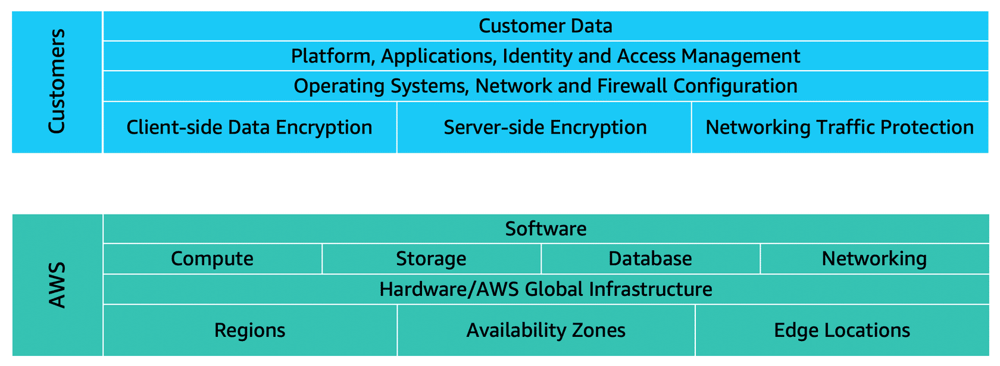
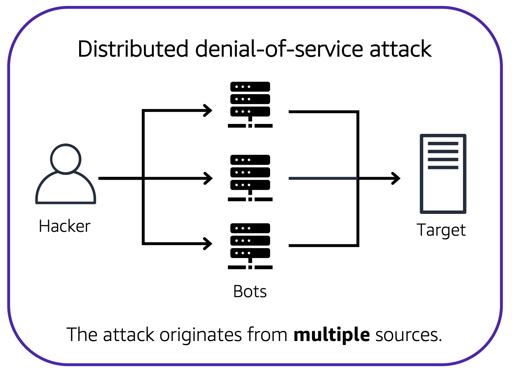

# AWS Practitioner Essentials

- [I. Introduction](#introduction-to-amazon-web-services-)
  - [Deployment Models for Cloud Computing](#deployment-models-for-cloud-computing-)
  - [Benefits of Cloud Computing](#benefits-of-cloud-computing-)
- [II. Compute](2_Compute-in-Cloud.md)
- [III. AWS Global Infrastructure and Reliability](3_AWS-Global-Infrastructure-and-Reliability.md)
- [IV. Networking](4_Networking.md)
- [V. Storages](5_Storage.md)
- [VI. Databases](6_Databases.md)
- [VI. AI/ML and Data Analytics in AWS](7_AI-and-Data-Analytics.md)
- [VII. Security in AWS](#security-)
  - [Shared Responsibility Model](#aws-shared-responsibility-model-)
  - [User Permissions and Access](#user-permissions-and-access-)
    - [Identity and Access Management (IAM)](#identity-and-access-management-iam-users)
    - [IAM Policies](#iam-policies)
    - [IAM Groups](#iam-groups)
    - [IAM Role](#iam-roles)
  - [AWS Organizations](#aws-organizations-)
  - [Compliance](#compliance-)
    - [AWS Artifacts](#aws-artifacts)
  - [Denial-of-Service (DoS) Attacks](#denial-of-service-dos-attacks-)
  - [Additional Security Services](#additional-security-services-)
- [VIII. Monitoring and Analytics in AWS](9_Monitoring-and-Analytics.md/#monitoring-and-analytics-)
- [IX. Pricing and Support in AWS](#pricing-and-support-)

## Terminologies:
`Cloud Computing`: On-demand delivery of IT resources and applications through the internet with pay-as-you-go pricing.

`Memory`: A temporary storage are for processing.

`Hardware Accelerators`: A component that can expedite data processing.

`Input/Output Operations Per Second (OIPS)`: A metric that indicates how many I/O operations a
device can perform per second.

## Introduction to Amazon Web Services [↑](#aws-practitioner-essentials)

### `Deployment Models for Cloud Computing` [↑](#aws-practitioner-essentials)
When selecting a cloud strategy, a company must consider factors such as required cloud application components, 
preferred resource management tools, and any legacy IT infrastructure requirements.

#### 1. Cloud-Based Deployment
- Run all parts of the application in the cloud.
- Migrate existing applications to the cloud.
- Design and build new applications in the cloud.

#### 2. On-Premises Deployment (private cloud deployment)
- Deploy resources by using virtualization and resource management tools.
- Increase resource utilization by using application management and virtualization technologies.
- Resources are deployed on premises by using virtualization and resource management tools.

#### 3. Hybrid Deployment
- Connect cloud-based resources to on-premises infrastructure.
- Integrate cloud-based resources with legacy IT applications.
- For instance where legacy applications that are better maintained on premises, or government regulations
that require business to keep certain records on premises.


### `Benefits of Cloud Computing` [↑](#aws-practitioner-essentials)

#### Trade upfront expense for variable expense
`Upfront expense` refers to data centers, physical servers, and other resources that you would need to invest
before using them. `Variable expense` means you only pay for computing resources you consume instead of investing
heavily in data centers and servers before you know how you're going to use them.

#### Stop spending money to run and maintain data centers
Cloud computing provides the ability to focus less on data centers that requires more expenses and time managing
infrastructure and servers. Which gives more focus on applications and customers.

#### Stop guessing capacity
Pay only for the compute time that is used. You can also scale in or scale out in response to demand.

#### Benefit from massive economies of scale
Achieve a lower variable cost than getting your own by using cloud computing.
Because usage from hundreds of thousands of customers can aggregate in the cloud, providers, 
such as AWS, can achieve higher economies of scale. The economy of scale translates into 
lower pay-as-you-go prices. 

#### Increase speed and agility
Cloud computing flexibility makes it easier to develop and deploy applications.
When computing in data centers, it may take weeks to obtain new resources that is needed. By comparison,
cloud computing enables to access new resources within minutes.

#### Go Global in minutes
Enables to deploy applications to customers around the world quickly, while providing low latency.


## Security [↑](#aws-practitioner-essentials)
### `AWS Shared Responsibility Model` [↑](#aws-practitioner-essentials)
The shared responsibility model divides into customer responsibilities (commonly referred to as “security in the cloud”) 
and AWS responsibilities (commonly referred to as “security of the cloud”).
<div align="center">
  
</div>

### `User Permissions and Access` [↑](#aws-practitioner-essentials)
- Scoping users permissions.
- `AWS Account Root User`: Owner of the AWS account.

#### Root User
When an AWS account is created, you begin with an identity called the **Root User**.

The root user is accessed by signing in with the email address and password that you used to create the AWS account.

<table>
  <tr>
    <th style="text-align:left; background-color:grey; color:black">Best Practice:</th>
  </tr>
  <tr>
    <td>Do not use the root user for everyday tasks. Instead, create an IAM user and assign permissions to create 
other users.
    </td>
  </tr>
</table>


#### Identity and Access Management (IAM) Users
- Represents the person or application that interacts with AWS services and resources.
- Consists of name and credentials.
- No access given by default upon creation.
- IAM Policy is a JSON document which describes the permissions associated on a specific user.


#### IAM Policies
Below is a sample IAM policy that is attached to users or groups.
```json
{
  "Version": "2012-10-17",
  "Statemenmt": {
    "Effect": "Allow",
    "Action": "s3:ListBucket",
    "Resource": "arn:aws:s3:::coffee_shop_reports"
  }
}
```
- Values:
  - **Effect**: Allow or Deny
  - **Action**: Any AWS API call
  - **Resource**: Which AWS resource the API call is for
  - 
<table>
  <tr>
    <th style="text-align:left; background-color:grey; color:black">Best Practice:</th>
  </tr>
  <tr>
    <td>Follow the security principle of <strong>least privilege</strong> when granting permissions</td>
  </tr>
</table>

#### IAM Groups
- To easily manage permission for users.
- Access control is done by assigning an IAM policy to the group instead of each user.
- Makes it easier to adjust permissions when an employee transfers to a different job.

#### IAM Roles
- For users that has changing roles from time-to-time.
- Have associated permissions that allow or deny certain actions but for aa temporary amount of time.
- No username or password.
- Temporarily grant access to users.
- Once assigned, it supersedes other permissions associated to an identity.
- Useful for varying roles from time-to-time. With this, one user can have different roles but not both.

### `AWS Organizations` [↑](#aws-practitioner-essentials)
An AWS services where it is a central location to manage multiple AWS accounts.

When an AWS Organization is created, a root user is automatically created which is the parent container for all the 
accounts in the organization.

- Centralized management
- Consolidated billing
- Implement hierarchical groupings of accounts.
- AWS service and API actions access control


#### Service Control Policies (SCPs)
It is possible to centrally control permissions for the accounts in the organization by using the **Service Control 
Policies (SCPs)**. SCPs enable to place restrictions on the AWS services, resources, and individual API actions that 
users and roles in each account can access.

- SCPs can ba applied to the organization root, an individual member account, or an OU.
- SCPs affects all IAM users, groups, and roles within an account, including the AWS account root user.
- You can apply IAM policies to IAM users, groups, or roles. You cannot apply an IAM policy to the AWS account root 
  user.

#### Organizational Units
In AWS Organizations, accounts can be grouped into an Organizational Unit (OU) to make it easier to manage accounts 
with similar business or security requirements.


### `Compliance` [↑](#aws-practitioner-essentials)

#### AWS Artifacts
AWS Artifacts is a no-cost AWS service that provides on-demand access to AWS security and compliance reports and select 
online agreements.

AWS Artifacts provide access to AWS security and compliance documents such as **_AWS ISO certifications_**, **_Payment Card 
Industry (PCI)_** reports, and **_Service Organization Control_** (SOC) reports.

**Two sections of AWS Artifacts**
- `AWS Artifact Agreements:`
  - Review, accept, and manage agreements for an individual account and for all accounts in AWS Organizations.

- `AWS Artifact Reports:`
  - Provide compliance reports from third-party auditors.
  - Can be provided to auditors or regulators as evidence of AWS security controls.

#### Customer Compliance Center
The [Customer Compliance Center](#https://aws.amazon.com/compliance/customer-center/) contains resources to help learn more about AWS compliance.

There is also access to compliance whitepapers and documentations on topics such as:
- AWS answers to key compliance questions
- An overview of AWS risk and compliance
- An auditing security checklist

### `Denial-of-Service (DoS) Attacks` [↑](#aws-practitioner-essentials)
DoS Attack is a deliberate attempt to make a website or application unavailable to users.

Customers can call the coffee shop to place their orders. After answering each call, a cashier takes the order and gives it to the barista.

However, suppose that a prankster is calling in multiple times to place orders but is never picking up their drinks. 
This causes the cashier to be unavailable to take other customers’ calls. The coffee shop can attempt to stop the false requests by blocking the phone number that the prankster is using. 

<div align="center">
  
</div>

#### Distributed Denial-of-Service (DDoS) Attacks
Multiple sources are used to start an attack that aims to make a website or application unavailable.

<div align="center">
  
</div>

#### AWS Shield
An AWS Service that protects applications against DDoS attacks. Provides two levels of protection: **Standard** and 
**Advanced**.

- **Standard**
  - Automatically protects all AWS customers at no cost.
  - Protects AWS resources from most common, frequently occurring types of DDoS attacks.
  - As network traffic comes into the application, AWS Shield uses a variety of analysis techniques to detect 
    malicious traffic in real time and automatically mitigates it.

- **Advanced**
  - A paid service that provides detailed attack diagnostics and the ability to detect and mitigate sophisticated 
    DDoS attack.
  - Integrates with other services such as `Amazon CloudFront`, `Amazon Route 53`, and ELB.
  - This can also be integrated with `AWS WAF` by writing custom ruled to mitigate complex DDoS attacks.

### `Additional Security Services` [↑](#aws-practitioner-essentials)

1. **AWS Key Management Service**
   - Enables to perform encryption operations through the cryptographic keys.
   - A **Cryptographic Keys** is a random string of digits used for encryption and decryption of data.
   - Used to create, manage, and user cryptographic keys and can also be used to control the use of keys across a wide 
     range of services and in the application.
   - Keys in the AWS KMS can be disabled on demand.
2. **AWS Web Application Firewall (WAF)**
   - Allows the monitoring of network requests that come into web applications.
   - Works together with `Amazon CloudFront` and Application ELB.
   - Just like network ACLs, it blocks/allows traffic using web ACLs.
3. **Amazon Inspector**
   - Performs automated security assessments.
   - Checks applications for security vulnerabilities and deviations from security best practices, such as open 
     access to Amazon EC2 instances and installations of vulnerable software versions.
   - After an assessment, Amazon Inspector provides with a list of security findings which is prioritized in 
     severity levels.
4. **Amazon GuardDuty**
   - An AWS Service that provides an intelligent threat detection for AWS infrastructure and resources.
   - Identifies threat by continuously monitoring the network activity and account behavior within the AWS environment.
   - If Amazon GuardDuty detects any threats, you can review detailed findings about them from the AWS Management 
     Console. Findings include recommended steps for remediation.
   - `AWS Lambda` can also be configured to take remediation steps automatically in response to GuardDuty's security 
     findings.

<div align="center">
  
</div>

### `Additional Resources`
- [Security Best Practices in IAM](https://docs.aws.amazon.com/IAM/latest/UserGuide/best-practices.html)
 


