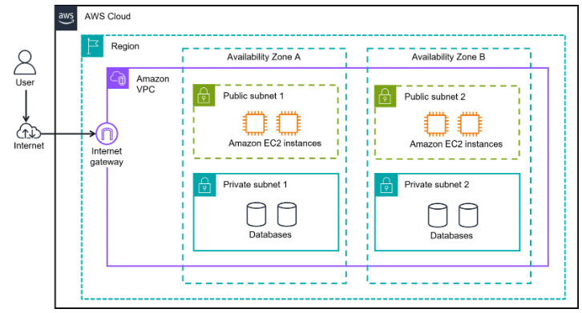
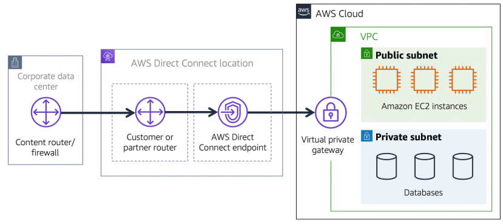
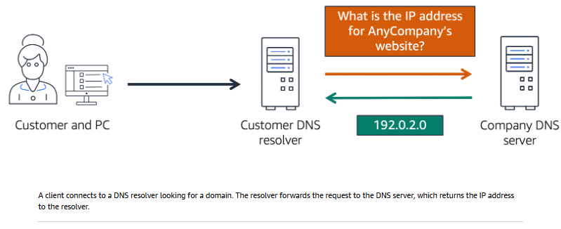
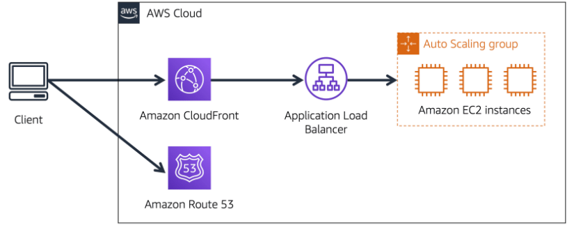

#### `PREVIOUS MODULE:` [AWS Global Infrastructure and Reliability](3_AWS-Global-Infrastructure-and-Reliability.md)

-----------

# Networking [↑](../README.md#1-aws-cloud-practitioner-notes)
- [Amazon Virtual Private Cloud (VPC)](#amazon-virtual-private-cloud-amazon-vpc)
- [VPC Components](#components-in-a-vpc-)
    - [`AWS Direct Connect`](#3-aws-direct-connect-)
- [More Ways to Connect to the AWS Cloud](#more-ways-to-connect-to-the-aws-cloud-)
- [Gateway Services](#gateway-services-)
- [Network Security Layers](#network-security-layers-)
- [Network ACLs](#network-access-control-list-network-acls-)
- [Security Groups](#security-groups-)
- [Global Networking](#global-networking-)
    - [Domain Name System](#domain-name-system-dns-)
    - [Amazon Route 53](#amazon-route-53-)
## `Amazon Virtual Private Cloud (Amazon VPC)`
- Provision a logically isolated section of the AWS cloud.
- The resources can be public or private facing. Public resources are in a public subnet while
  private resources are under a private subnet.
- A networking service that can be used to establish boundaries around AWS resources.

`Subnet:` Group of IP addresses. A section of a VPC that can contain resources such as EC2
instances or Amazon RDBs.

`Public Subnet:` Contains resources that need to be accessible by the public.

`Private Subnet:` Contains resources that should be accessibly only through private network.

  

## `Components in a VPC` [↑](#networking-)
### 1. Internet Gateway (IGW)
- Allows public traffic from the internet to access resources in the VPC.
- It is a doorway for the public to use. Without IG, no once can access resources in the VPC.

### 2. Virtual Private Gateway (VPG)
- To access private resources in a VPC.
- Allows protected internet traffic to enter into the VPC.
- Still prone to traffic since it uses the same path used by the public.
- VPG establish a virtual private network (VPN) connection between the VPC and a private network.
- Allows traffic into the VPC only if it is coming from an approved network.

### 3. AWS Direct Connect [↑](#networking-)
- AWS service that lets users establish a dedicated private connection between data center
  and a VPC.
- Helps reduce network costs and increase the amount of bandwidth that can travel through the
  network.
- Network traffic remains in the AWS network and never touches the public path which promotes
  more security and prevents bottleneck and sudden increase in latency.

  

## `More ways to connect to the AWS Cloud` [↑](#networking-)

### 1. AWS Client VPN
- Connect remote workers and on-premises networks to the cloud.
- Fully managed, elastic VPN service that automatically scales up or down based on user demand.
- It is a cloud VPN solution where there is no need to install and manage hardware.
- **Use Case:** Quickly scale remote user access.

### 2. AWS Site-to-Site VPN
- Some companies might want to establish secure, encrypted connections between their on-premises networks like data centers or branch offices and their resources in their Amazon VPC.
- Creates a secure connection between your data center or branch offices and AWS Cloud resources.
- **Use Case:** Application migration and secure communication between remote locations.

### 3. AWS PrivateLink
- Highly available, scalable technology that can be used to privately connect your VPC to services and resources as if they were in your VPC.
- There is no need to use an IG, NAT device, public IP address, Direct Connect connection, or AWS Site-to-Site VPN connection to allow communication with AWS services or resources from your private subnets.
- The specific API endpoints, sites, services, and resources that are reachable from the VPC are controlled instead.

## `Gateway Services` [↑](#networking-)
There are several different types of gateways to connect to AWS resources.

### 1. AWS Transit Gateway
- Connect Amazon VPCs and on-premises networks through a central hub.
- **QUICK LINK:** [AWS Transit Gateway](https://aws.amazon.com/transit-gateway/)

### 2. Network Address Translation (NAT) Gateway
- Used so that instance in a private subnet can connect to services outside of VPC but external services cannot initiate a connection with those instance.
- **QUICK LINK:** [NAT Gateway](https://docs.aws.amazon.com/vpc/latest/userguide/vpc-nat-gateway.html)

### 3. Amazon API Gateway
- AWS Service for creating, publishing, maintaining, monitoring, and securing APIs at any scale.
- **QUICK LINK:** [Amazon API Gateway](https://aws.amazon.com/api-gateway/)

## `Network Security Layers` [↑](#networking-)
- Network Hardening
- Application Security
- User Identity
- Authentication and Authorization
- Distributed Denial of Service (DDoS) Prevention
- Data Integrity
- Encryption

### `Network Access Control List (Network ACLs)` [↑](#networking-)
- A virtual firewall that controls inbound and outbound traffic **at the subnet level**.
- Checks the packets (message from the internet) permissions if it is allowed to enter or leave the
  network. These permissions indicate who sent the packet and how the packet is trying to
  communicate with the resources in a subnet.
- Only evaluates a packet if it crosses a **certain subnet**.
- Stateless (focuses on the list, it does not check if it originates from its own subnet or not.)
- **By default**, ACL **allows** all inbound and outbound traffic and can be customized by adding
  personalized rules.
- **for custom network ACLs**, all inbound and outbound traffics are **denied** by default until rules
  to specify is added.

---
`Stateless packet filtering`
- ACLs remember nothing and check packets that cross the subnet border inbound and outbound.
- After a packet has entered a subnet, it must have its permissions evaluated for resources
  within the subnet, such as EC2 instances.
---

### `Security Groups` [↑](#networking-)
- A virtual firewall that controls inbound and outbound traffic for an EC2 instance (**instance level**).
- **By default,** it blocks inbound traffic and allows outbound traffic.
  allow certain traffics.
- Does not allow any IP address by default.
- **Instance level type of security**.
- Every newly launch instance is already assigned to a default security group.
- Can be modified to indicate what type of traffics can be accepted (HTTPS, OS, Admin).
- Stateful

---
`Stateful packet filtering`
- Security groups remember previous decisions made for incoming packets.
- When a packet response for a request returns to the instance, the security group remembers the
  previous request. The security group allows the response to proceed, regardless of inbound
  security group roles.
---

## `Network Traffics in VPC`
- When a data is requested from an application hosted in the AWS cloud, the request is sent as a
  packet. A **packet** is a unit of data sent over the internet or a network.

## `Global Networking` [↑](#networking-)
A website hosted in AWS Cloud is accessed through **DNS resolution**.

**DNS Resolution** involves a customer DNS resolver communicating with a company DNS server.
It is the process of translating domain name to an IP address.

### Domain Name System (DNS) [↑](#networking-)
- Translates website names into IP addresses.
- Acts as a _phonebook_ of the internet.
- `DNS resolution:` process of translating a domain name to an IP address

  

### Amazon Route 53 [↑](#networking-)
- A DNS web service that gives developers and businesses a reliable way to route end users to
  internet applications hosted in AWS.
- Manages the DNS records for domain names.
- This is where new domain names are registered.
- Existing domain names and records managed by other domain registrars can also be transferred.

  

1. A customer requests data from the application by going to AnyCompany's website.
2. Amazon Route 53 uses DNS resolution to retrieve the IP Address of AnyCompany's website. This
   information is sent back to the customer.
3. The customer's request is sent to the nearest edge location through Amazon CloudFront.
4. Amazon CloudFront connects to the Application Load Balancer, which sends the incoming packet
   to an Amazon EC2 instance.

-----------

#### `NEXT MODULE:` [Storage](5_Storage.md)

-----------