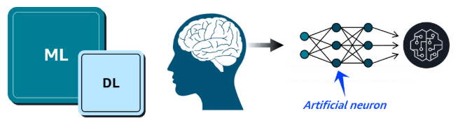
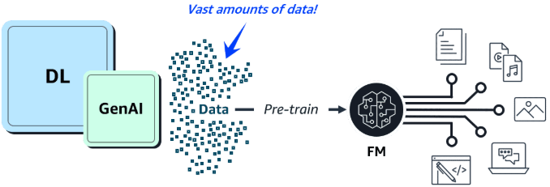
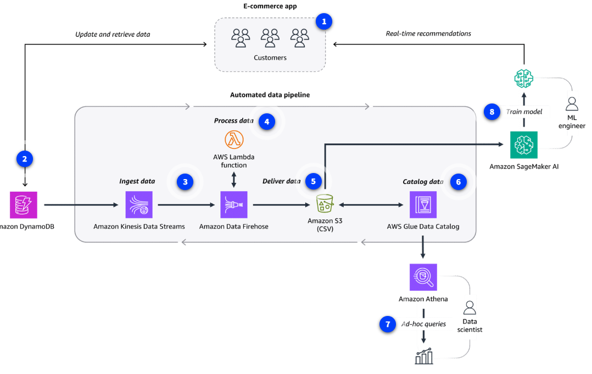

#### `PREVIOUS MODULE:` [Databases](6_Databases.md)

-----------
# AI/ML and Data Analytics [↑](../README.md#1-aws-cloud-practitioner-notes)

- [AI and ML on AWS](#artificial-intelligence-ai-and-machine-learning-ml-on-aws-)
- [AWS AI/ML Solutions](#aws-aiml-solutions-)
  - [Tier 1: AI Services](#tier-1-aws-ai-services-)
  - [Tier 2: ML Services](#tier-2-ml-services-)
    - [`Amazon SageMaker AI`](#amazon-sagemaker-ai)
  - [Tier 3: ML Frameworks and Infrastructure](#tier-3-ml-frameworks-and-infrastructure-)
- [AWS Generative AI](#aws-generative-ai-introduction-)
- [AWS Generative AI Solutions](#aws-generative-ai-solutions-)
- [Data Analytics on AWS](#data-analytics-on-aws-)
  - [AWS Data Pipeline Services](#aws-data-pipeline-services-)

## `Artificial Intelligence (AI) and Machine Learning (ML) on AWS` [↑](#aiml-and-data-analytics-)
**_Artificial Intelligence_** is a broad field focused on the development of intelligent computer systems capable of
performing human-like tasks.

**_Machine Learning_** is a type of AI for training machines to perform complex tasks without explicit instructions. ML
training finds the patterns hidden in vast amounts of historical data to produce an **ML model**. This ML model can
then be applied to new data to make predictions or decisions based on the patterns it's learned.

### Common ML Business use cases
1. Predict trends, such as future stock prices.
2. Make decisions, like routing callers to the right department.
3. Detect anomalies, such as bank fraud.

## `AWS AI/ML Solutions` [↑](#aiml-and-data-analytics-)
The AWS AI/ML stack is composed of the following three (3) tiers of solutions:

### Tier 1: AWS AI Services [↑](#aiml-and-data-analytics-)
- Pre-built models that are already trained to perform specific functions. 
- These ready-to-use, managed services can help quickly solve for a variety of business use cases.

#### 1. **Language Services**

AWS AI Language Services are great for when there is a need to interpret text or speech and transform it into something meaningful.

| Language Service      | Description                                                                                                                                                                                                                                                 |
|-----------------------|-------------------------------------------------------------------------------------------------------------------------------------------------------------------------------------------------------------------------------------------------------------|
| **Amazon Comprehend** | Uses natural language processing to extract key insights from documents. It develop these insights by recognizing key phrases, language, sentiment, and other common elements in the document                                                               |
| **Amazon Polly**      | Converts text into life-like speech. Supports multiple languages, different genders, and variety of accents.   **Use Cases:** Virtual assistants, e-learning applications, accessibility enhancements for visually impaired users.                      |
| **Amazon Transcribe** | Converts speech into text. Supports multiple language ans offers speaker identification, custom vocabulary, and real-time transcription.   **Use cases:** Customer call transcription, automated subtitling, and metadata generation for media content. |
| **Amazon Translate**  | Text translation service. Ideal for global communication because it supports real-time and batch text translation across multiple language.   **Use Cases:** Document translation and muti-language application integration.                            |

#### 2. **Computer Vision and Search Services**

These services are ideal for answering questions and gathering insights from various types of content sources such as documents, images, videos, and more.

| Computer Vision and Search Services | Description                                                                                                                                                                                                                                                                                                                           |
|-------------------------------------|---------------------------------------------------------------------------------------------------------------------------------------------------------------------------------------------------------------------------------------------------------------------------------------------------------------------------------------|
| **Amazon Kendra**                   | Uses natural language processing to search for answers within large amounts of enterprise content. Understands the context of a query so it can return more precise and relevant answers than just a list of documents with matching keywords.   **Use Cases:** Intelligent search, chatbots, and application search integration. |
| **Amazon Rekognition**              | Video analysis service. Identify objects, people, text, scenes, and activities within images and videos stored in Amazon S3.   **Use cases:** Content moderation, identity verification, media analysis, and hone automation experiences.                                                                                         |
| **Amazon Textract**                 | Detects and extracts typed and handwritten text found in documents, forms, and even tables within documents.   **Use cases:** Financial, healthcare, and government form text extraction for quick processing.                                                                                                                    |

#### 3. **Conversational AI and personalization services**

Users can interact with applications through text and voice conversations. It is also possible to present customers with produce recommendations personalized just for them.

| Conversational AI Services | Description                                                                                                                                                                                       |
|----------------------------|---------------------------------------------------------------------------------------------------------------------------------------------------------------------------------------------------|
| **Amazon Lex**             | Add voice and text conversational interfaces to applications. This service use both Natural Language Understanding (NLU) and Automatic Speech Recognition (ASR) to create lifelike conversations. |
| **Amazon Personalize**     | Use historical data to build intelligent applications with personalized recommendations for customers.                                                                                            |

### Tier 2: ML Services [↑](#aiml-and-data-analytics-)
- More customized approach for customers who want a bit more control over their ML solutions without having to manage infrastructure.

#### `Amazon SageMaker AI`
- A fully managed service.
- Build, train, and deploy own ML models without worrying about the infrastructure.
- The SageMaker AI IDE provides simplified access control and transparency over ML projects.
- Track model training experiments, visualize data, and debug and monitor workflows all within one environment.
- SageMaker AI also offers access to hundreds of pre-trained models that can deploy in a few quick steps.

**Benefits**

1. **Choice of ML tools:** Increase innovation with different tool choices. Data scientists can use the IDE, and business analysts can use the no-code interface.
2. **Fully managed Infrastructure:** Focus on ML model development while SageMaker AI provides with high-performance, cost-effective infrastructure.
3. **Repeatable ML workflows:** Automate and standardize MLOps practices and governance across enterprise to support transparency and auditability.

### Tier 3: ML Frameworks and Infrastructure [↑](#aiml-and-data-analytics-)
- For organizations that have highly specialized needs that require complete control over the ML training process.
- Use of in-house expertise, ML frameworks, and AWS infrastructure to develop own ML solutions.

**Core Components:**
1. **ML Frameworks**
   - Software library or tool that provides experienced ML practitioners with pre-built, optimized components for building machine learning models.
   - AWS supports ML frameworks like PyTorch, Apache M-X Net, and TensorFlow.
2. **AWS ML Infrastructure**
   - Such as ML-optimized Amazon EC2 instances, Amazon EMR, and Amazon ECS, can support these custom solutions.
   - These services provide high performance and flexibility for advanced ML workloads.

## AWS Generative AI Introduction [↑](#aiml-and-data-analytics-)

### Key Concepts

#### Deep Learning (DL)
- Deep learning is a subset of ML where models are trained using layers of artificial neurons that mimic the human brain.
- Each layer of neural networks summarizes and feeds information to the next layer until a final model is produced.

#### Generative AI
- Generative AI is a type of DL powered by extremely large ML models known as **foundation models (FMs)**
- FM's are pre-trained on vast collections of data. While traditional ML models are trained to perform singular tasks, FMs can be adapted to perform multiple tasks.
- Large Language Models (LLMs) are popular type of FM trained to use human language.
- FMs can also be used to create videos, images, music, and more.

## AWS Generative AI Solutions [↑](#aiml-and-data-analytics-)

### 1. Amazon SageMaker JumpStart
- A machine learning hub within SageMaker AI that accelerates the process of building, training, and deploying ML models.
- Offers a library of pre-built ML solutions across various domains such as computer vision, NLP, and tabular data.
- These pre-trained models can be fine-tuned to suit specific needs and deploy with just a few clicks.

#### Common Use Cases
- Rapid ML model deployments
- Custom fine-tuned solutions
- ML experiments and prototypes

### 2. Amazon Bedrock
- A fully-managed service that was specifically designed for working with large foundation models and building generative AI applications.
- It provides access to FMs from Amazon and leading AI startups, such as Claude and Stable Diffusion, all through a single unified API.
- Quickly experiment with FMs, fine-tune them with own data, and seamlessly integrate into AWS applications.

#### Common Use Cases
- **Enterprise-grade Generative AI:** Build production-ready Gen AI applications with enterprise-level security, privacy, and scalability.
- **Multimodal content generation:** Create applications that can generate multiple content types, such as text and images.
- **Advanced Conversational AI:** Develop advanced conversational agents that connect to enterprise data to provide accurate responses.

### 3. Amazon Q Products
- Amazon Q is a generative AI assistant that can help companies streamline processes, get to decisions faster, and improve employee productivity.
- Help employee gain insights into their data and accelerate their tasks.

#### 1. Amazon Q Business
- Answer pressing questions, help solve problems, and take actions using the data and expertise found in company's information repositories.
- Provides tailored assistance with a secure connection to commonly used systems.
- **Use Cases:** Information requests, automated workflows, insight extractions

#### 2. Amazon Q Developer
- Provides code recommendations to accelerate development for coding languages including C#, Java, JavaScript, Python, and TypeScript applications.
- It integrates with multiple IDEs and help developers write code faster by generating entire functions and logical blocks of code.
- **Use Cases:** Faster code generation, improved reliability and security, automated code reviews.

## Data Analytics on AWS [↑](#aiml-and-data-analytics-)
Both AI/ML and Data Analytics are supported by good data.

#### Data Pipelines for ETL processes
- Both AI/ML and traditional data analytics need clean and accessible data in a format that's usable by analytics tools and AI algorithm. ETL processes are used for this purpose.
  1. **Extract** data from various sources and store it.
  2. **Transform** data into a consistent, usable format for downstream tools to consume.
  3. **Load** the data into a destination system, like a data warehouse or analytics platform.
- Data pipelines are automated assembly lines used to make the ETL process efficient and repeatable.

#### Data Analytics
- Data Analytics is when analysts transform raw historical data to uncover valuable insights and trends.
- This traditional data analysis can apply to important use cases:
  - Loan companies explaining lending decisions to customer.
  - Medical researchers analyzing clinical trial data through hypothesis testing.
  - Insurance companies making risk assessment models transparent for regulators.

## `AWS Data Pipeline Services` [↑](#aiml-and-data-analytics-)

### Data Ingestion Services [↑](#aiml-and-data-analytics-)
- Data ingestion involves moving data from source systems into chosen storage solution. 
- Use **real-time ingestion** when the data is needed immediately.
- Use **batch ingestion** when some latency is tolerable.

#### Amazon Kinesis Data Streams
- For real-time ingestion of terabytes of data from applications, streams, and sensors.
- Serverless service that provides automatic provisioning and scaling in on-demand mode.

#### Amazon Data Firehose
- Option for data ingestion in near real-time.
- Fully-managed service that provides automatic provisioning and scaling.
- Delivers data within seconds to data lakes, warehouses, and analytics services.
- Can invoke AWS Lambda function for processing.
- Has no direct integration with DynamoDB.

### Data Storage Service [↑](#aiml-and-data-analytics-)
Data can come from many different sources. To gain insights, data is commonly consolidated into a single location.
- **Flexible Data Lakes:** Sore vast amounts of raw data.
- **Data Warehouse:** More structured and optimized for business intelligence.

#### Amazon S3
Amazon S3 is popular choice for data lakes. Can securely house virtually ant amount of structured or unstructured data.

#### Amazon Redshift
Fully-managed data warehouse service that can store petabytes of structured or semi-structured data.

### Data Cataloging Services [↑](#aiml-and-data-analytics-)
Cataloging data with metadata provides an inventory of the organization's data.

#### AWS Glue Data Catalog
- Provides a centralized, scalable, and managed metadata repository that enhances data discovery.
- Improves the overall efficiency of data pipelines by delivering metadata to various data stores and analytics services.

### Data Processing Services [↑](#aiml-and-data-analytics-)
Data processing services clean and transform your data so it is ready to be analyzed.

#### AWS Glue
- Fully managed ETL service that makes data preparation simpler, faster, and cost-effective.
- AWS Glue ETL jobs can use the AWS Glue Data Catalog to access metadata about data sources, which can help inform transformations defined in the ETL script.

#### Amazon EMR
- Ideal for large-scale data processing and organizations with existing big data expertise.
- Automatically handles infrastructure provisioning, cluster management, and scaling.
- Supports popular big data frameworks like _Apache Spark_, _Apache Hadoop_, and _Apache Hive_.

### Data Analysis and Visualization Services [↑](#aiml-and-data-analytics-)
Queries and visualization tools to help to develop important insights about data.

#### Amazon Athena
- Run SQL queries to analyze data in relational, non-relational, object, and custom data sources.
- Fully-managed serverless service that can access data hosted on Amazon S3, on-premises, or even multi-cloud environments.
- Pay for the queries you run.

#### Amazon Redshift
- Fully-managed data warehouse solution.
- Columnar storage and massively parallel processing architecture, which is ideal for analyzing large datasets.
- Use to perform complex SQL queries on large datasets for frequent, high-performance analytical workloads.

#### Amazon QuickSight
- Both technical and non-technical users can quickly create modern interactive dashboards and reports from various data sources without managing infrastructure.
- Amazon Q in QuickSight provides natural language queries so business analysts and users can build, discover, and share meaningful insights in seconds.

#### Amazon OpenSearch Service
- Search for relevant content through precise keyword matching or natural language queries.
- Unified dashboards provide real-time data visualization as logs, traces, and metrics for various applications are analyzed and monitored.

## `Data Analytics and AI/ML Architecture Diagram` [↑](#aiml-and-data-analytics-)

-----------

#### `NEXT MODULE:` [Security](8_Security.md)

-----------