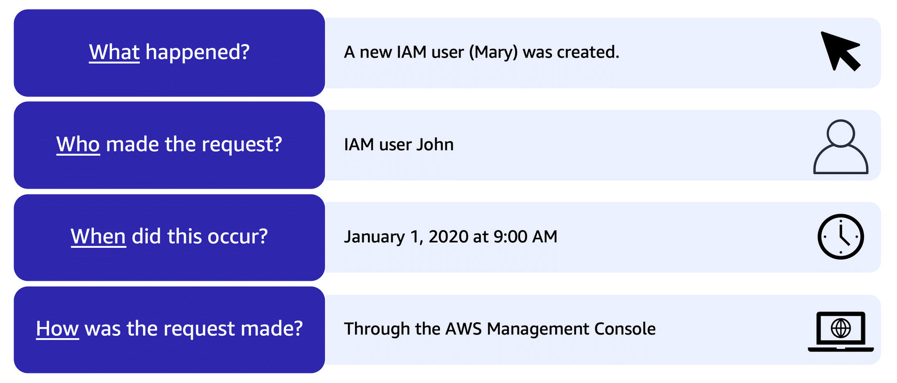
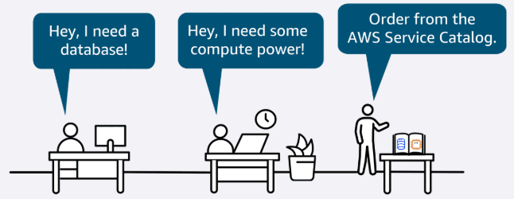
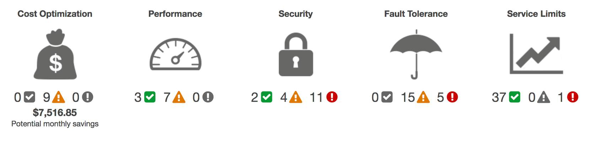

#### `PREVIOUS MODULE:` [Security](8_Security.md)

-----------

# Monitoring and Analytics [↑](../README.md#1-aws-cloud-practitioner-notes)
- [`Amazon CloudWatch`](#amazon-cloudwatch-)
- [`AWS CloudTrail`](#aws-cloudtrail-)
- [`AWS Config`](#aws-config-)
- [`AWS Audit Manager`](#aws-audit-manager-)
- [`Governance in AWS`](#governance-in-aws-)
- [`Trusted Advisor`](#aws-trusted-advisor-)

Observing systems, collecting metrics, and then using data to make decisions.

## `Amazon CloudWatch` [↑](#monitoring-and-analytics-)
- a web service that enables to monitor and manage various metrics and configure alarm actions based on data from
  those metrics.
- CloudWatch uses [Metrics](#metrics) to represent the data points in an AWS resources. The metrics is sent to the
  CloudWatch. The CloudWatch then uses these metrics to create graphs automatically that show how performance has
  changed over time.

### Metrics
- Metrics are data about the performance of your systems.
- By default, many services provide free metrics for resources (such as EC2 instance, EBS volumes, RDS DB instances).
- It is also possible to publish own application metrics and be reflected on Amazon CloudWatch.
- Amazon CloudWatch can load all metrics in the AWS account.
- Metric data is kept for **15 months**, enabling to view both up-to-the-minute data and historical data.
- To graph metrics in the console, the `CloudWatch Metric Insigts` is used. It is a high-performance SQL query
  engine that can be used to identify trends and patterns within all metrics in real-time.

### CloudWatch Alarms
- **alarms** can be created to automatically perform actions if the value of a metric has gone above or below a
  predefined threshold.

## `AWS CloudTrail` [↑](#monitoring-and-analytics-)
- Records the API call for the account.
- The recorded information includes the identity of the API caller, the time of the API call, the source IP address
  of the API caller, and more.
- CloudTrail can be think of as a _"breadcrumbs"_ or a log of actions that someone left behind.
- Events are typically updated in CloudTrail within **15 minutes** after an API call.
- A filter is enabled by specifying the time and date that an API call occurred, the user who requested the action,
  the type of resource that was involved in the API call, and more.

  

### Cloud Trail Insights
- Optional feature that allows CloudTrail to automatically detect unusual API activities in AWS account.

## `AWS Config` [↑](#monitoring-and-analytics-)
A service that can be used to assess, audit, and evaluate the configurations of AWS resources.

- **Benefits:** Helps evaluate configurations against a desired state, manage resource configuration changes, and
  simplify troubleshooting and remediation.
- **Use cases:** Continually audit security monitoring and analysis and to streamline operational troubleshooting
  and change management.

## `AWS Audit Manager` [↑](#monitoring-and-analytics-)
A service that continually audits your AWS usage to simplify risk and compliance assessment. It helps collect
evidence and manage audit data.

- **Benefits:** Saves time with _automated evidence collection_, streamlines collaboration across teams, and helps
  ensure integrity of audits with read-only permissions.
- **Use Case:** Automate evidence collection, continually audit to assess compliance, and deploy internal risk
  assessments.

## Governance in AWS [↑](#monitoring-and-analytics-)
Governance is a framework to manage IT goals with policies, processes, and structures to ensure adherence.

Standardized initial account setup according to best practices.

Detect and remediate non-compliance accounts.

### AWS Control Tower
A service that can be used to enforce and manage governance rules for security, operations, and compliance at scale
across all your organizations and accounts in the AWS cloud.

- **Benefits:** Save time while providing governance. It uses pre-configured controls, which can help to quickly set
  up milti-account environments, automation with built-in governance, and integration of third-party software at scale.
- **Use Cases:** Quickly deploy applications and provision compliant AWS accounts.
- **Features:**
    - **Dashboard:** Provide continuous oversight to see provisioned accounts across enterprise. AWS Control Tower
      also has controls for policy enforcement and can help detect non-compliant resources.
    - **Account Factory:** Configurable account template that standardizes the provisioning of new accounts.
    - **Controls (Guardrails):** High-level rules that provide governance for overall AWS environment.
    - **Landing Zone:** Well-architected multi-account environment that's based on security and compliance best
      practices. It is the enterprise-wide container that holds all the OUs, accounts, users, and resources that
      needs to be regulated for compliance.

### AWS Service Catalog
Create, share, and organize from a curated catalogs of AWS resources.

Deploy baseline networking resources and security tools for new AWS accounts so it can be governed consistently.

  

### AWS License Manager
The AWS Bring-Your-Own-License model (BYOL) allows companies to use existing license that they have already
purchased for a more cost-effective reason instead of buying directly from AWS.

The **AWS License Manager** helps manage software licenses and fine-tune licensing cost.

- **Benefits:** Helps with the visibility and control, tracking and managing licenses, and reduce the risk of
  non-compliance with licenses.
- **Use Cases:** Streamline license management and to simplify the Microsoft License Mobility through Softwarte
  Assurance experience. It can also be used to automate the distribution and activation of software entitlements
  across AWS accounts for end users.

## `AWS Trusted Advisor` [↑](#monitoring-and-analytics-)
- Web service that inspects AWS environment and provides real-time recommendations in accordance with AWS best
  practices.

### Five Categories
Trusted Advisor compares its findings to AWS best practices in five categories:

1. **Cost Optimization**
2. **Performance**
3. **Security**
4. **Fault Tolerance**
5. **Service Limits**

  

## `IAM Access Analyzer`
Provides capabilities to set, verify, and refine permissions by analyzing external access and validating that
policies match the corporate security standards.

-----

#### `NEXT MODULE:` [Pricing and Support](10_Pricing-and-Support.md)

----